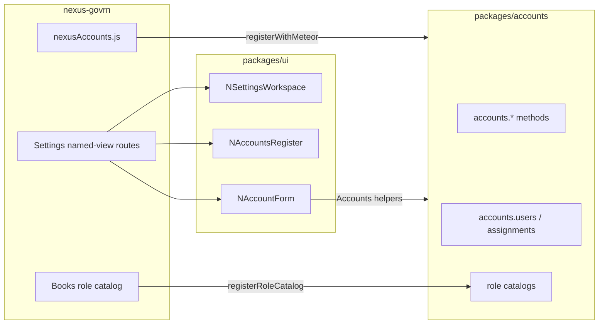

# Settings, accounts, and assignable sub-app roles

**Override you chose:** extract `@nexus/accounts` **now**, and put the Settings / account **Vue in `@nexus/ui` now** (same pattern as `NSetupWizard` → `@nexus/setup`). Cost: extra `file:` + Rspack include before a second app exists. Payoff: `nexus-erp` only adds the adapter and routes.

**Roles store:** keep [`meteor/roles`](https://github.com/Meteor-Community-Packages/meteor-roles). No second roles collection. Each sub-app registers a JS catalog.

**Platform roles:** `superadmin` and `admin` have the **same account-admin permissions**. The only difference is **applog**: `superadmin` has full visibility on all logs (audit / regulatory / compliance). `admin` does not.

Branch `auth` is already checked out.

## What exists today

- Platform roles `superadmin` / `admin` are created in [`packages/setup`](packages/setup/src/constants.js) (`ADMIN_ROLES`) and granted on first-run / demo seed.
- Books hardcodes roles in [`apps/nexus-govrn/imports/apps/Books/server/roles.js`](apps/nexus-govrn/imports/apps/Books/server/roles.js). On every login/startup, every user gets reader roles and every admin gets writer roles — that would undo assign-roles.
- Drawer Settings already goes to `/settings` ([`WebLayout.vue`](apps/nexus-govrn/imports/ui/layouts/WebLayout.vue)); no route or UI yet.
- Own-user role assignments are published in [`publishUserRoles.js`](apps/nexus-govrn/imports/api/publishUserRoles.js) (display only).
- [`packages/applog`](packages/applog/src/constants.js) `READ_ROLES` is `['superadmin', 'admin']` and [`applog.recent`](packages/applog/src/publish.js) returns the same rows to both. That contradicts the new rule.

## 1. `@nexus/accounts` (injected Meteor)

New [`packages/accounts`](packages/accounts) — same shape as setup: `register.js`, `methods.js`, `publish.js`, `catalog.js`, `constants.js`, README + Contents.

- **No `meteor/*` imports.** App injects `Meteor`, `Accounts`, `Roles`, `check`, `Match` (optional `Applog.record`).
- **No new Mongo collection.** Users on `Meteor.users`; roles on meteor-roles; suspend as `suspendedAt` on the user.
- Import `ADMIN_ROLES` from `@nexus/setup`.
- `registerRoleCatalog({ key, roles: [{ name, group }] })`. Startup creates those roles plus `ADMIN_ROLES`.
- `validateLoginAttempt`: reject if `suspendedAt` is set.

**Methods** — `check`, then login, then caller in `ADMIN_ROLES`. **`admin` and `superadmin` are interchangeable** for every accounts method. Never accept a client Mongo modifier.

- `accounts.users.insert` — email, name, password; optional roles from catalog + platform roles
- `accounts.users.update` — id, name, email (not password)
- `accounts.users.remove` — not self; refuse if it would remove the last `superadmin`
- `accounts.users.setPassword` — admin-set password (no email reset yet)
- `accounts.users.setSuspended` — not self; last-`superadmin` guard if suspending a `superadmin`
- `accounts.roles.set` — replace roles with a checked list; refuse to remove the last `superadmin`

**Publications** (caller in `ADMIN_ROLES`, else `this.ready()`):

- `accounts.users` — `_id`, `emails`, `profile.name`, `createdAt`, `suspendedAt` (never `services`)
- `accounts.roleAssignments` — `Meteor.roleAssignment` for those users

Client helpers: `subscribeUsers`, `subscribeRoleAssignments`, `listRoleCatalog`. Catalogs register on the client too so `@nexus/ui` can label checkboxes without `meteor/*`.

**Audit:** injected `Applog.record` from methods; redact password. Do not wrap `Meteor.users`.

No tests unless you ask.

## 2. Account UI in `@nexus/ui` (now)

Same contract as `NSetupWizard`: SFCs import `@nexus/accounts` / `@nexus/setup` only — **no `meteor/*`**. N-prefix, export from [`packages/ui/src/index.js`](packages/ui/src/index.js), document in [`packages/ui/README.md`](packages/ui/README.md) and [`PACKAGES.md`](PACKAGES.md). i18n keys in `packages/ui/src/i18n/locales` (`settings.*`, `accounts.*`).

Suggested files under `packages/ui/src/components/accounts/` (and a small workspace widget):

- `NSettingsWorkspace` — icon/card grid of settings destinations (`items: { key, title, icon, to }`)
- `NAccountsRegister` — user table; row click emits / uses a `to` builder for `/settings/accounts/:id`
- `NAccountForm` — create and edit: name, email, password (create or reset), suspend, role checkboxes grouped by catalog key (including `superadmin` / `admin`)
- Reuse `NModal` / `NRemoveIcon` for delete/suspend confirm

GovRN does **not** own the account widgets. The app only:

- Registers `@nexus/accounts` ([`nexusAccounts.js`](apps/nexus-govrn/imports/api/nexusAccounts.js), `file:` dep, client/server `main.js` after setup)
- Adds thin named-view routes that **mount the N components** (`/settings`, `/settings/accounts`, `/settings/accounts/:id?`) in [`router.js`](apps/nexus-govrn/imports/ui/router.js)
- Optionally a 3-line heading wrapper if WebLayout still needs a named `heading`

`useUserRole(['superadmin','admin'])` on those routes is display only.

When `nexus-erp` appears: same `file:` packages + the same N components in its router. No copy of Vue.

## 3. Books role catalog (assignable writers)

Refactor [`server/roles.js`](apps/nexus-govrn/imports/apps/Books/server/roles.js):

- Export `bookRoleCatalog` (the six `books.*` / `files.books.*` names + groups).
- `registerBooks()` calls `Accounts.registerRoleCatalog(bookRoleCatalog)`.
- **Stop** granting writer roles to every admin on login/startup.
- **Keep** auto-grant of `books.reader` + `files.books.download` for every signed-in user.
- Demo seed: grant writer roles once to `admin@localhost`.

`rolePrefix` in [`collections/books.js`](apps/nexus-govrn/imports/apps/Books/collections/books.js) stays the method gate. Risks later: another catalog, one register line.

## 4. Superadmin vs admin

Account admin: **identical**. Either role may create/update/delete users, reset passwords, suspend, and assign any catalog or platform role (including granting `superadmin`). Shared guards: not self for delete/suspend; cannot remove or suspend the last `superadmin`.

Applog: **not identical**. Change [`packages/applog/src/constants.js`](packages/applog/src/constants.js) so full log read is `superadmin` only (e.g. `READ_ROLES = ['superadmin']` or a new `AUDIT_READ_ROLES`). Update [`publish.js`](packages/applog/src/publish.js) comments and [`packages/applog/README.md`](packages/applog/README.md). `admin` no longer receives `applog.recent`. A future restricted admin view is out of scope.

## Out of scope (unless you add it)

- Email-based forgot-password
- Tests
- A custom roles Mongo collection
- Changing onboarding (`setup.complete` still creates the first `superadmin` / `admin` only)
- Building an applog UI (only the publication gate changes in this work)
