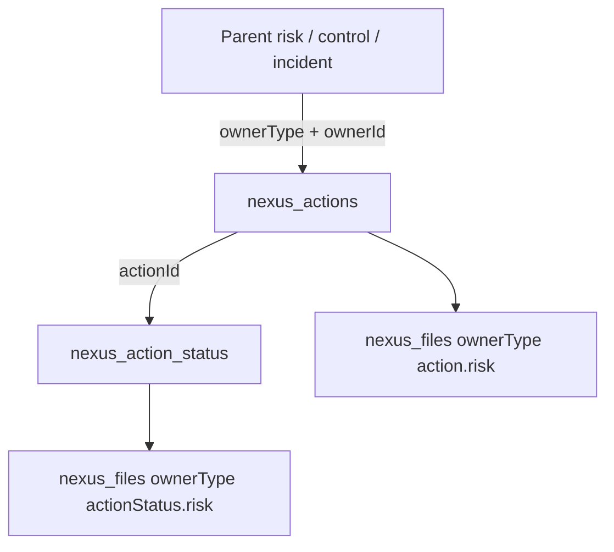
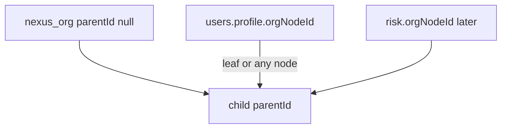
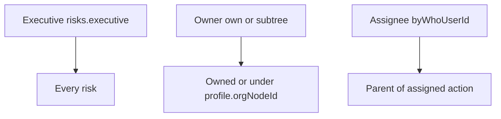

# Actions as a shared package

**This round:** `@nexus/org` (tree, no user-assignment UI) + `@nexus/actions` + action UI widgets + GovRN adapters. **Not this round:** Risks sub-app, org picker on `NAccountForm`, or a demo parent.

**Challenge, then proceed**

- `@nexus/lists` could have stored a two-level catalog. You overrode a real tree (`@nexus/org`). Accept the extra package; do not also invent `divisionId` / `departmentId` on the user.
- **`accounts.directory` stays in `@nexus/accounts`.** Org does not publish users. An admin method on accounts writes `profile.orgNodeId` after the user exists.
- Widgets for actions ship **unmounted**. First risk screen is later.
- **Do not put org walks inside `@nexus/actions`.** Actions only has `canRead` / `canWrite` hooks. Risks (later) calls `Org.descendantIds`.
- No scoped `meteor/roles` groups. Assignee is not a role.
- Assignee file access still needs a `Files.defineOwner` authorize hook.

## What we locked

| Decision | End state |
|----------|-----------|
| Status | Journal rows (`asOf` + translatable `description` + `createdBy`). Action has a manual **`completed`** boolean. No open/in-progress/cancelled machine. |
| Status edits | `canWrite(parent)` may edit or delete any status row. Assignee may insert/update/delete status on **their** action only. |
| `byWho` | Combobox: Meteor user or external label. `byWhoUserId` and/or `byWhoLabel`. External people have no login. |
| Locales | `title`, `description`, and status `description` are maps. `en` required. Keys follow `settings.public.locales.data`. |
| Roles | Parent supplies `canRead` / `canWrite` per document. Actions ORs assignee for that action. No `actions.risks.*`. No global `risks.reader`. |
| Executive | `risks.executive` (and `superadmin` / `admin`) **reads and writes every risk** — actions, `completed`, files. |
| Org | New `@nexus/org` this round. Generic tree, free `type` string, admin/superadmin writes only. |
| User org | One field: `Meteor.users.profile.orgNodeId` (any node). Not `divisionId` + `departmentId`. Assignment **method** this round; **UI later**. |
| Same unit | User may see/write risks whose `orgNodeId` is **their node or any descendant** (plus risks they own). |
| Directory | Stays on accounts. Does not move into org. |
| Scope | Org package + actions package + action widgets. No Risks, no org assignment widgets. |

**Completed flag:** `canWrite(parent)` only (executive and in-scope owner). Not the assignee.

**`byWhen`:** date only (`NDatePicker`). Overdue is a UI hint (`!completed && byWhen < today`).

## Data model (actions)

Fixed names, one Mongo database per Meteor app.



**`nexus_actions`:** `ownerType`, `ownerId`, `title` / `description` maps, `byWhoUserId`, `byWhoLabel`, `byWhen`, `completed`, `completedAt`, `completedBy`, `createdBy`, `createdAt`, `updatedAt`. One parent; no moving.

**`nexus_action_status`:** `actionId`, `asOf`, `description` map, `createdBy`, `createdAt`, `updatedAt`.

Deny client writes on both (lists pattern).

## `@nexus/org` (this round)

Lists stay for select catalogs. Org owns the **hierarchy**.



**`nexus_org`**

- `parentId` — `null` for a root; otherwise another `nexus_org` `_id`
- `type` — **free string** (admin types `division`, `department`, `team`, …)
- `title` — locale map, `en` required (same rules as lists)
- `sortOrder`, `active`
- `createdAt`, `updatedAt`

Writes: `superadmin` / `admin` only (`org.insert` / `update` / `remove`). Any logged-in user may subscribe to the tree (needed later for pickers and for server walks).

Helpers (server, used by Risks later): `Org.descendantIds(nodeId)`, `Org.ancestorIds(nodeId)`, `Org.isUnder(nodeId, ancestorId)` — `isUnder` is true when the ids are equal or `nodeId` is a descendant.

Remove rules: refuse if the node has children; refuse if any user has `profile.orgNodeId` equal to this id or a descendant (once assignment exists). Cycle check on `parentId` update.

No Vue org manager this round. Seed/admin can call methods or use meteor shell until a later settings screen.

**User attachment (method now, UI later)**

- `accounts.users.setOrg({ id, orgNodeId })` — admin/superadmin, after the user exists. `orgNodeId` must exist and be `active`, or `null` to clear.
- Field: `profile.orgNodeId` only. Server method; **not** a client `users.update` of `profile`.
- [`accounts.directory`](packages/accounts/src/publish.js) stays in accounts: `_id`, `profile.name`, `emails.address`, `profile.orgNodeId`; omit suspended; never `services`.

## Visibility and roles

Books-style `books.reader` (every row) is wrong for Risks. Three personas:



| Persona | Recognized how | See | Write |
|---------|----------------|-----|-------|
| Executive | `risks.executive` or `superadmin` / `admin` | Every risk and its actions | **Every** risk: update/remove, full action CRUD, `completed`, files |
| Risk owner | `risk.ownerUserId === userId` **or** `Org.isUnder(risk.orgNodeId, user.profile.orgNodeId)`, and they hold `risks.update` / `create` / `remove` | Own risks and risks under their org node | Those risks and their actions / `completed` / files |
| Assignee | `action.byWhoUserId === userId` — not a role | That action, its statuses and files, **and the parent risk** (read-only) | Status + files on **their** action only |

External `byWhoLabel`: no login. Owner or executive updates that journal.

`Actions.defineOwner` (Risks later):

```javascript
Actions.defineOwner({
  type: 'risk',
  collection: Risks,
  async canRead({ userId, parent }) {
    // executive/admin OR ownerUserId OR Org.isUnder(parent.orgNodeId, profile.orgNodeId)
  },
  async canWrite({ userId, parent }) {
    // executive/admin OR (owner/subtree AND risks.update)
  },
})
```

Actions **always** ORs assignee for read of that action and download of its files. Export `Actions.ownerIdsAssignedTo(userId, ownerType)` for the parent pub:

```javascript
const assignedIds = await Actions.ownerIdsAssignedTo(this.userId, 'risk')
const underOrg = userOrgId ? await Org.descendantIds(userOrgId) : []
return Risks.find({
  $or: [
    executiveOrAdmin ? {} : null,
    { ownerUserId: this.userId },
    underOrg.length ? { orgNodeId: { $in: [userOrgId, ...underOrg] } } : null,
    { _id: { $in: assignedIds } },
  ].filter(Boolean),
})
```

`defineOwner` also registers Files owners `action.risk` and `actionStatus.risk`. `authorize`: download if `canRead` or assignee; upload/remove if `canWrite` or assignee. `allowAnonymous: false`. File role strings stay required by files; the hook is the real gate.

**Risks role catalog (Risks round, document now):**

| Name | Meaning |
|------|---------|
| `risks.executive` | `canRead` and `canWrite` for **every** risk |
| `risks.create` | Insert a risk (becomes `ownerUserId`) |
| `risks.update` | Update a risk that `canWrite` accepts (own / subtree — executives already pass) |
| `risks.remove` | Remove a risk that `canWrite` accepts |
| `files.risks.*` | Same scope via the files authorize hook |

No `risks.reader`. Risk document later: `ownerUserId`, `orgNodeId`. Actions does not store org.

Cascade: `actions.remove` deletes statuses + file owners. `actions.removeForOwner` for `risks.remove` after `canWrite`.

## Package API (`packages/actions`)

Same injection pattern as files/lists. No `meteor/*`.

| DDP | Who |
|-----|-----|
| `actions.insert` / `update` / `remove` | Parent exists; `canWrite(parent)` |
| `actions.update` `completed` | `canWrite(parent)` only |
| `actions.removeForOwner` | `canWrite(parent)` |
| `actionStatus.insert` / `update` / `remove` | `canWrite(parent)` **or** assignee |
| `actions.forOwner` | `canRead(parent)` → all actions; **else** only the caller’s assigned actions; else empty |
| `actionStatus.forAction` | `canRead(parent)` or assignee |
| `actions.assignedToMe` | `byWhoUserId === this.userId` |

Client helpers: `Actions.insert`, `subscribeForOwner`, `subscribeAssignedToMe`, `ActionStatus.insert`, `Actions.collection`. Server: `Actions.ownerIdsAssignedTo`.

Locales injected like lists. Applog wraps both action collections after register. Indexes: `{ ownerType, ownerId }`, `{ byWhoUserId }`, `{ actionId }`, `{ asOf }`.

## User picker (accounts)

`accounts.users` remains admin-only. `accounts.directory`: logged-in; `_id`, `profile.name`, `emails.address`, `profile.orgNodeId`. Widget: `NUserOrLabelField` (`v-combobox`, custom text).

## UI (`@nexus/ui`, `N` prefix)

| Widget | Job |
|--------|-----|
| `NUserOrLabelField` | Directory user or external label |
| `NActionForm` | Maps, assignee, `byWhen`, `completed` (edits if `canWrite`) |
| `NActionStatusForm` | `asOf` + description + `NFileUpload` |
| `NActionStatusTimeline` | `asOf` descending |
| `NActionsList` | Actions for `ownerType` + `ownerId` |

No org tree widgets and no org fields on `NAccountForm` this round.

## GovRN wiring this round

- `"@nexus/org"` and `"@nexus/actions"` as `file:` deps + `meteor npm install`
- Adapters `imports/api/nexusOrg.js` and `nexusActions.js`
- Order: Files → Lists → Setup → Accounts → **Org** → **Actions** → Applog
- No `Actions.defineOwner` until Risks
- Rspack already compiles `@nexus/ui`

## Docs (same change)

- [packages/org/README.md](packages/org/README.md), [packages/actions/README.md](packages/actions/README.md)
- [docs/architecture/org.md](docs/architecture/org.md), [docs/architecture/actions.md](docs/architecture/actions.md), hub + [docs/README.md](docs/README.md)
- [PACKAGES.md](PACKAGES.md), [SECURITY.md](SECURITY.md), files / accounts / ui / locales

No new tests unless you ask.

## Out of scope (later)

- Org assignment UI on the user form; org tree manager screen
- `Actions.defineOwner` for `risk` with `Org.isUnder` / executive filters
- Risks collection, catalog, pub `$or`, mount `NActionsList`
- Scoped meteor-roles groups

Assignee “my actions” UI is Risks; `actions.assignedToMe` ships now.
