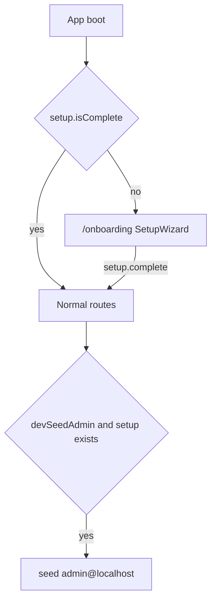

# First-run onboarding (`@nexus/setup`)

Branch: `onboarding` (already created). Wizard is **one-shot**. Editing company/logo later is a future settings page, not this branch.

## Settings: JSONC then JSON

Meteor only reads JSON. Author [`apps/nexus-govrn/settings.jsonc`](apps/nexus-govrn/settings.jsonc) (comments allowed). A small Node script strips comments and writes [`apps/nexus-govrn/settings.json`](apps/nexus-govrn/settings.json).

- Script: [`apps/nexus-govrn/scripts/build-settings.mjs`](apps/nexus-govrn/scripts/build-settings.mjs) (no extra npm dep: strip `//` and `/* */` outside strings).
- Scripts in [`apps/nexus-govrn/package.json`](apps/nexus-govrn/package.json):
  - `settings:build` → generate `settings.json`
  - `start` → `settings:build` then `meteor run --settings settings.json`
- Commit **`.jsonc`**. Gitignore **`settings.json`** (generated; later secrets belong here).
- Local `.jsonc` sets `public.devSeedAdmin: true` with a comment that production must omit or set `false`.

`Meteor.settings.public` is for flags (and later license URL). **Company fields do not live in settings.**

Docker build does not pass `--settings` today; leave that as a follow-up (env / secret file). Local `meteor run` uses the script.

## Singleton: `nexus_setup`

New workspace package [`packages/setup`](packages/setup) → `@nexus/setup`. Same rules as files/lists: no `meteor/*`, inject APIs, `*Async` only.

Fixed collection **`nexus_setup`**. One document, `_id: 'current'`.

```javascript
{
  _id: 'current',
  companyName,           // required
  legalName,             // optional
  website, phone, email, // optional
  address: { line1, line2, city, region, postalCode, country },
  logoDataUrl,           // optional image data URL
  iconDataUrl,           // optional image data URL (favicon / app-bar)
  installedAt,           // Date, set once on complete
  meteorRelease,         // Meteor.release
  nodeVersion,           // process.version (server)
  firstAdminUserId,
  createdAt,
  updatedAt,
}
```

Never store the admin password on this document.

**Methods**

| Method | Who | Behavior |
|--------|-----|----------|
| `setup.complete` | Anyone, **only if no document** | Validate payload, create password user, `createRoleAsync` `superadmin`/`admin`, `addUsersToRolesAsync`, `insertAsync` singleton, return `{ ok: true }`. Second call throws `setup-already-complete`. |
| `setup.isComplete` | Anyone | `{ complete: boolean }` |

**Publications**

- `setup.public` — no login required. Projects **only** `companyName`, `logoDataUrl`, `iconDataUrl`. Used on login/app bar after install.
- Address, system info, `firstAdminUserId` stay off DDP for now (server + complete payload only).

Client writes denied. Unique/fixed `_id` is the singleton.

Inject `{ Meteor, Mongo, check, Match, Roles, Accounts }`. Creating the user uses the same `createUser` / `createUserAsync` fallback as [`demoAdmin.js`](apps/nexus-govrn/imports/api/demoAdmin.js) (Rspack often lacks `createUserAsync`).

`Applog.registerCollection({ name: 'nexus_setup', collection: Setup.collection })` after register.

Logo/icon: **data URLs** (not GridFS). Method rejects non-image prefixes and payloads over **400 KB** (logo) / **100 KB** (icon). UI reads `File` via `FileReader.readAsDataURL`.

## Shared wizard ([`packages/ui`](packages/ui))

`SetupWizard` — `v-stepper-vertical` (Vuetify 4). Peer `@nexus/setup`. Core i18n `setup.*` (en/fr/ar). No `meteor/*` in the SFC; calls `Setup.complete` / `Setup.isComplete`.

Steps:

1. **Company** — name (required), legal name, website, phone, email
2. **Address** — line1, line2, city, region, postal, country
3. **Branding** — logo + icon file inputs → data URLs, preview
4. **First admin** — display name, email, password, confirm
5. **Review** — summary, submit

On success: `Meteor.loginWithPassword` (same fallback as Auth.vue), then `emit('completed')`. Errors (`setup-already-complete`, validation) shown on the review step.

## GovRN gate

- [`nexusSetup.js`](apps/nexus-govrn/imports/api/nexusSetup.js) + `file:` dep + Rspack alias; register on client/server **before** applog.
- Route **`/onboarding`**, new layout `setup` (app bar + **wide** container — Auth layout’s 480px is too narrow). No drawer.
- Router `beforeEach`: wait for `setup.isComplete` (or a small reactive helper). If not complete and path ≠ `/onboarding` → `/onboarding`. If complete and path is `/onboarding` → `/`.
- [`seedDemoAdmin`](apps/nexus-govrn/imports/api/demoAdmin.js) runs **only when** `Meteor.settings.public.devSeedAdmin === true` **and** `nexus_setup` already exists. Fresh installs go through the wizard; `/lists-test` still works after that in local JSONC.
- After complete, app bar / sign-in can show `companyName` + icon from `setup.public` (optional small glue this branch: title fallback stays `t('brand')` if empty).



## Docs / out of scope

- [`packages/setup/README.md`](packages/setup/README.md) Contents TOC; mention in root README / PNPM.md.
- No new tests unless you ask. Do not grow TESTING.md beyond a one-line `/onboarding` note.
- Out of scope: re-open wizard, Collection2, license server, Docker `--settings`, GridFS for logo, `/risks/setup/*`.
