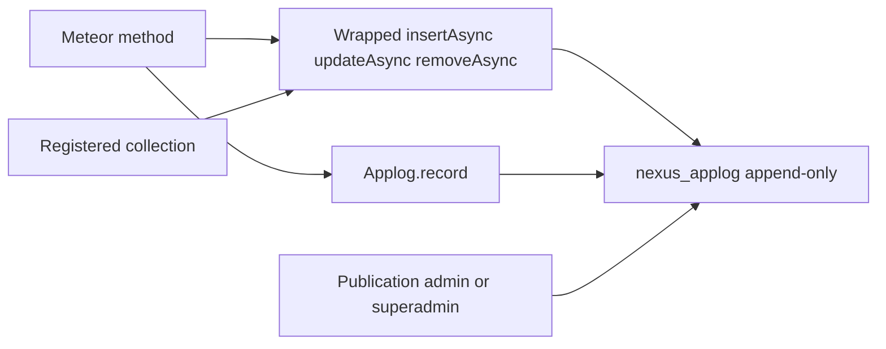

# Application audit log (`@nexus/applog`)

Branch `applog` already exists (working tree may still show an unrelated `.meteor/versions` touch — do not mix it in).

## What we agreed

- **This branch is audit only.** OpenReplay / PostHog stays a later GovRN drop-in, not part of this package.
- **Capture both ways:** wrap `insertAsync` / `updateAsync` / `removeAsync` on collections you register, and expose `Applog.record()` for domain events (login, export, approve, role change).
- **Payload:** field-level diff on update; create stores the new document; remove stores the last document. Configured keys are redacted (`password`, `token`, `services`, …).
- **Integrity:** append-only (no update/remove on the audit collection). Publication only if the caller is in `superadmin` or `admin`. No audit UI on this branch.
- **Tests:** do not add any unless you later ask ([`.cursor/rules/testing.mdc`](.cursor/rules/testing.mdc)).

## Why the old Applog was weak

[`Applog.js`](c:\DATA\projects\archive\nxgen-govrn\imports\api\Applog.js) + [`Log.js`](c:\DATA\projects\archive\nxgen-govrn\imports\api\utils\Log.js):

- Every method had to remember `Log.info()` — most calls were later commented out.
- `type` was info/error/warning, not create/update/remove. `code` like `PROFILCMS01` was opaque.
- `docOwner` was the writer, not a distinct actor. Full `docData` snapshots leaked size and secrets.
- A logging failure threw and could fail the business write.
- Collection2/SimpleSchema and `meteor/*` imports — cannot live in a `packages/*` npm package.

`meteor/logging` stays what it is: server console. This package is **who changed which document when**.

## Package shape (same injection model as `@nexus/files`)

New workspace member [`packages/applog`](packages/applog) → `@nexus/applog`. No `meteor/*` imports. The app calls `Applog.registerWithMeteor({ Meteor, Mongo, check, Match, Roles })` once (same pattern as [`packages/files/src/register.js`](packages/files/src/register.js)).

Fixed collection name: **`nexus_applog`** (opinionated like `nexus_files`).



### Public API

```javascript
Applog.registerWithMeteor(apis)
Applog.registerCollection({
  name: 'risks',
  collection: Risks,
  redactKeys: ['secretNote'],
})
Applog.record({
  action: 'export',
  collection: 'risks',
  docId,
  document: snapshot, // optional, redacted
})
Applog.subscribeRecent() // client helper, publication gated
```

`registerCollection` wraps the collection’s async write methods (and sync aliases if present). After a successful write, it inserts one audit row. **A failed audit insert is logged to the console and must not throw** — the business write already succeeded.

Actor: `Meteor.userId()` in the method. If missing (anonymous file upload, startup seed), store `actorId: null` and `actorKind: 'anonymous' | 'system'`.

### Document shape

```javascript
{
  createdAt,          // Date, server
  actorId,            // String | null
  actorKind,          // 'user' | 'anonymous' | 'system'
  action,             // 'create' | 'update' | 'remove' | custom
  collection,         // registered name
  docId,
  fields,             // [{ key, before, after }] — update only, changed keys
  document,           // redacted create (new) or remove (last); omit on update
}
```

Redact: deep-strip keys from a package default list (`password`, `bcrypt`, `token`, `services`, `resume`) plus per-collection `redactKeys`. Never store `$`-operator blobs raw; compute a plain before/after map from `findOneAsync` + the modifier.

Indexes on startup: `{ collection: 1, docId: 1, createdAt: -1 }`, `{ actorId: 1, createdAt: -1 }`, `{ createdAt: -1 }`.

Deny all client inserts/updates/removes. Do not expose `update`/`remove` helpers.

### Publication

`applog.recent` (limit + optional `collection` / `docId` filter). Allow only `Roles.userIsInRoleAsync(userId, ['superadmin', 'admin'])`. GovRN does not create those roles yet — the pub stays empty until they exist. That is correct.

## GovRN wiring (minimal, so the package is live)

- Add `@nexus/applog` as `file:../../packages/applog` next to files.
- [`apps/nexus-govrn/server/main.js`](apps/nexus-govrn/server/main.js) / a small `imports/api/nexusApplog.js`: `registerWithMeteor`, then `registerCollection` for `nexus_files` (and optionally `files_demo_parents`) so `/files-test` uploads already produce audit rows.
- Client: register without server-only APIs (same split as files). No UI.

Rspack will need `resolve.alias['@nexus/applog']` if junction resolution fails the same way files did ([`apps/nexus-govrn/rspack.config.js`](apps/nexus-govrn/rspack.config.js)).

## Docs

Short [`packages/applog/README.md`](packages/applog/README.md) (Contents TOC) + a few lines in the root README / PNPM.md listing the new package. Do not expand [`TESTING.md`](TESTING.md) with a test suite.

## OpenReplay (not this branch)

Later, in GovRN only: `Meteor.startup` + SDK, env `OPENREPLAY_PROJECT_KEY` / ingest URL, mask inputs, identify `Meteor.userId()`. Self-host or cloud is an ops choice. It must not write to `nexus_applog`.

## What this branch will not do

- OpenReplay / PostHog SDK or Docker service
- Audit UI / Vuetify table
- Retention deletes (append-only forever in v1)
- Collection2 / SimpleSchema
- Tests (until you ask)
- Changing [`TESTING.md`](TESTING.md) protocol beyond mentioning the package if the root README lists it
