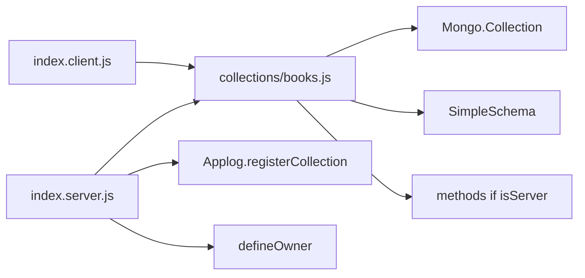

# Books as cloneable sub-app boilerplate

**First action when you approve:** commit and push the current working Books tree on `model` (that did not happen — Plan mode started before the commit). Then change Books in place as the workbench.

## What we keep from today

- Named views, `/books/:id`, `NModal` / `NRemoveIcon`, `@nexus/files` owners, `books.category` lists, `useUserRole`, drawer catalog in [imports/ui/nav.js](apps/nexus-govrn/imports/ui/nav.js).
- Vue `v-if` is display only. Methods still login + role + `$set` of known fields. No client Mongo modifiers.
- Export `import { Books } from '…/collection…'` (or from the one collection file). That is the right Vue import. `import { collection as Books }` is the same idea; named `Books` is clearer when Controls has several collections.

## What we will not bring back from archive

- **`methodsFactory` / `publicationsFactory`.** Archive [Bookshelf.js](c:/DATA/projects/archive/nxgen-govrn/imports/ux/app/microapp/Bookshelf/Api/Bookshelf.js) hid insert/update/remove behind a factory. That is what made cloning *look* cheap and reading *hard*. Methods stay written out. Constants + snippets replace the factory.
- **Collection2 `attachSchema`.** Auto-validate on `insertAsync` sits under Applog’s wrap and hides the failure. You chose **SimpleSchema only**: `clean` + `validate` inside the method, then write.

SimpleSchema is the one extra Atmosphere package that earns its keep: one field contract, one error object the form can show.

## Clone unit: one file per collection

Archive’s numbered table of contents was the readable part. Meteor import split is the constraint: client must get the collection, must **not** run `Meteor.publish`.

One file, two entry points:

```js
// imports/apps/Books/collections/books.js
const collectionName = 'books'

export const Books = new Mongo.Collection(collectionName)
export const bookSchema = new SimpleSchema({ /* fields */ })

denyClientWrites(Books)

if (Meteor.isServer) {
  Meteor.methods({
    async [`${collectionName}.insert`](params) { /* … */ },
    async [`${collectionName}.update`](params) { /* … */ },
    async [`${collectionName}.remove`](params) { /* … */ },
  })
  Meteor.publish(`${collectionName}.list`, function () { /* … */ })
  Meteor.publish(`${collectionName}.one`, function (id) { /* … */ })
}
```

- [index.client.js](apps/nexus-govrn/imports/apps/Books/index.client.js) imports `./collections/books.js` (Minimongo + schema).
- [index.server.js](apps/nexus-govrn/imports/apps/Books/index.server.js) imports the **same** file (methods + pubs register once on the server), then Applog, file owners, roles, indexes.

Controls later: add `collections/frameworks.js`, `collections/controlAreas.js`, import both from the two index files. No `registerBookMethods` names to rewrite.

Top-of-file constants (snippet placeholders, same idea as archive `collectionName` / `apiCode`):

- `collectionName` — Mongo name and DDP prefix (`books.insert`)
- `rolePrefix` — `books.create` / `.update` / `.remove` (or derive from `collectionName`)
- optional short `apiCode` only if you still want coded log ids; Applog already records collection + action

A `.vscode` snippet (from [jssnips.code-snippets](c:/DATA/projects/archive/nxgen-govrn/.vscode/jssnips.code-snippets), without the factory) tab-stops `$1` collectionName, `$2` schema fields.

Delete the current split that exists only to say “Book” in the function name: [server/methods.js](apps/nexus-govrn/imports/apps/Books/server/methods.js), [server/publications.js](apps/nexus-govrn/imports/apps/Books/server/publications.js), [collection.js](apps/nexus-govrn/imports/apps/Books/collection.js). Keep small dedicated files that are **not** per-collection clones: `server/files.js`, `server/roles.js`, `server/indexes.js` (or indexes at the bottom of the collection file).



## Method body (repeat this, do not factory it)

Shared helpers live in the **app**, not `@nexus/ui` (no `meteor/*` there): [apps/nexus-govrn/imports/api/methodHelpers.js](apps/nexus-govrn/imports/api/methodHelpers.js).

- `requireLoggedIn(userId)`
- `requireRole(userId, role)` — generic error, optional message override
- `validateDocument(schema, params)` — `schema.clean(params)` then `schema.validate`; on failure throw `Meteor.Error` with SimpleSchema’s message (what the form already reads as `error.reason`)

Method sketch (the human-visible part after a clone):

```js
async [`${collectionName}.insert`](params) {
  const userId = requireLoggedIn(this.userId)
  await requireRole(userId, `${collectionName}.create`)
  const doc = validateDocument(bookSchema, params)
  return Books.insertAsync({ ...doc, createdAt: new Date(), createdBy: userId, updatedAt: new Date() })
}
```

`createdAt` / `createdBy` stay server-set (schema `optional` + autoValue, or stripped from client params). Still `$set` only schema keys on update — not a caller-supplied modifier.

## Form

Replace the per-field refs in [FrmBook.vue](apps/nexus-govrn/imports/apps/Books/forms/FrmBook.vue) with one `reactive` document:

```js
const emptyBook = () => ({ title: '', description: '', /* … */ category: null })
const form = reactive(emptyBook())

function applyBook(book) {
  Object.assign(form, emptyBook(), book ? pickFormFields(book) : {})
}
```

`v-model="form.title"`. Payload is `{ ...form }`. Same `error.reason` path now carries SimpleSchema messages.

## Scaffold after this pass

Unchanged idea, fewer names:

- Server: `import { registerBooks } from '…/index.server.js'` then `registerBooks()`
- Client: `import { registerBooksClient } from '…/index.client.js'` then `registerBooksClient()`
- Routes, i18n, [nav.js](apps/nexus-govrn/imports/ui/nav.js) row

`registerBooks` / `registerBooksClient` stay as the **sub-app** names (one line to rename). Inside, they only import collection files.

## Out of scope

- No Collection2
- No methodsFactory
- No mocha/Playwright unless you ask
- Snippet file can land in `.vscode/` in the same change as the collection file template
