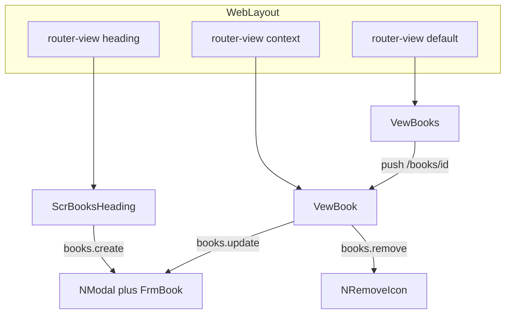

# Books sub-app structure

Replace the incomplete stub at [apps/nexus-govrn/imports/apps/Books/server/Books.js](apps/nexus-govrn/imports/apps/Books/server/Books.js) with a readable, copy-pasteable Books sub-app. Prefer repetition over factories. Keep `Scr*` / `Vew*` / `Frm*` prefixes. You will execute this; this file is the reviewable end state.

## Principles

- One sub-app is one folder under `imports/apps/<Name>/`. A colleague should understand the feature from that folder alone.
- Repeat named files (collection, methods, publications, roles). Do not add `methodsFactory` / `publicationsFactory` / Collection2.
- Security lives next to the collection. Vue `v-if` is **display only**.
- Reusable widgets that are not domain-specific live in `@nexus/ui` (`N` prefix). A thin role-check composable may be shared at the app level.
- Three scaffold imports in the Meteor app (server, routes, i18n) plus one nav row.

## Prerequisite: authenticated file HTTP

Today [packages/files/src/http.js](packages/files/src/http.js) returns 401 unless `allowAnonymous` is true. Covers and PDFs will not render.

Do **not** set `allowAnonymous: true` on Books.

Add a named helper in `@nexus/files` (e.g. `userIdFromRequest`):

- Read `meteor_login_token` from the cookie
- SHA-256 hash, look up `Meteor.users` resume token
- No user → 401; missing `roles.download` → 403; else stream as today

Update [packages/files/README.md](packages/files/README.md) and existing HTTP tests. This is infrastructure, not a Books hook.

## Shared UI widgets (`@nexus/ui`)

No SweetAlert. Vuetify 4 only. Follow [N prefix](.cursor/rules/nexus-ui-components.mdc). No `meteor/*` inside these SFCs (same rule as `NSetupWizard`).

### NModal

Vuetify `v-dialog` equivalent of archive `SModalButton` ([SModalButton.vue](c:/DATA/projects/archive/nxgen-govrn/imports/ux/components/Modals/SModalButton.vue)): title, close, default slot for a form, optional activator slot.

```vue
<n-modal v-model="formOpen" :title="t('books.add')">
  <frm-book is-modal @close="formOpen = false" @saved="onSaved" />
</n-modal>
```

Expose `open` / `close` via `defineExpose` so a heading button or a parent ref can open it (BIA pattern). Width via a `max-width` prop (default ~720).

### NRemoveIcon

Icon button (`mdi-delete-outline`, `color="error"`) plus a confirm `v-dialog` (title, message, Cancel, Confirm `color="error"`). Emit `confirm`. No third-party alert library.

```vue
<n-remove-icon
  v-if="canRemove"
  :title="t('books.removeTitle')"
  :text="t('books.removeConfirm', { title: book.title })"
  @confirm="removeBook"
/>
```

Add core i18n keys under `ui.modal.*` / `ui.remove.*` in [packages/ui/src/i18n/locales/en.js](packages/ui/src/i18n/locales/en.js) (and fr/ar). Export from [packages/ui/src/index.js](packages/ui/src/index.js). Update [packages/ui/README.md](packages/ui/README.md) and [PACKAGES.md](PACKAGES.md). Do not refactor `NListItemsEditor` in this pass (it already has its own confirm dialog).

## Role visibility (`useUserRole`)

Vue hides buttons; methods still enforce roles.

`@nexus/ui` must not import `meteor/*`. Put a small composable in the **app**: [apps/nexus-govrn/imports/ui/useUserRole.js](apps/nexus-govrn/imports/ui/useUserRole.js).

- Input: one role string or an array (OR)
- Reactive to `Meteor.userId()` and role changes
- Uses `Roles.userIsInRoleAsync`
- Returns a boolean ref, e.g. `canCreate`

Books (and later Risks) import `/imports/ui/useUserRole.js`. That is the allowed reuse — one named helper, not a factory.

In Books:

- `books.create` → New button in the heading
- `books.update` → pencil on the selected row / context
- `books.remove` → `NRemoveIcon` (`color="error"`)
- `superadmin` or `admin` → Categories button (lists package write roles)

## Layout: named router views (not a Screen wrapper)

[WebLayout.vue](apps/nexus-govrn/imports/ui/layouts/WebLayout.vue) already hosts three outlets:

- `heading` — page title + actions (`.app-page-heading`)
- `default` — main register
- `context` — aside when the route defines `components.context` (`.app-workspace--context`)

`/submissions` is the **layout** template ([router.js](apps/nexus-govrn/imports/ui/router.js) lines 63–71): `heading` + `default` + `context`. Do **not** copy its `?submission=` selection — that is a static preview, not a product convention.

Create/update uses `NModal` + `FrmBook` (archive BIA: [ScrBIAAssets.vue](c:/DATA/projects/archive/nxgen-govrn/imports/ux/app/microapp/BIA/Screens/ScrBIAAssets.vue)). The selected document is a path param (`/books/:id`); the context pane reads `route.params.id`. No `/books/new` or `/books/:id/edit` full-page screens.



## Folder end state

Delete `apps/nexus-govrn/imports/apps/Books/server/Books.js`. Do not recreate empty legacy folders (`Blocks`, `Dashboard`, `Reports`).

```
imports/apps/Books/
  README.md
  collection.js
  index.server.js
  index.client.js
  server/
    methods.js
    publications.js
    indexes.js
    roles.js
    files.js
  client/
    routes.js
    i18n.js
    nav.js
  screens/
    ScrBooksHeading.vue
    ScrBookCategoriesHeading.vue
  views/
    VewBooks.vue
    VewBook.vue
    VewBookCategories.vue
  forms/
    FrmBook.vue
```

`collection.js` stays at the sub-app root so client Minimongo exists. Methods and publications stay server-only.

No `ScrBookAdd` / `ScrBookUpdate` / `ScrBook` full-page screens.

## Routes

Path params, not query strings. A colleague should see `/books/abc123` and know which document is open. `route.params.id` is the only selection API.

Do **not** use a global `/:category/:linkDocId` catch-all — it collides with `/signin`, `/onboarding`, `/governance`, and hides the sub-app name. Do **not** put the list field `category` in the URL (that is a filter on the document, not a route). Do **not** keep the legacy name `linkDocId`; every sub-app uses `:id`.

Declare **static paths first** so `categories` is never captured as an id:

```js
export const bookRoutes = [
  {
    path: '/books/categories',
    name: 'bookCategories',
    components: {
      heading: ScrBookCategoriesHeading,
      default: VewBookCategories,
    },
    meta: { layout: 'web' },
  },
  {
    path: '/books/:id?',
    name: 'books',
    components: {
      heading: ScrBooksHeading,
      default: VewBooks,
      context: VewBook,
    },
    meta: { layout: 'web' },
  },
]
```

- `/books` — list, empty context (`params.id` missing)
- `/books/:id` — same three named views; `VewBook` subscribes `books.one` with `route.params.id`
- `/books/categories` — heading + default, **no** context

Row click: `router.push({ name: 'books', params: { id: row._id } })`. After create, close the modal and push `/books/<newId>`. After remove, push `/books`. Highlight the selected row when `route.params.id === row._id`.

Copy to Risks later: `/risks`, `/risks/:id`, `/risks/categories` — same param name `id`.

`/books` named views:

- `heading`: `ScrBooksHeading` — title, short text, New (`books.create` opens `NModal` + `FrmBook`), Categories link to `{ name: 'bookCategories' }` (`superadmin`/`admin`)
- `default`: `VewBooks` — table/cards, cover thumb
- `context`: `VewBook` — selected book (cover, fields, category label, Open PDF); pencil if `books.update`; `NRemoveIcon` if `books.remove`

`/books/categories`:

- `heading`: `ScrBookCategoriesHeading`
- `default`: `VewBookCategories` wrapping `NListItemsEditor` `list-key="books.category"`

## Two file owner types (same parent)

`@nexus/files` keys files by `{ ownerType, ownerId }`. `NFileReplace` shows the first file for that pair. Cover and PDF would collide on a single `books` type.

Register the same `Books` collection twice in `server/files.js`, both `allowAnonymous: false`, both using `files.books.upload` / `.download` / `.remove`:

- `bookCover` — `NFileReplace` image (square is fine for a cover)
- `bookPdf` — `NFileReplace` document, accept `application/pdf`

Parent must exist before upload: insert the book first. Then either keep the modal open for uploads, or close it and let the context pane own `NFileReplace` for writers (and a read-only cover / Open PDF for everyone else). Prefer **context owns files** so create stays a short metadata save.

## Document and DDP contract

No SimpleSchema. Comment block at the top of `methods.js`.

Fields on `books`: `title` (required), `description`, `author`, `aboutAuthor`, `publisher`, `publishedOn` (`NDatePicker`), `language` (plain text or a tiny hardcoded select — **not** a list), `category` (`code` from `listKey: 'books.category'`), `createdAt`, `updatedAt`, `createdBy`. Cover and PDF are **not** book fields.

Methods (`check` / `Match`, login, named role, then `$set` of known fields only):

- `books.insert` → `books.create`
- `books.update` → `books.update`
- `books.remove` → `books.remove`, then `Files.remove` for that book’s cover + PDF

Publications (any signed-in user; anonymous → `this.ready()`):

- `books.list` — drives `VewBooks`
- `books.one` — drives `VewBook` from `route.params.id`

## Roles (server)

- `books.create` / `books.update` / `books.remove` — grant to `superadmin` and `admin`
- `files.books.upload` / `files.books.remove` — same writers
- `files.books.download` and `books.reader` — every signed-in user

`server/roles.js`: `createRoleAsync` for each string; grant writers to existing `superadmin`/`admin`; grant download + reader to all users on startup and on login/create.

Lists stay on the package contract: `lists.insert` / `update` / `remove` already allow `superadmin` **or** `admin`. No Books-only list API.

## Package wiring (inside the sub-app)

- **Files:** `Files.defineOwner` ×2 in `Books/server/files.js` after `registerNexusFiles()` in [server/main.js](apps/nexus-govrn/server/main.js)
- **Lists:** `listKey: 'books.category'`. `FrmBook` uses `NListSelect`
- **Applog:** `Applog.registerCollection({ name: 'books', collection: Books })` in `registerBooks()`, not in [nexusApplog.js](apps/nexus-govrn/imports/api/nexusApplog.js)

## Scaffold (four copy-paste lines)

After the four `registerNexus*` calls in [server/main.js](apps/nexus-govrn/server/main.js):

```js
import { registerBooks } from '/imports/apps/Books/index.server.js'
registerBooks()
```

After the four `registerNexus*` calls in [imports/ui/main.js](apps/nexus-govrn/imports/ui/main.js):

```js
import { registerBooksClient } from '/imports/apps/Books/index.client.js'
registerBooksClient()
```

`registerBooksClient()` only imports `collection.js`.

[router.js](apps/nexus-govrn/imports/ui/router.js): `import { bookRoutes } from '/imports/apps/Books/client/routes.js'` then `...bookRoutes`. Each Books route uses `components: { heading, default, context? }` like `/submissions`, not a single `component`.

[i18n/index.js](apps/nexus-govrn/imports/ui/i18n/index.js): merge `bookMessages.en` / `.fr` / `.ar`.

[WebLayout.vue](apps/nexus-govrn/imports/ui/layouts/WebLayout.vue): one nav row from `client/nav.js` (`books`, Books, `mdi-book-open-page-variant-outline`, `/books`). No nav factory.

Copy Books → Risks later by copying the folder, renaming strings, and repeating these four lines. VS Code snippets wait until this template exists.

## Out of scope

- No `Api/` folder imported on both sides
- No Collection2 / aldeed schema on `books`
- No mocha/Playwright unless you ask later
- Do not change `@nexus/lists` to superadmin-only
- Do not add SweetAlert or Headless UI
- Do not import `meteor/*` from `@nexus/ui`

## Execution order

1. Authenticated `GET /nexus-files/:fileId` in `@nexus/files` + README/tests
2. `NModal` + `NRemoveIcon` in `@nexus/ui` (exports, locales, docs)
3. `useUserRole` in `imports/ui/useUserRole.js`
4. `collection.js` + deny + methods + publications + indexes
5. `server/files.js` + `server/roles.js` + applog in `index.server.js`
6. Wire `registerBooks()` / `registerBooksClient()`
7. Heading, views, `FrmBook` in `NModal`, categories route, role-gated actions
8. `client/routes.js` (static `/books/categories` first, then `/books/:id?`), `i18n.js`, `nav.js` + scaffold edits
9. Books `README.md` (Contents, tree, roles, named views, `/books/:id`, `books.category`, four integration lines)
