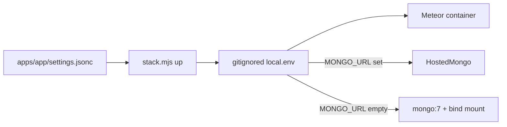

# Docker runtime settings and persistence

## What is possible (and what is not)

- **Possible:** Meteor already reads `MONGO_URL`, `ROOT_URL`, `PORT`, `MAIL_URL`, and `METEOR_SETTINGS` from the process environment. Twilio is ordinary `process.env` once the app uses it. Compose can skip the local Mongo service when `MONGO_URL` is set. A host bind mount (`MONGO_DATA_DIR`) makes local/DigitalOcean Block Storage data a normal folder.
- **Not possible / not allowed:** Baking `settings.json` or secrets into [`docker/Dockerfile`](docker/Dockerfile). Committing live keys the way [`ecosystemprd.config.js`](c:\DATA\projects\archive\nxgen-govrn\ecosystemprd.config.js) did (those SendGrid/Twilio values should be treated as leaked and rotated). Using DigitalOcean **Spaces** as Mongo’s data directory — Spaces is object storage, not a filesystem for WiredTiger. Atlas **replaces** the `mongo` container; it does not sit beside it.
- **This change is plumbing only.** No Twilio SMS or SMTP product code. The container will receive the variables; GovRN can use them later.

Tradeoff of your `METEOR_SETTINGS=` choice: one string is simple and matches Meteor, but `.env` quoting and `$` in JSON are easy to break. [`docker/stack.mjs`](docker/stack.mjs) will write that line so humans do not minify by hand.

## End state

| Concern | End state |
|---------|-----------|
| Image | Unchanged: no settings or secrets copied in |
| Meteor settings | Host builds minified JSON from `settings.jsonc`; `METEOR_SETTINGS` is set on the meteor service |
| Secrets / relays | `MAIL_URL`, `TWILIO_*`, optional `MONGO_URL` in a **gitignored** overlay |
| Local Mongo | Started only when `MONGO_URL` is unset; data at `MONGO_DATA_DIR` (bind mount) |
| Hosted Mongo | `MONGO_URL` set → no `mongo` / `mongo-init` / volume |
| Production disk | Same bind path on a droplet (`/mnt/mongo/...`) or omit local Mongo and use Atlas |

Keep committed [`docker/apps/nexus-govrn.env`](docker/apps/nexus-govrn.env) for public stack keys (`APP_NAME`, ports, `ROOT_URL`, `MONGO_DB`, default `MONGO_DATA_DIR`). Put `METEOR_SETTINGS` and secrets in `docker/apps/<app>.local.env` (gitignored). That is one file you edit for environment-specific values; mixing them into the committed file would either leak secrets or force the whole env file out of git.

## Implementation

### 1. Generate `METEOR_SETTINGS` on `docker:up` / `docker:build`

- Reuse [`scripts/build-settings.mjs`](scripts/build-settings.mjs) (or its `stripJsonc`) from [`docker/stack.mjs`](docker/stack.mjs).
- Write/replace a single `METEOR_SETTINGS=...` line in `docker/apps/<app>.local.env` without wiping other keys. Value is compact JSON, quoted safely for Docker `env_file` (no Compose interpolation on `env_file`).
- Create the local file from [`docker/apps/nexus-govrn.local.env.example`](docker/apps/nexus-govrn.local.env.example) on first run if missing.
- Fail `up` if production-like `ROOT_URL` is https and `settings.public.devSeedAdmin` is true.

### 2. Compose: env + dual Mongo

Update [`docker/docker-compose.yml`](docker/docker-compose.yml):

- `meteor.env_file`: committed `.env` plus `apps/${APP_NAME}.local.env` (optional file handled by the runner if missing).
- Pass through `METEOR_SETTINGS`, `MAIL_URL`, `TWILIO_ACCOUNT_SID`, `TWILIO_AUTH_TOKEN`, `TWILIO_NUMBER`, and any extra keys already in the local file.
- `MONGO_URL`: `${MONGO_URL:-mongodb://mongo:27017/${MONGO_DB}?replicaSet=rs0}`.
- Put `mongo` and `mongo-init` on Compose profile `local-mongo`.
- Bind `mongo` data: `${MONGO_DATA_DIR}:/data/db` (default e.g. `docker/data/${APP_NAME}/mongo`, gitignored).
- `stack.mjs`: if `MONGO_URL` is empty, add `--profile local-mongo` and keep `depends_on` mongo; if set, start only meteor+nginx (no local replica). Meteor must not `depends_on` mongo when Atlas is used — the runner selects the compose args / an override file so Atlas up does not wait on `mongo`.

### 3. Ignore rules and docs

- [`.gitignore`](.gitignore): `docker/apps/*.local.env`, `docker/data/`.
- [`docker/README.md`](docker/README.md) and [`SECURITY.md`](SECURITY.md): settings injection, dual Mongo, bind-mount vs Atlas vs Spaces, `devSeedAdmin` must be false in production, never commit the PM2-style secret file.
- Committed example lists empty `MAIL_URL` / `TWILIO_*` / `MONGO_URL` / `MONGO_DATA_DIR` with comments.

### 4. Out of scope

- Implementing email or SMS sending in GovRN.
- Baking settings into the image.
- Kubernetes / DO App Platform rewrite.
- Changing Penpot volumes.

## Verify

- `docker:up` with empty `MONGO_URL`: local mongo starts, data appears under `MONGO_DATA_DIR`, `Meteor.settings.public` matches jsonc (e.g. `devSeedAdmin`).
- Set a dummy/hosted `MONGO_URL`: `mongo` containers do not start; meteor receives that URL.
- Confirm `METEOR_SETTINGS` and Twilio placeholders are present in the meteor container env (`docker exec … printenv` without printing secret values into docs/logs).
- Confirm `*.local.env` and `docker/data/` are not staged by git.