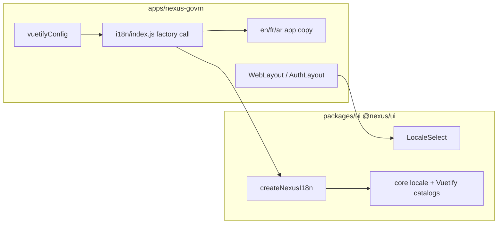

# Externalise LocaleSelect into `@nexus/ui`

Branch `externalise-components` is already checked out from `main`.

## Goals

- Shared Vue components live in one package every product app can import.
- Iterate in this monorepo now; publish to npm later **without changing import paths**.
- First extract: `LocaleSelect` + the i18n bootstrap it needs (EN/FR/AR, Vuetify `$vuetify` catalogs, persist/RTL helpers).
- **Out of scope:** layouts, Vuetify theme/defaults, cloning a second app.

## Why a factory, not a singleton

[`LocaleSelect.vue`](apps/nexus-govrn/imports/ui/components/LocaleSelect.vue) today imports [`../i18n/index.js`](apps/nexus-govrn/imports/ui/i18n/index.js), which creates one `i18n` instance and hard-codes `nexus-govrn-locale` plus GovRN copy.

The package must not own per-product strings or a module-level singleton. The app creates the instance and merges its own messages:

```js
import { createNexusI18n } from '@nexus/ui'
import en from './en.js'
import fr from './fr.js'
import ar from './ar.js'

export const i18n = createNexusI18n({
  storageKey: 'nexus-govrn-locale',
  messages: { en, fr, ar },
})
```

`createNexusI18n` merges **core** keys (`locale.label` / `locale.en` / `fr` / `ar`) and Vuetify `en`/`fr`/`ar` under `$vuetify`. App files drop the `locale` block; they keep `brand`, `nav`, `home`, etc.

`LocaleSelect` uses `useI18n()` plus package helpers (`supportedLocales`, `setAppLocale(i18n, code, storageKey)`). Storage key is injected or passed from `createNexusI18n` so the component never imports an app path.

[`vuetify.config.js`](apps/nexus-govrn/imports/ui/vuetify.config.js) still lives in the app and still does `createVueI18nAdapter({ i18n, useI18n })` against the app-created instance. Themes stay local.



## Package layout (npm-ready)

Do **not** add Meteor apps to npm workspaces. Hoisting fights `meteor npm`. Each app depends via `file:` so the name stays `@nexus/ui` when you later publish.

```text
packages/ui/
  package.json          # name @nexus/ui, version 0.1.0, type module
  src/index.js          # public exports
  src/components/LocaleSelect.vue
  src/i18n/createNexusI18n.js
  src/i18n/locales/{en,fr,ar}.js   # locale picker strings only
  README.md             # Contents + how to consume / later publish
```

[`packages/ui/package.json`](packages/ui/package.json) essentials:

- `"exports": { ".": "./src/index.js" }` — later you can point this at `dist` without changing app imports
- `peerDependencies`: `vue`, `vue-i18n`, `vuetify` (same major ranges as GovRN)
- `"files": ["src"]` so a future `npm publish` ships source; Rspack already compiles `.vue`

## App wiring

In [`apps/nexus-govrn/package.json`](apps/nexus-govrn/package.json):

```json
"@nexus/ui": "file:../../packages/ui"
```

Then `meteor npm install` (updates the app lockfile).

- Delete [`apps/nexus-govrn/imports/ui/components/LocaleSelect.vue`](apps/nexus-govrn/imports/ui/components/LocaleSelect.vue).
- Layouts import `import { LocaleSelect } from '@nexus/ui'`.
- Thin [`imports/ui/i18n/index.js`](apps/nexus-govrn/imports/ui/i18n/index.js): only `createNexusI18n` + app message modules + `export { i18n }`.
- [`rspack.config.js`](apps/nexus-govrn/rspack.config.js): ensure `vue-loader` compiles the linked package (include `node_modules/@nexus/ui` or the `packages/ui` path). Meteor often excludes `node_modules` from Vue rules.

## Docker must copy `packages/`

Today [`docker/Dockerfile`](docker/Dockerfile) only copies `apps/${APP_NAME}`. `meteor npm ci` will fail on `file:../../packages/ui` because that path is missing in the image.

App lives at `/opt/src`, so `file:../../packages/ui` resolves to **`/packages/ui`**. Copy shared packages there **before** `npm ci`:

```dockerfile
COPY packages /packages
COPY apps/${APP_NAME}/package.json apps/${APP_NAME}/package-lock.json $APP_SOURCE_FOLDER/
RUN bash $SCRIPTS_FOLDER/build-app-npm-dependencies.sh
COPY apps/${APP_NAME} $APP_SOURCE_FOLDER/
```

`.dockerignore` already allows `packages/`. Document this in [`docker/README.md`](docker/README.md) (and refresh its Contents). Mention in [`packages/ui/README.md`](packages/ui/README.md) and a one-liner on the root [`README.md`](README.md).

## Verify

- `meteor run`: Language menu still drives vue-i18n + Vuetify FR/AR + RTL; workspace and sign-in still translate.
- Confirm no leftover `$vuetify.app.*` or `../i18n` imports from the package.
- Docker path: file-level Dockerfile + README only unless you ask to rebuild the image on this branch.

## Later (not this branch)

- `npm publish @nexus/ui` and change the app dep from `file:` to a version.
- Next extracts (layouts, theme presets) as optional `@nexus/ui/layouts` exports so ERP vs restaurant themes stay app-local.
