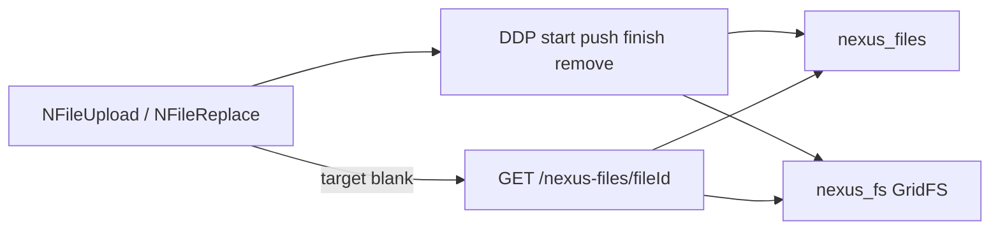

# Plan: file upload UI and GovRN test page

Continue on branch `gridfs`. Do not edit [`.cursor/plans/nexus-files-gridfs.plan.md`](.cursor/plans/nexus-files-gridfs.plan.md). All new code stays **human-readable** ([`.cursor/rules/human-readable-code.mdc`](.cursor/rules/human-readable-code.mdc)).

`@nexus/ui` stays Vue/Vuetify only. It talks to `@nexus/files` (`Files.upload`, `Files.remove`, subscribe, download URL). The app injects Meteor into `@nexus/files` and owns parent documents.

## Package changes `@nexus/files` (needed by the UI)

Anonymous access and new-tab open are not in the package today: methods call `requireLoggedIn` / `requireRole`, and there is no HTTP route.

**`defineOwner`:** add `allowAnonymous: true` (default `false`). Roles strings stay required so flipping the flag later is enough. Demo owner in GovRN sets `allowAnonymous: true`.

When `allowAnonymous` is set:

- Skip login and role checks on start / remove / publish / HTTP GET
- Keep parent-exists, MIME, and size checks
- Bind in-memory sessions to `uploadId` only (anonymous has no `userId`)
- Store `uploadedBy: userId ?? null`

**HTTP download (your choice):** inject optional `WebApp` in `registerWithMeteor` (server only; do **not** import `meteor/*` from the package). Mount `GET /nexus-files/:fileId`, stream GridFS with `Content-Type` from metadata and `Content-Disposition: inline`. New tab = `target="_blank"` to that URL.

Relax `assertRequiredApis` so `MongoInternals` and `WebApp` are required only on the server (client register does not have them).

Add thin helpers on `Files`:

- `Files.remove(fileId)` — `Meteor.callAsync('nexusFiles.remove', { fileId })`
- `Files.downloadUrl(fileId)` — `/nexus-files/${fileId}`
- `Files.subscribeForOwner(ownerType, ownerId)` — wraps the existing publication



## Reorganize [`packages/ui`](packages/ui)

Move from a flat `components/` dump to feature folders. Public imports stay `@nexus/ui`.

```text
packages/ui/src/
  index.js
  i18n/                    # unchanged factory + locale/en|fr|ar
  components/
    locale/NLocaleSelect.vue
    files/NFileUpload.vue
    files/NFileReplace.vue
    files/NFileRow.vue
    files/useOwnerFiles.js
```

- Update [packages/ui/src/index.js](packages/ui/src/index.js) exports
- [packages/ui/package.json](packages/ui/package.json): peer `@nexus/files` and `vue-meteor-tracker` (app already has the tracker)
- Core i18n keys in [packages/ui/src/i18n/locales](packages/ui/src/i18n/locales) (`files.upload`, `files.replace`, `files.open`, `files.remove`, `files.empty`, errors)
- [packages/ui/README.md](packages/ui/README.md): Contents, folder layout, both components, mermaid

GovRN layouts keep `import { NLocaleSelect } from '@nexus/ui'` — only the internal path changes.

## Components

Shared composable `useOwnerFiles({ ownerType, ownerId })`: subscribe, reactive list via `vue-meteor-tracker`, `upload`, `remove`, `downloadUrl`.

**`NFileUpload`** — many files per parent.

- `v-file-input` `multiple`, progress, `NFileRow` list
- Each row: name, size, **Open** (`target="_blank"` + `rel="noopener"`), **Remove**
- Adding files does not delete existing ones

**`NFileReplace`** — one file (avatar / photo).

- Image → `v-avatar` preview from download URL; otherwise show the file name
- On pick: **upload the new file first**, then hard-delete every other file for that owner (keeps the old file if the new upload fails)
- Same open / remove actions

Props (both): `ownerType`, `ownerId`, optional `accept` (defaults to `@nexus/files` allowlist), `disabled`, `label`. No Meteor imports in the SFCs — only the composable + `@nexus/files`.

## GovRN test page

Wire the package (previously out of scope; required to exercise the UI).

1. `"@nexus/files": "file:../../packages/files"` in [apps/nexus-govrn/package.json](apps/nexus-govrn/package.json), then `meteor npm install` in the app
2. [`imports/api/filesDemoParents.js`](apps/nexus-govrn/imports/api/filesDemoParents.js) — collection + seed two parents: `files-demo-many`, `files-demo-one`
3. [`imports/api/nexusFiles.js`](apps/nexus-govrn/imports/api/nexusFiles.js) — `registerWithMeteor` + `defineOwner({ type: 'demo', allowAnonymous: true, ... })`. Import from [server/main.js](apps/nexus-govrn/server/main.js) and [imports/ui/main.js](apps/nexus-govrn/imports/ui/main.js)
4. Page [`imports/ui/FilesTest.vue`](apps/nexus-govrn/imports/ui/FilesTest.vue): two cards — `NFileUpload` on `files-demo-many`, `NFileReplace` on `files-demo-one`
5. Route `/files-test` in [router.js](apps/nexus-govrn/imports/ui/router.js); nav item in [WebLayout.vue](apps/nexus-govrn/imports/ui/layouts/WebLayout.vue)
6. App strings in `imports/ui/i18n/{en,fr,ar}.js` (page title / hints only)

Rspack already compiles `packages/ui` Vue files — no config change.

## Docs

- [packages/files/README.md](packages/files/README.md): `allowAnonymous`, HTTP GET, `Files.remove` / `downloadUrl`
- [packages/ui/README.md](packages/ui/README.md) as above
- One line in root [README.md](README.md) / [PNPM.md](PNPM.md) if the UI section still only mentions NLocaleSelect

## Verify

- Root `pnpm install` still lists `@nexus/ui` and `@nexus/files`; `apps/` is not a workspace member
- No `meteor/*` imports from either npm package
- Browser on `/files-test`: multi upload lists several files; replace swaps the single file and deletes the previous; Open opens a new tab and shows the blob (image/pdf)
- Signed-out still works on the demo owner
- Locale switch still works (NLocaleSelect move)

## Out of scope

- Real accounts / meteor-roles assignment
- Virus scan, Azure adapter, HTTP **upload**
- Wiring files onto real Risks / user profile collections
