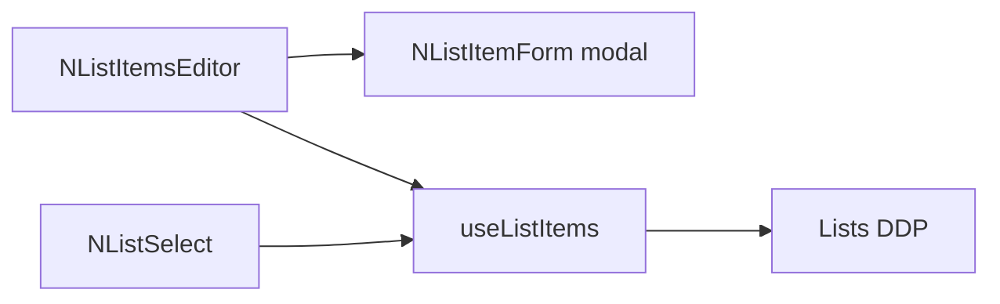

# Lists UI in `@nexus/ui` + GovRN demo

Work on **`main`**. No `/risks/setup/*` routes yet — those later pages will pass `listKey` into the same editor. No v-select tests unless you ask.

## Shared components ([`packages/ui`](packages/ui))

Same pattern as files: no `meteor/*` in SFCs. Talk to [`@nexus/lists`](packages/lists) only. Add `@nexus/lists` as a **peer** (like Vue). Core i18n keys `lists.*` in [`packages/ui/src/i18n/locales`](packages/ui/src/i18n/locales) (en/fr/ar).

**`useListItems({ listKey })`** — copy the subscribe + `find()` + `fetchAsync()` + `observe` approach from [`useOwnerFiles.js`](packages/ui/src/components/files/useOwnerFiles.js):

- `Lists.subscribeForKey(listKey)`
- items from `Lists.collection.find({ listKey })`, client-sorted by `sortOrder`
- `insert` / `update` / `remove` via `Lists.*` (`callAsync`)
- `ready`, `errorMessage`

**`NListItemForm`** — fields only (used inside a dialog):

- `code` (required; **disabled when editing** — immutable)
- `title.en` (required), `title.fr`, `title.ar`
- `sortOrder` (number), `active` (switch)
- No `meta` in v1

**`NListItemsEditor`** — setup page widget. Prop: `listKey`.

- `v-data-table` of that key: code, localized title (`Lists.title` + current locale), sortOrder, active, edit/delete
- Add opens a `v-dialog` with `NListItemForm`
- Edit opens the same dialog with the row
- Delete uses a confirm dialog, then `lists.remove`
- Show method errors (including `not-authorized` / `not-logged-in`)

**`NListSelect`** — capture-form widget. Props: `listKey`, `modelValue` (the **code**), `label`, `disabled`. `v-select` with `item-value="code"`, titles via `Lists.title(item, locale)`. **Active rows only** (inactive stay in Mongo for the editor). Empty when not subscribed / not logged in.

Export all four from [`packages/ui/src/index.js`](packages/ui/src/index.js). Update [`packages/ui/README.md`](packages/ui/README.md) Contents.

## Demo admin (required for real methods)

[`Auth.vue`](apps/nexus-govrn/imports/ui/Auth.vue) is a dummy. `.meteor/packages` has `accounts-passwordless` but **not** `accounts-password`.

- Add `accounts-password`.
- Seed on server startup (idempotent): user `admin@localhost` / `admin`, roles `superadmin` and `admin` (`createRoleAsync` + `addUsersToRolesAsync` inside `Applog.runAsSystem`).
- Wire `/signin` to `Meteor.loginWithPassword` / logout. Document the credentials on the demo page.

Until signed in, `lists.forKey` is empty and writes fail — that is the real contract.

## GovRN demo route

New [`apps/nexus-govrn/imports/ui/ListsTest.vue`](apps/nexus-govrn/imports/ui/ListsTest.vue), route **`/lists-test`**, nav item next to Files test. App i18n `listsTest.*` in en/fr/ar.

One page, two concerns (same idea as Files test):

- **Setup:** two `NListItemsEditor`s — `listKey="demo.category"` and `demo.likelihood` (stands in for `/risks/setup/categories` and `/likelihood`).
- **Capture:** a small card with two `NListSelect`s bound to local refs (`category`, `likelihood`) so changing locale updates labels and `v-model` stays the **code**.

No Mongo seed of list rows. No Risks sub-app.

## Out of scope

- `/risks/setup/*` product routes
- `meta` on the form
- Per-listKey roles
- New Vitest / mocha / Playwright
- Changing [`TESTING.md`](TESTING.md) beyond a one-line mention of `/lists-test` if the nav copy needs it
