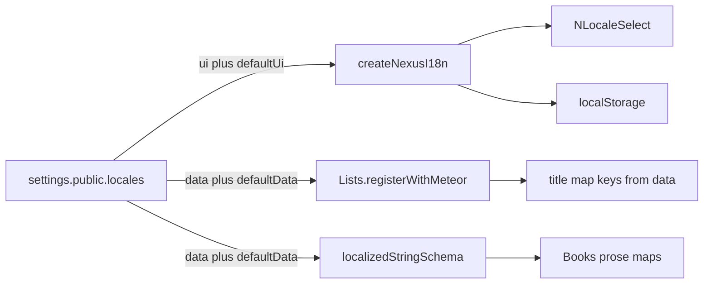

# Locale settings and translatable fields

## Lists today vs after this work

**Today: no.** [`packages/lists/src/methods.js`](packages/lists/src/methods.js) `check` / `buildTitle` / `mergeTitle` only allow `en`, `fr`, `ar`. A payload `title: { en: '…', es: '…' }` fails `check` or drops `es`. [`title(item, locale)`](packages/lists/src/title.js) can *read* any key, but nothing can write `es`. [`NListItemForm.vue`](packages/ui/src/components/lists/NListItemForm.vue) is hardcoded En/Fr/Ar fields.

**After this work: yes.** `data: ['en', 'ar', 'es']` is passed into `Lists.registerWithMeteor`. Insert/update accept exactly those keys, require `title[defaultData]`, drop anything else. The list form renders one title field per **data** locale (label from `locale.es` or `Intl.DisplayNames` / the raw code if we have no pack).

## Challenge (resolved)

- **Do not add `@nexus/locale`.** `@nexus/ui` owns the picker; `@nexus/lists` owns list title maps.
- **Do not put SimpleSchema in packages.** Lists stay on `check` / `Match`.
- **Do not add Pinia.** vue-i18n + `localStorage` (`storageKey`) is the UI locale. Data maps are documents, not the picker.
- **UI locale and data locales are separate.** A client can run chrome in `en/fr/ar/es` and store only `title.en`.
- **`data` is a subset of `ui`.** To persist `es` you must also list `es` under `ui`.
- **Not every string is translatable.** Schema marks which fields use a locale map.



## Settings shape (all four keys mandatory)

[`apps/nexus-govrn/settings.jsonc`](apps/nexus-govrn/settings.jsonc) **must ship this block** so Books and lists can be exercised with three UI languages and three data languages (selector visible, form data-locale switcher has en/fr/ar):

```jsonc
"locales": {
  "defaultUi": "en",
  "ui": ["en", "fr", "ar"],
  "defaultData": "en",
  "data": ["en", "fr", "ar"]
}
```

The normalizer still accepts other valid combinations later (e.g. `ui` plus `es`, `data: ["en"]` only). Those are not the GovRN demo values.

Normalize (app, then pass the result into packages):

- All four keys are mandatory; `ui` and `data` are non-empty string arrays.
- `defaultUi` must be in `ui`. `defaultData` must be in `data`.
- Every `data` code must appear in `ui`. Fail startup if the object is invalid.

**Picker:** every code in `ui`. Hide `NLocaleSelect` when `ui.length < 2`. A stored UI locale not in `ui` falls back to `defaultUi`. Missing UI JSON (e.g. `es`) uses vue-i18n `fallbackLocale = defaultUi` so chrome stays English until we add a pack. Out of scope this branch: writing `es.js` catalogs.

**Data maps:** only keys in `data`. Resolve `map[requested] → map[defaultData] → ''`. Display in `NListSelect` still uses the **UI** locale; if that code is not in `data`, the helper falls back to `defaultData` (your “title.es missing → title.en”).

## `@nexus/ui`

[`createNexusI18n.js`](packages/ui/src/i18n/createNexusI18n.js) accepts the normalized `{ defaultUi, ui, defaultData, data }`, provides it, exports `normalizeLocales`, `resolveLocalized`, `emptyLocalizedMap`. `setAppLocale` only accepts codes in `ui`.

`NListItemForm`: one title field per **`data`** locale; `defaultData` required. Not hardcoded En/Fr/Ar.

## `@nexus/lists`

Pass the same object into [`registerWithMeteor`](packages/lists/src/register.js) from [`nexusLists.js`](apps/nexus-govrn/imports/api/nexusLists.js).

Build `Match` dynamically from `data`. `buildTitle` / `mergeTitle` keep only `data` keys. `title(item, locale)` uses `defaultData` instead of a hardcoded `en`.

## App SimpleSchema

[`imports/api/localizedString.js`](apps/nexus-govrn/imports/api/localizedString.js): object keyed by **`data`**; `defaultData` required unless optional. Sub-apps pick the helper vs `String` per field (name/address stay `String`).

## Books

Prose fields (`title`, `description`, `author`, `aboutAuthor`, `publisher`) become maps with **`data` keys only**. Scalars unchanged.

Forms do **not** bind to the UI picker. If `data.length === 1`, one control per field. If `data.length > 1`, a form-level **data-locale** switcher (independent of `NLocaleSelect`) so five prose fields do not become twenty. Views use `resolveLocalized(map, uiLocale, defaultData)`.

Coerce legacy string values to `{ [defaultData]: value }` on read.

**Manual check with the shipped settings:** switch UI language with `NLocaleSelect`; on FrmBook switch data locale independently and save `title.fr` / `title.ar`; VewBook shows the map entry for the current UI locale and falls back to `en` when that key is empty.

## Reports

Unchanged: Vue report tabs reuse `storageKey` for **UI** locale. Data resolution still uses `data` / `defaultData`.

## Docs

ui, lists, GovRN, SECURITY READMEs + TOCs. State clearly: lists persist whatever is in `data`, including codes with no UI pack.

## Out of scope

- Collection2 / SimpleSchema in `packages/*`
- Pinia
- Shipping an `es.js` UI pack (picker can still list `es`; chrome falls back)
- HTML reports, Penpot, Docker, tests unless asked
