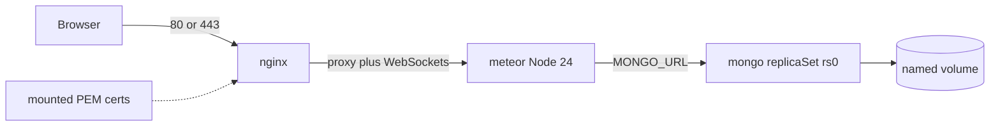

# Per-app Meteor Docker stacks

Each app under [`apps/`](apps/) gets **one Compose stack**: a built Meteor image, official MongoDB (data on a named volume), and NGINX in front with optional TLS. Shared templates live in [`docker/`](docker/) (already empty). First target: [`apps/nexus-govrn`](apps/nexus-govrn) (Meteor **3.5.2**, Vue 3 + Rspack, Node **24**).

## Why this shape

- **Meteor 3.5** defaults to **change streams**, which need MongoDB 6+ as a **replica set**. A single-node replica set (`rs0`) is required or live queries can fail.
- **Do not use `--server-only`** on `meteor build` — this app ships a Vue client that must be in the bundle.
- **NGINX must proxy WebSockets** (`Upgrade` / `Connection`) or Meteor DDP breaks.
- Vue Router uses `createWebHistory()`. NGINX proxies all paths to Meteor; Meteor serves the client for unknown routes.
- Build **inside Linux** (Docker Desktop). A Windows-host `meteor build` is the wrong architecture for the runtime image.
- Give Docker Desktop **at least 4 GB RAM** (8 GB is safer). `meteor build` is heavy.

DigitalOcean target is a **Droplet with Docker** (volumes + mounted certs). App Platform does not fit this stack.

## File layout

All Docker sources under [`docker/`](docker/). Build context is the **repo root** so the Dockerfile can `COPY apps/${APP_NAME}`.

- [`docker/Dockerfile`](docker/Dockerfile) — parameterized Meteor image (`ARG APP_NAME`)
- [`docker/docker-compose.yml`](docker/docker-compose.yml) — nginx + meteor + mongo + one-shot replica init
- [`.dockerignore`](.dockerignore) — at repo root (Docker only reads it from the build context)
- [`docker/nginx/nginx.conf`](docker/nginx/nginx.conf) + [`docker/nginx/templates/app.conf.template`](docker/nginx/templates/app.conf.template)
- [`docker/nginx/docker-entrypoint.d/30-enable-ssl.sh`](docker/nginx/docker-entrypoint.d/30-enable-ssl.sh) — HTTPS if certs exist, otherwise HTTP only
- [`docker/mongo/init-replica.js`](docker/mongo/init-replica.js) — `rs.initiate` for `rs0`
- [`docker/apps/nexus-govrn.env`](docker/apps/nexus-govrn.env) — ports, `ROOT_URL`, DB name
- [`docker/certs/nexus-govrn/.gitkeep`](docker/certs/nexus-govrn/.gitkeep) — mount point for `fullchain.pem` + `privkey.pem`
- [`docker/build.ps1`](docker/build.ps1) and [`docker/up.ps1`](docker/up.ps1) — Windows helpers: `.\docker\up.ps1 nexus-govrn`

A later app is a new `docker/apps/<name>.env` plus `docker/certs/<name>/`. Same Dockerfile and Compose file.

## Meteor image (multi-stage)

**Build stage:** `geoffreybooth/meteor-base:3.5.2` (fall back to `:3.5` if that tag is missing). Copy `apps/${APP_NAME}`, `meteor npm ci` (devDeps required for Rspack/Vue/Tailwind), then:

`meteor build --directory /opt/bundle`

**Runtime stage:** `node:24.15.0-alpine`. Copy the bundle only, `npm install --omit=dev` in `programs/server`, run `node main.js`. No Meteor CLI in the final image.

Env at runtime: `ROOT_URL`, `PORT=3000`, `MONGO_URL=mongodb://mongo:27017/${MONGO_DB}?replicaSet=rs0`, optional `METEOR_SETTINGS`.

## Compose stack

Three long-running services plus a one-shot init. Project name = app name so several stacks can run at once.

- **mongo** — `mongo:7`, `mongod --replSet rs0 --bind_ip_all`, volume `${APP_NAME}-mongo:/data/db`. **Do not publish 27017** on the host.
- **mongo-init** — `mongosh` `rs.initiate`, `restart: on-failure`, exits 0 when the set is already up.
- **meteor** — image `ik-nexus/${APP_NAME}:latest`, depends on healthy mongo + completed init.
- **nginx** — `nginx:1.27-alpine` plus our config. Host ports from the env file (govrn local: `8080:80`, `8443:443`). Mount `docker/certs/${APP_NAME}` read-only.

Local env for govrn:

- `APP_NAME=nexus-govrn`
- `HTTP_PORT=8080` / `HTTPS_PORT=8443`
- `ROOT_URL=http://localhost:8080`
- `MONGO_DB=nexus-govrn`

Production (Droplet): map `80`/`443`, set `ROOT_URL=https://your.domain`, drop PEMs into `docker/certs/nexus-govrn/`.

NGINX TLS rule: if `fullchain.pem` and `privkey.pem` are present, listen on 443 and redirect HTTP→HTTPS; otherwise HTTP only (Docker Desktop default).

## Ignore files

Add a root [`.dockerignore`](.dockerignore) excluding `.git`, `**/.meteor/local`, `**/node_modules`, `_build`, `.rsdoctor`, `build-assets`, `build-chunks`. Recreate the missing root [`.gitignore`](.gitignore) with the earlier generic rules plus `docker/certs/**/*.pem` so private keys are never committed.

## Build, run, and test (after you approve)

On Docker Desktop (Linux containers):

1. `.\docker\up.ps1 nexus-govrn` — build image, start stack, wait until nginx is up.
2. Browser: open `http://localhost:8080`, confirm Home and `/about`, confirm seeded tutorial links (proves Meteor + Mongo).
3. `docker compose ... restart`, reload — links still there (volume persistence).
4. Optional HTTPS: generate a local self-signed pair into `docker/certs/nexus-govrn/`, recreate nginx, open `https://localhost:8443` (expect a browser warning).
5. Tear down with `down` (keep the volume) vs `down -v` (wipe data).

If `meteor build` OOMs, raise Docker Desktop memory and retry before changing the Dockerfile.