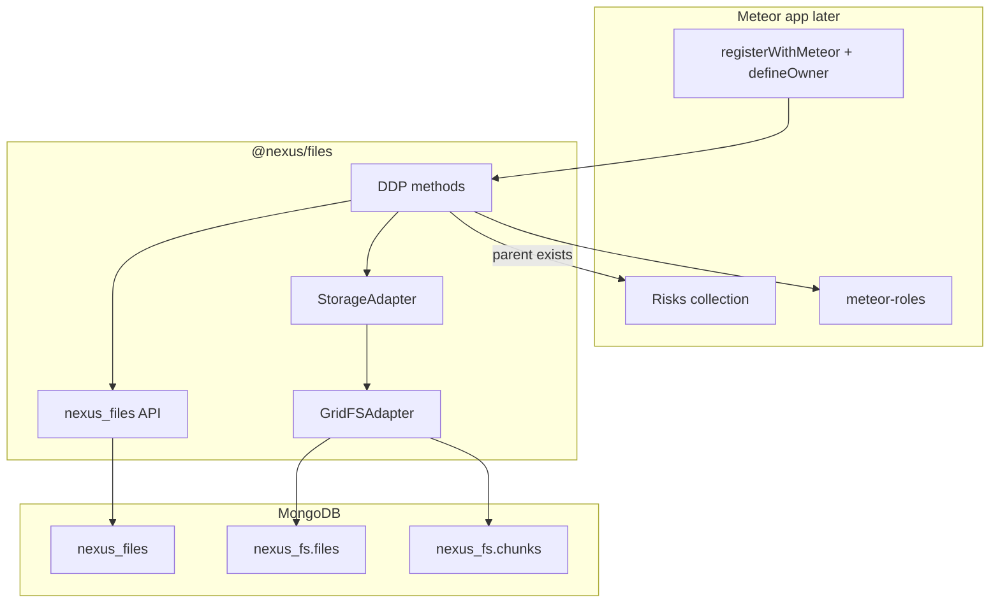
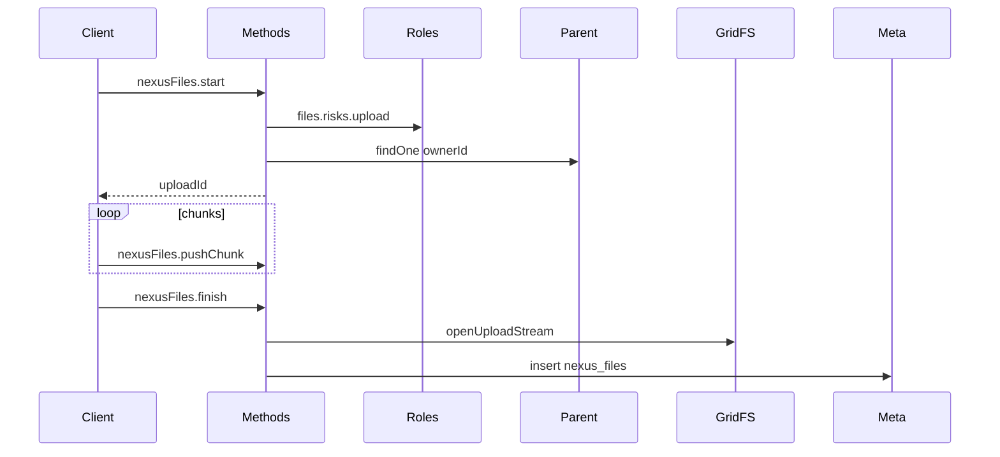

<!--
Author: Karmil Asgarally - INTELLEKTRA © 2026
Plan for @nexus/files GridFS package
-->
# Plan: opinionated `@nexus/files` (GridFS)

Saved reference for branch `gridfs`. Review this before implementation. Do not treat Meteor-Files as a dependency; it is only a behavioural reference for chunked DDP.

**Code quality:** all new code in this work must be **human-readable** (see Cursor rule `.cursor/rules/human-readable-code.mdc`). Prefer clear names, small functions, and comments that explain *why*. Do not write compact or clever code that needs a walkthrough.

## Contents

- [Decisions locked](#decisions-locked)
- [Why not Meteor-Files as-is](#why-not-meteor-files-as-is)
- [Package shape](#package-shape)
- [Meteor injection](#meteor-injection)
- [Data model](#data-model)
- [Limits](#limits)
- [DDP API](#ddp-api)
- [Storage adapter](#storage-adapter)
- [Docs to update](#docs-to-update)
- [Verify](#verify)
- [Out of scope](#out-of-scope)
- [Implementation todos](#implementation-todos)

## Decisions locked

| Topic | Choice |
|-------|--------|
| Store | One GridFS bucket **per Meteor app**, shared by all sub-apps (Risks, Incidents, Controls, ERP modules) |
| Metadata collection | `nexus_files` (fixed in every app, like meteor-roles’ `role-assignment`) |
| GridFS bucket | `nexus_fs` → `nexus_fs.files` + `nexus_fs.chunks` |
| Link to parent | `ownerType` + `ownerId`. Parent must exist (`collection.findOne(ownerId)`) before upload |
| Auth | **meteor-roles**. App registers `files.<ownerType>.upload`, `.download`, `.remove` |
| Transport | **DDP chunked** methods. No HTTP in v1 |
| Delete | **Hard delete** (metadata + GridFS chunks) |
| Size | Default max **25 MB** |
| MIME allowlist | pdf; office (`doc`/`docx`/`xls`/`xlsx`/`ppt`/`pptx`); images (`png`/`jpeg`/`gif`/`webp`); `txt`; `csv` |
| Cardinality | Many files per parent. No replace-in-place (upload new, remove old) |
| Sessions | In-memory on the server (restart aborts in-flight uploads) |
| UI | **None** in this package. Later `@nexus/ui` |
| v1 ship | **Package only** — no GovRN screens or `registerWithMeteor` wiring in the app |

## Why not Meteor-Files as-is

[Meteor-Files](https://github.com/veliovgroup/Meteor-Files) is a useful reference for chunked DDP. Collection names are caller-defined and it bundles FS, S3, Dropbox, and HTTP. We want **fixed names**, **GridFS first**, **Roles in the package contract**, no UI, and a thin adapter so a storage account can be added later without rewriting metadata.

[meteor-roles](https://github.com/Meteor-Community-Packages/meteor-roles) is the model for **opinionated collection names** that never change per app.

## Package shape

New pnpm workspace member [`packages/files`](../../packages/files) named `@nexus/files`. Do **not** add `apps/` to [`pnpm-workspace.yaml`](../../pnpm-workspace.yaml).

```text
packages/files/
  package.json
  src/index.js
  src/constants.js      # collection names, max size, MIME allowlist
  src/adapter.js        # StorageAdapter interface
  src/gridfs.js         # GridFSAdapter
  src/owners.js         # defineOwner registry
  src/methods.js        # start / pushChunk / finish / remove
  src/publish.js        # nexusFiles.forOwner
  src/register.js       # registerWithMeteor({ ...injected Meteor APIs })
  src/upload.js         # client helper Files.upload (no Vue)
  README.md
```

Apps will later depend with `"@nexus/files": "file:../../packages/files"` (same pattern as `@nexus/ui`). Docker already `COPY packages /packages`.

## Meteor injection

Meteor 3 will not reliably resolve `meteor/mongo` from an npm package. **`@nexus/files` must not import `meteor/*`.** The consuming app (later) injects APIs:

```js
import { Files } from '@nexus/files'
import { Meteor } from 'meteor/meteor'
import { Mongo, MongoInternals } from 'meteor/mongo'
import { Roles } from 'meteor/roles'
import { check, Match } from 'meteor/check'
import { Random } from 'meteor/random'
import { Risks } from '/imports/api/risks'

Files.registerWithMeteor({
  Meteor,
  Mongo,
  MongoInternals,
  check,
  Match,
  Random,
  Roles,
})

Files.defineOwner({
  type: 'risks',
  collection: Risks,
  roles: {
    upload: 'files.risks.upload',
    download: 'files.risks.download',
    remove: 'files.risks.remove',
  },
})
```

This branch does **not** add that wiring to nexus-govrn. Document it in the package README.



## Data model

`nexus_files` document:

- `ownerType`, `ownerId`
- `name`, `mime`, `size`
- `storage: 'gridfs'`
- `gridFsId` — id in `nexus_fs.files`
- `uploadedBy`, `createdAt`

Indexes: `{ ownerType: 1, ownerId: 1 }`, `{ uploadedBy: 1 }`, `{ createdAt: -1 }`.

## Limits

Package defaults (overridable later if needed): 25 MB; allowlist above. Empty MIME is rejected.

## DDP API

| Method / publication | Who | Check |
|----------------------|-----|--------|
| `nexusFiles.start` | logged-in | parent exists; `files.<type>.upload`; mime/size |
| `nexusFiles.pushChunk` | same user as session | session owner; chunk size |
| `nexusFiles.finish` | same user | write GridFS; insert `nexus_files` |
| `nexusFiles.remove` | logged-in | `files.<type>.remove`; hard-delete blob + row |
| `nexusFiles.forOwner` | logged-in | `files.<type>.download`; **metadata only**, never chunks |

Client helper (no Vue): `Files.upload({ ownerType, ownerId, file })` reads a `File` / `Uint8Array` in chunks and calls the methods. Future `@nexus/ui` will call this.



## Storage adapter

```js
class StorageAdapter {
  async write({ filename, mime, streamOrBuffer }) { /* returns id */ }
  async read(id) { /* returns stream */ }
  async remove(id) {}
}
```

v1: `GridFSAdapter` using `mongodb.GridFSBucket` on `MongoInternals.defaultRemoteCollectionDriver().mongo.db`, bucket name `nexus_fs`.

Future: `AzureBlobAdapter` (or similar). Metadata keeps `storage` plus an adapter-specific id field. No rename of `nexus_files`.

## Docs to update

- [`packages/files/README.md`](../../packages/files/README.md) — Contents, mermaid, collection names, role strings, `defineOwner` example, human-readable code note, “do not run pnpm inside apps/”
- Root [`README.md`](../../README.md) and [`PNPM.md`](../../PNPM.md) — one line each pointing at `@nexus/files`; update Contents

## Verify

- Root `pnpm install` lists `@nexus/files`; `apps/` is still not a workspace member
- Package exports `Files`, constants, and `registerWithMeteor` **without** importing `meteor/*`
- No Vue / Vuetify files under `packages/files`
- Code is readable: named helpers, documented public API, no clever one-liners

## Out of scope

- Vue/Vuetify upload UI (`@nexus/ui` later)
- HTTP upload/download routes
- Azure / disk / S3 adapters
- Soft delete, virus scan, image variants
- Wiring or demo screens in `nexus-govrn`
- Publishing to npm

## Implementation todos

1. Scaffold `packages/files` (`@nexus/files`) with constants, adapter interface, GridFS adapter, owner registry
2. Implement DDP method/publish factories and client chunked upload helper (Meteor injected)
3. Package README + mermaid; one-line links from root README and PNPM.md (update TOCs)
