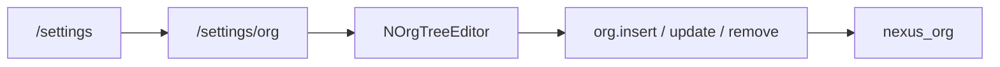

# Org tree settings UI

The DDP package already exists. This change is the missing admin screen plus a `devSeedAdmin` dummy tree. **Not in this change:** org picker on [`NAccountForm`](packages/ui/src/components/accounts/NAccountForm.vue), user `profile.orgNodeId` assignment UI, or Risks.

Writes stay `superadmin` / `admin` on the server ([`packages/org/src/methods.js`](packages/org/src/methods.js)). Vue `v-if` is display only.

## Widgets in `@nexus/ui`

New folder [`packages/ui/src/components/org/`](packages/ui/src/components/org/) (N prefix). Add `@nexus/org` as a peer of `@nexus/ui` (same as actions).

| Piece | Job |
|-------|-----|
| `useOrgTree` | `Org.subscribeTree`, observe `Org.collection`, nest by `parentId`, sort by `sortOrder` then `title.en` |
| `NOrgNodeForm` | `NTranslatableTextField` title (`en` required), free-text `type` (hint: division / department / team), parent select (exclude self and descendants; empty = root), `sortOrder`, `active` |
| `NOrgTreeEditor` | Nested `v-list` (no extra Vuetify treeview dep). Add root / add child / edit / remove. `NModal` + `NRemoveIcon`. Surface method errors (`org-has-children`, `org-has-users`, `org-cycle`) |

`type` stays a **free string** — do not add a `nexus_lists` catalog.

Export from [`packages/ui/src/index.js`](packages/ui/src/index.js). i18n in `en` / `fr` / `ar`:

- Card: `settings.orgTitle`, `settings.orgSubtitle`
- Editor: `org.*` (type, parent, root, addRoot, addChild, empty, remove confirm)

## GovRN Settings

Same thin-wrapper pattern as accounts.

- Route `/settings/org` (`settingsOrg`) in [`apps/nexus-govrn/imports/ui/settings/routes.js`](apps/nexus-govrn/imports/ui/settings/routes.js)
- [`VewOrg.vue`](apps/nexus-govrn/imports/ui/settings/VewOrg.vue): `useUserRole(['superadmin', 'admin'])` then `<n-org-tree-editor>`
- [`NSettingsWorkspace`](packages/ui/src/components/accounts/NSettingsWorkspace.vue): org card (`mdi-sitemap-outline` → `/settings/org`) next to accounts
- [`NSettingsHeading`](packages/ui/src/components/accounts/NSettingsHeading.vue) + [`ScrSettingsHeading.vue`](apps/nexus-govrn/imports/ui/settings/ScrSettingsHeading.vue): `page === 'org'` uses org title/subtitle; back to `/settings`

No `/settings/org/:id` — one page, like `NListItemsEditor`.

## Dev seed (`public.devSeedAdmin`)

Reuse the existing flag in [`settings.jsonc`](apps/nexus-govrn/settings.jsonc). No new public key.

- Dummy nodes in [`demoSeedData.js`](apps/nexus-govrn/imports/api/demoSeedData.js) with **stable `_id`s** and `en` / `fr` / `ar` titles
- `seedDemoOrg()` in a small sibling (or next to [`demoAdmin.js`](apps/nexus-govrn/imports/api/demoAdmin.js)): if `devSeedAdmin !== true`, return; if any `nexus_org` row exists, return (do not mix with a hand-built tree); otherwise `Org.collection.insertAsync` parent-first inside the existing `Applog.runAsSystem` block in [`server/main.js`](apps/nexus-govrn/server/main.js)
- Direct collection insert (system seed), not DDP — methods require a logged-in admin

Suggested dummy tree (governance-shaped, not a product catalog):

- `org-demo-hq` company — INTELLEKTRA
  - `org-demo-grc` division — Risk and Compliance
    - `org-demo-oprisk` department — Operational Risk
    - `org-demo-audit` department — Internal Audit
  - `org-demo-fin` division — Finance
    - `org-demo-treas` department — Treasury
  - `org-demo-ops` division — Operations
    - `org-demo-it` department — Information Technology
      - `org-demo-plat` team — Platform

`meteor reset` + `devSeedAdmin: true` fills the tree. Production (`devSeedAdmin` omitted/false) stays empty.

## Docs (same change)

Update Contents on every touched README.

- [`packages/ui/README.md`](packages/ui/README.md), [`docs/architecture/ui.md`](docs/architecture/ui.md)
- [`packages/org/README.md`](packages/org/README.md) (drop “no Vue manager”), [`docs/architecture/org.md`](docs/architecture/org.md)
- [`apps/nexus-govrn/imports/ui/settings/README.md`](apps/nexus-govrn/imports/ui/settings/README.md)
- [`PACKAGES.md`](PACKAGES.md) catalog line for UI widgets if it names them

No new tests unless asked.

## Verify after implement

Signed-in as `admin@localhost`: Settings card → `/settings/org` → add root, add child, edit type/title, deactivate, remove leaf. Confirm a node with children is refused. Non-admin sees `settings.notAuthorized`. After `meteor reset` with the flag, the dummy tree is present.