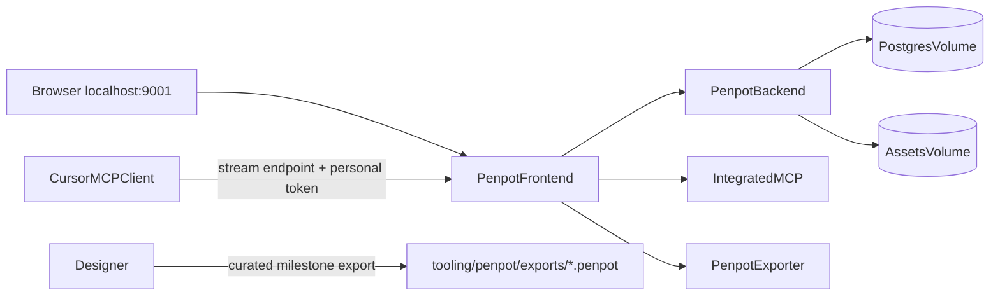

# Penpot Design Tooling

## Architecture

- Keep this stack independent from [`docker/docker-compose.yml`](docker/docker-compose.yml) and [`docker/stack.mjs`](docker/stack.mjs), which are Meteor-specific.
- Pin Penpot frontend/backend/exporter/MCP to `2.17.2`; retain official Postgres 15, Valkey 8.1, and development mail catcher services.
- Publish only `127.0.0.1:9001` for Penpot and `127.0.0.1:1080` for captured email. PostgreSQL, Valkey, backend, exporter, and MCP container ports remain internal.
- Use named volumes for PostgreSQL and assets. `.penpot` exports are portable milestones, not the canonical database or a complete backup.

## Compose and local configuration

- Add [`tooling/penpot/docker-compose.yml`](tooling/penpot/docker-compose.yml), based on the official 2.17.2 Compose topology, with `enable-mcp`, password login/registration for local development, disabled email verification/secure cookies for localhost HTTP, telemetry disabled, configurable body limits, generated secret/database credentials, health checks, and explicit localhost bindings.
- Add [`tooling/penpot/.env.example`](tooling/penpot/.env.example) containing non-secret defaults and placeholders. A real gitignored `.env` will contain a stable random 512-bit `PENPOT_SECRET_KEY` and database password.
- Add [`tooling/penpot/stack.mjs`](tooling/penpot/stack.mjs), following the cross-platform spawn/readiness style of [`docker/stack.mjs`](docker/stack.mjs). Commands: `init`, `up`, `down`, `restart`, `logs`, `ps`, `pull`, and `backup`; `down --volumes` is the explicit destructive reset. `init` creates missing secrets without overwriting an existing `.env`; `up` waits for `http://localhost:9001`.
- `backup` writes timestamped, gitignored PostgreSQL dump and assets archive files under `tooling/penpot/backups/`. Document restoration and that both artifacts form one backup set.

## Exports and repository policy

- Add [`tooling/penpot/exports/README.md`](tooling/penpot/exports/README.md) documenting import/export steps and a milestone naming convention such as `nexus-ui-YYYY-MM-DD-purpose.penpot`.
- Keep curated milestone `.penpot` files trackable in Git. Warn that they are ZIP archives with poor diffs/merges and should exclude unnecessary large media; routine/full backups stay ignored.
- Update [`.gitignore`](.gitignore) for generated Penpot `.env` and `tooling/penpot/backups/`, without ignoring curated exports.

## Commands and documentation

- Add root scripts in [`package.json`](package.json): `penpot`, `penpot:init`, `penpot:up`, `penpot:down`, `penpot:restart`, `penpot:logs`, `penpot:ps`, `penpot:pull`, and `penpot:backup`.
- Add [`tooling/penpot/README.md`](tooling/penpot/README.md) covering prerequisites, first start, account creation, lifecycle commands, persistence/reset, backup/restore, milestone import/export, upgrades, Windows Docker Desktop considerations, and troubleshooting. Maintain the required Contents list.
- Update [`README.md`](README.md), [`PACKAGES.md`](PACKAGES.md), and [`SECURITY.md`](SECURITY.md) to describe `tooling/` as a fourth isolated install world, link the Penpot guide, and record localhost/MCP-token/secret boundaries while keeping all README Contents lists current.

## Integrated MCP handoff and verification

- Document the self-hosted URL pattern `http://localhost:9001/mcp/stream?userToken=...`, but never place the personal key in Git, `.env.example`, terminal scripts, screenshots, or logs.
- Document the manual sequence: create/sign into a local Penpot account; enable MCP under account integrations; generate/store the one-time key; configure Cursor as a remote HTTP MCP server; open a design file; choose **File → MCP Server → Connect**; keep exactly one Penpot tab active.
- Explain that Cursor remote MCP cannot load the stack `.env`; the token must be installed through Cursor/user environment configuration. Do not commit a token-bearing `.cursor/mcp.json`.
- Verify Compose interpolation/config, start and health of all services, browser access at port 9001, persistence across `down`/`up`, stack status/log commands, backup artifact creation, and the documented import/export workflow. After the user completes the one-time token step, verify the Penpot MCP namespace with a read-only page/file query before any design writes. No new automated test suite is added.