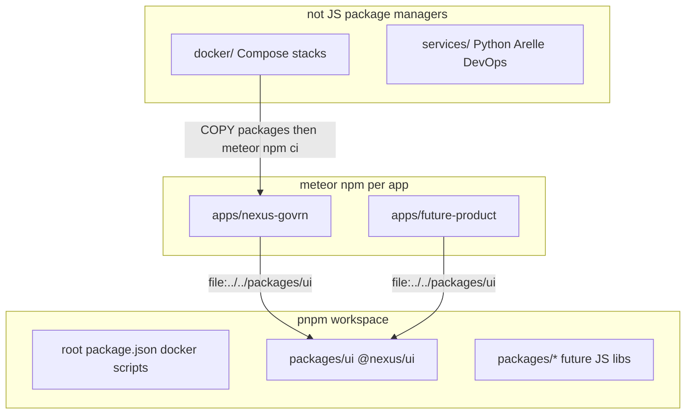

# pnpm workspace for shared JS only

Branch `workspace` is checked out from `main`.

## Decision

Do **not** put Meteor apps in a pnpm (or npm) workspace.

Meteor 3 resolves deps from each app’s `node_modules` via `meteor npm`. A hoisted workspace lifts Vue/Vuetify to the repo root; Rspack and `meteor npm ci` then miss them or load two copies. That already bit us when aliasing `vuetify` during the `@nexus/ui` extract.

You also want **independent** product pins (GovRN can stay on Vuetify 4 while another app upgrades). That requires a per-app `package.json` + lockfile. A single workspace lockfile fights that.

So the repo splits into three install worlds:



## Layout

- **[`packages/*`](packages/ui)** — pnpm workspace members. `@nexus/ui` today; later API clients, shared Meteor helpers, config. One `pnpm-lock.yaml` at the repo root for this tree only.
- **[`apps/*`](apps/nexus-govrn)** — **not** workspace members. Each app: `meteor npm install`, own `package-lock.json`, own Vue/Vuetify/Meteor versions. Consume shared JS with `"@nexus/ui": "file:../../packages/ui"` (same import after a future npm publish: change the dep string only).
- **[`docker/`](docker)** — unchanged. Image still `COPY packages /packages` then `meteor npm ci` in [`docker/Dockerfile`](docker/Dockerfile). Apps never see pnpm inside the Meteor image.
- **`services/`** (new, convention only) — Python/Arelle XBRL containers, DevOps sidecars. Own venv/Compose/lockfiles. **Not** listed in `pnpm-workspace.yaml`.

## What we will add

Root [`pnpm-workspace.yaml`](pnpm-workspace.yaml):

```yaml
packages:
  - "packages/*"
```

Root [`package.json`](package.json):

- `"packageManager": "pnpm@10"` (pin a current 10.x)
- Keep existing `docker:*` scripts
- Optional: `"packages:ui": "pnpm --filter @nexus/ui"` later; not required for v1

Root [`.npmrc`](.npmrc) (pnpm, workspace-only):

```ini
ignore-workspace-root-check=true
```

No `shamefully-hoist`. Nothing in `apps/` should be hoisted.

[`packages/ui/package.json`](packages/ui/package.json) stays as-is (peerDeps on Vue/vue-i18n/Vuetify). Root `pnpm install` links it; it has no runtime deps today.

Do **not** convert GovRN to pnpm. Do **not** replace `file:` with `workspace:` (that protocol only works for workspace members).

## Docs (TOCs updated in the same change)

- [`README.md`](README.md) — three-world layout: `pnpm install` at root for `packages/*`; `meteor npm install` in each app; `services/` for non-JS.
- [`packages/ui/README.md`](packages/ui/README.md) — consume via `file:`; develop via root pnpm.
- [`docker/README.md`](docker/README.md) — Meteor image still uses npm/`file:`; pnpm is host-only for shared libs.
- Short [`services/README.md`](services/README.md) — this tree is not a pnpm member.

## Verify

- From repo root: `pnpm install` succeeds; `apps/nexus-govrn/node_modules` is untouched.
- From `apps/nexus-govrn`: `meteor npm install` still resolves `@nexus/ui`; app boots; NLocaleSelect EN/FR/AR still works.
- Confirm `apps/` is absent from `pnpm-workspace.yaml`.

## Out of scope

- Moving apps into the workspace
- Publishing `@nexus/ui` to npm
- Implementing Arelle/Python services (directory + README only)
- Changing the Docker Meteor build to pnpm
