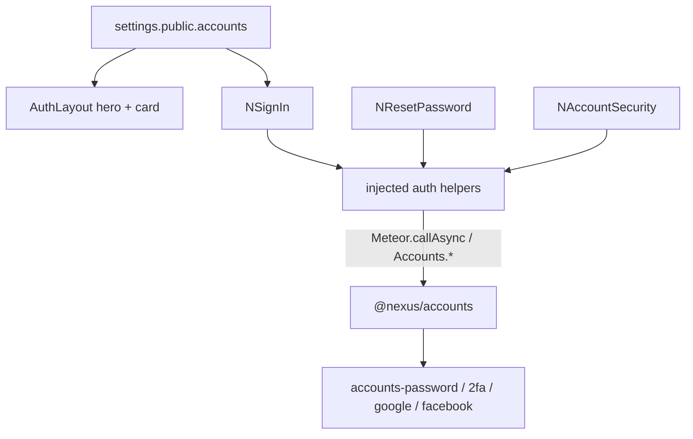

# Sign-in, 2FA, reset, and gated self-register

## Agreed end state

- **Shared layer:** [`NSignIn`](packages/ui/src/components/auth/NSignIn.vue) / reset / security widgets in `@nexus/ui` (no `meteor/*`). DDP and hooks in `@nexus/accounts`. Atmosphere packages already in the app (`.meteor/packages` has `accounts-2fa`, `accounts-google`, `accounts-facebook`).
- **GovRN:** `selfRegister: false`. Signup and OAuth buttons stay hidden. Admin-created users only (current model).
- **2FA:** Optional. Password login works without a code. After enroll, sign-in asks for the TOTP. Enrollment lives on a page any signed-in user can open (not only `/settings`).

## Why this layering

`Auth.vue` today imports `meteor/*` and prefills demo credentials. The next product (property self-register) needs the same screen. Packages still must not import `meteor/*`: the app injects login/reset/OAuth/2FA functions, same pattern as `NEXUS_TRANSLATE_KEY` and `Setup.loginWithPassword`.



## Settings (human-replaceable hero, no hardcoded image)

Extend [`apps/nexus-govrn/settings.jsonc`](apps/nexus-govrn/settings.jsonc). Hero is a **string**: Meteor `public/` path **or** a full Unsplash URL. The browser loads it as CSS `background-image`. The server does **not** fetch that URL (A10).

```jsonc
"public": {
  "accounts": {
    "selfRegister": false,
    "selfRegisterRoles": ["user"],
    "heroImage": "https://images.unsplash.com/photo-1486406149926-2bddad0bc895?auto=format&fit=crop&w=1600&q=80"
  }
}
```

To use a local file: drop `apps/nexus-govrn/public/auth-hero.jpg` and set `heroImage` to `"/auth-hero.jpg"`. Document both in GovRN README and architecture.

OAuth secrets stay **out of** `public` (never commit real keys). Server-only, e.g. `oauth.google.clientId` / `secret`, `oauth.facebook.appId` / `secret`. Empty or missing → do not upsert `ServiceConfiguration` and do not show that button even if self-register is on.

`Accounts.config({ forbidClientAccountCreation: true })` always. Self-register goes through our method, not Meteor’s default client `createUser`.

## Layout and UI (`@nexus/ui` + thin app routes)

Replace the centered 480px card in [`AuthLayout.vue`](apps/nexus-govrn/imports/ui/layouts/AuthLayout.vue) with a full-height split:

- **Pane:** cover image from `settings.public.accounts.heroImage` (gradient fallback if empty). Keep app bar (brand from `nexus_setup`, locale, theme).
- **Pane:** [`NSignIn`](packages/ui/src/components/auth/NSignIn.vue) — email, password, optional TOTP field (shown after `no-2fa-code` or when the user has 2FA), Forgot password, Sign in. Signup + Google/Facebook only if inject says `selfRegister` and that provider is configured.
- Do **not** prefill `admin@localhost` unless `devSeedAdmin` (professional default is empty fields).

New routes in [`router.js`](apps/nexus-govrn/imports/ui/router.js):

| Path | Widget | Who |
|------|--------|-----|
| `/signin` | `NSignIn` | Guest (auth layout) |
| `/forgot-password` | request-reset form (or a mode on `NSignIn`) | Guest |
| `/reset-password/:token` | `NResetPassword` | Guest |
| `/account` | `NAccountSecurity` (enroll/disable TOTP) | Any signed-in user |

Thin wrappers in the app (`Auth.vue` becomes a one-liner that mounts `NSignIn` and provides helpers). Post-login redirect: `?next=` or `/` (stop sending people to `/lists-test`).

Vuetify 4: `v-sheet` / `v-card`, outlined fields, `mdi-google` / `mdi-facebook`, error `v-alert`. i18n keys `auth.*` in [`packages/ui/src/i18n/locales/{en,fr,ar}.js`](packages/ui/src/i18n/locales/en.js).

## Password + TOTP

Inject from [`imports/ui/main.js`](apps/nexus-govrn/imports/ui/main.js) (or an `authProvide.js`):

- `loginWithPassword({ email, password, code })` → `Meteor.loginWithPassword` then, on `no-2fa-code`, `Meteor.loginWithPasswordAnd2faCode` (`accounts-2fa` is already in [`.meteor/packages`](apps/nexus-govrn/.meteor/packages)).
- `forgotPassword(email)` → `Accounts.forgotPassword`
- `resetPassword(token, password)` → `Accounts.resetPassword`
- `generate2faQr(password)` / `enable2fa(code)` / `disable2fa(code)` / `has2fa()` wrapping the `accounts-2fa` client API

[`NAccountSecurity`](packages/ui/src/components/auth/NAccountSecurity.vue): confirm current password, show QR SVG, enter first TOTP, enable; later disable with a code. Mount at `/account`. Do not put this only on admin `/settings` — invite-only users still need a place to enroll.

Keep existing admin “set password” on [`NAccountForm.vue`](packages/ui/src/components/accounts/NAccountForm.vue) as-is (that is admin-for-others, not forgot-password email).

## Email (reset tokens in the server console)

In `@nexus/accounts` server register (injected `Accounts`):

- `Accounts.urls.resetPassword = (token) => Meteor.absoluteUrl('reset-password/' + token)`
- `Accounts.emailTemplates` from / subject / text (no secrets)
- Without `MAIL_URL`, Meteor prints the message to the **server console** — that is the intended local behavior

No SendGrid/SMTP in this work.

## Self-register (off in GovRN, ready for the next app)

`@nexus/accounts`:

1. Add `user` to the **platform** role catalog next to `superadmin` / `admin` in [`catalog.js`](packages/accounts/src/catalog.js). `ensureRegisteredRoles` already creates every catalog name — that is how `user` exists even though setup does not grant it.
2. Read `selfRegister` and `selfRegisterRoles` from `Meteor.settings.public.accounts` (passed in at `registerWithMeteor` or read from injected `Meteor.settings`). Roles must be in the catalog; default `["user"]`. Never allow `superadmin` / `admin` in that list.
3. Method `accounts.selfRegister` `{ email, name, password }` — only if `selfRegister === true`; `createPasswordUser` + `addUsersToRolesAsync(selfRegisterRoles)`.
4. `Accounts.onCreateUser` for Google/Facebook: if self-register off, reject new OAuth users; if on, assign `selfRegisterRoles`. Existing users linking OAuth still sign in.
5. Server startup: upsert `ServiceConfiguration` only when oauth client id/secret are present.

UI: `NSignIn` asks the inject `authOptions()` `{ selfRegister, providers: { google, facebook } }`. Buttons call injected `loginWithGoogle` / `loginWithFacebook`.

GovRN ships `selfRegister: false`. A property app later sets it `true` and fills oauth keys.

## Security (must not regress)

- `forbidClientAccountCreation: true` — client `Accounts.createUser` stays closed.
- OAuth secrets never in `Meteor.settings.public`.
- Suspend hook already on login — keep it for password, 2FA, and OAuth.
- Hero URL is a **client** background only; no server `fetch` of a caller URL.
- `check` / `Match` on new methods. Applog `record` on self-register.
- Update [`SECURITY.md`](SECURITY.md) and [`docs/architecture/accounts.md`](docs/architecture/accounts.md); add a short [auth](docs/architecture/auth.md) page and link it from [`_Architecture.md`](docs/architecture/_Architecture.md).

## Docs and package READMEs

[`packages/ui/README.md`](packages/ui/README.md), [`packages/accounts/README.md`](packages/accounts/README.md), [`apps/nexus-govrn/README.md`](apps/nexus-govrn/README.md), [`PACKAGES.md`](PACKAGES.md): `NSignIn`, settings keys, how to swap the hero, how to turn on self-register, MAIL_URL vs console.

No new tests unless you ask.

## Manual check

- `/signin`: split layout, Unsplash (or `/auth-hero.jpg`) shows; empty email/password; no Google/Facebook (self-reg off).
- Sign in as seeded admin; optional TOTP enroll on `/account`; sign out; sign in again asks for the code.
- Forgot password: token + link appear in the Meteor server console; `/reset-password/:token` sets a new password.
- Temporarily set `selfRegister: true` and confirm signup + `user` role; restore `false` before finish (or leave a commented example in jsonc).
