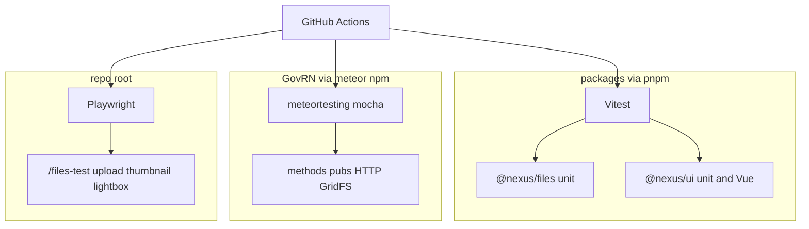

# Testing protocol for packages and Meteor apps

## What we agreed

- You must **see** what ran: verbose terminal, a saved HTML (or Markdown) report, and GitHub Actions on PRs.
- This branch writes **real tests now** for `@nexus/files`, `@nexus/ui`, and GovRN — not empty scaffolding.
- **Playwright** covers the files gallery: upload, thumbnail, lightbox image actually visible.
- **Keep Meteor mocha** for methods / pubs / HTTP / GridFS. **Vitest** for packages and for app JS that does not need a Meteor process.
- Risks / Controls / other sub-apps do not exist yet. The Cursor rule will say what to add when they appear.

## First execution step

Plan mode could not create the branch. First command on execute:

```powershell
git checkout -b test-package
```

Any already-local FileLightbox fix travels onto this branch. Do not mix unrelated Meteor `.meteor/local` db files.

## Why today’s `npm test` felt empty

[`apps/nexus-govrn/tests/main.js`](apps/nexus-govrn/tests/main.js) is the Meteor scaffold: package name + `isClient` / `isServer`. The runner is real (`meteortesting:mocha`); the **cases** are not. [`packages/files`](packages/files) and [`packages/ui`](packages/ui) have **no** test script. Root [`package.json`](package.json) has no `test` either.



## Layer 1 — Vitest for `packages/*`

Root pnpm owns this world ([`pnpm-workspace.yaml`](pnpm-workspace.yaml) is already `packages/*` only).

- Add root `devDependencies`: `vitest`, `@vue/test-utils`, `happy-dom`, `@vitest/coverage-v8` (optional, only if cheap).
- One root [`vitest.config.js`](vitest.config.js): ESM, `happy-dom`, reporters `verbose` + `html` (and `default` so CI logs stay readable).
- Root scripts: `test` / `test:packages` → `vitest run`. HTML report under `reports/vitest/` (gitignored except we keep the folder `.gitkeep` if useful).
- Each package gets `"test": "vitest run"` so `pnpm -r test` also works.

**`@nexus/files` (mocked Meteor, no boot):**

- `downloadUrl` / MIME constants / `defineOwner` validation ([`helpers.js`](packages/files/src/helpers.js), [`owners.js`](packages/files/src/owners.js), [`constants.js`](packages/files/src/constants.js)).
- `registerWithMeteor` required APIs and “already called” ([`register.js`](packages/files/src/register.js)).
- `gridfs` hex `gridFsId` vs Meteor `ObjectID` (the FileNotFound class of bug).
- HTTP path parse for `/nexus-files/:fileId`.

**`@nexus/ui`:**

- `createNexusI18n` / `readStoredLocale` / `applyDocumentLocale`.
- `FileLightbox`: native `img.file-lightbox-image` present, `max-height: 80vh`, prev/next/close emit. Mount with a tiny Vuetify test plugin so `v-overlay` / `v-btn` resolve.

Colocate as `packages/<name>/tests/*.test.js`. File headers stay the INTELLEKTRA header.

## Layer 2 — Meteor mocha for GovRN runtime

Keep [`apps/nexus-govrn/package.json`](apps/nexus-govrn/package.json) `test` / `test-app`. `meteortesting:mocha` is a **driver**, not a line in [`.meteor/packages`](apps/nexus-govrn/.meteor/packages) — leave that as-is.

Replace the placeholder in [`tests/main.js`](apps/nexus-govrn/tests/main.js) with imports of real files. Force a **spec** reporter so every name prints:

- `SERVER_TEST_REPORTER=spec`
- `CLIENT_TEST_REPORTER=spec`

**Server cases (need real Meteor):**

- Demo parents exist (`DEMO_*` ids from [`filesDemoParents.js`](apps/nexus-govrn/imports/api/filesDemoParents.js)).
- `demo` owner is registered (`allowAnonymous`).
- `GET /nexus-files/<missing>` → 404.
- Upload via DDP `start` / `pushChunk` / `finish`, then `GET /nexus-files/<id>` → 200 and the bytes match.

**Client cases:** only if they assert something a human cares about (e.g. router has `/files-test`). Do not keep “client is not server”.

Meteor mocha HTML reports are awkward with this driver. Verbose **spec in the log** is the mocha report; Vitest + Playwright own the HTML you reopen.

App-only JS that does **not** need Meteor (pure helpers) can live as Vitest next to the file **or** move into `packages/*`. Do not add a second Vitest install inside `apps/nexus-govrn` unless a helper cannot move.

## Layer 3 — Playwright files gallery

Root `devDependency` `@playwright/test`. Specs in [`e2e/`](e2e/) (repo root, not inside the Meteor app).

- `e2e/files-gallery.spec.js`: open `/files-test`, set a fixture PNG on the **images** card file input, wait for a thumbnail, click it, assert `.file-lightbox-image` is visible and has a non-zero box.
- `e2e/fixtures/lightbox-probe.png`: tiny committed PNG (generate with Node, not a huge binary).
- Script `test:e2e`: `playwright test`. HTML reporter → `reports/playwright/`.
- Local: against `http://localhost:3000` if Meteor is already up; otherwise `webServer` starts `meteor run` in `apps/nexus-govrn` (timeout generous — first boot is slow).
- Target the images card explicitly (there are two `Upload files` inputs).

## GitHub Actions

No `.github/` today. Add [`.github/workflows/test.yml`](.github/workflows/test.yml) on `push` / `pull_request`:

| Job | What | Artifact |
|-----|------|----------|
| `packages` | `pnpm install` + `pnpm test` | `reports/vitest` |
| `meteor` | install Meteor, `meteor npm ci` in GovRN, `npm test` with spec reporters | mocha log |
| `e2e` | Meteor + `pnpm exec playwright install --with-deps`, start app, `pnpm test:e2e` | `reports/playwright` |

Cache `~/.meteor` and pnpm store. `e2e` can `needs: packages` so a broken unit suite fails fast. Ubuntu runners (Meteor CI is documented there).

## Cursor rule

Add [`.cursor/rules/testing.mdc`](.cursor/rules/testing.mdc) with `alwaysApply: true` (you asked the agent to know this whenever you say “add tests”, not only when a `*.test.js` is open). Keep it short and actionable:

- Packages → Vitest, verbose + HTML.
- Meteor methods / pubs / collections / HTTP → mocha under `apps/<app>/tests`.
- User-visible flow → Playwright in `e2e/`.
- New sub-app (Risks, Controls, …): mocha for that app’s methods/pubs; Playwright for its screens; extract shared logic to `packages/*` and Vitest it.
- Test titles describe the behavior. Never ship a silent placeholder (`package.json has correct name`).
- Same file-header and human-readable-name rules as production code.

Optional second rule with `globs` for `**/*.{test,spec}.js` and `e2e/**` if the always-on file would otherwise grow past ~50 lines.

## Docs humans can run

Short [`TESTING.md`](TESTING.md) at repo root (Contents TOC per workspace rule): commands, which layer covers what, where HTML reports land. Link it from the root README. Do **not** edit [`.cursor/plans/nexus-files-gridfs.plan.md`](.cursor/plans/nexus-files-gridfs.plan.md).

## What this branch will not do

- Invent Risks/Controls test suites (no code yet).
- Force-add Vitest inside Meteor’s `meteor npm` tree.
- Treat mocha HTML as a must-have (spec log is the mocha surface).
- Run or commit `.meteor/local` database files.
