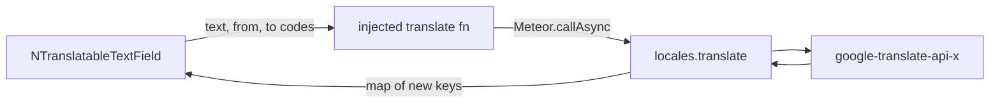

# Translatable text field and textarea

## Why a server method

[`google-translate-api-x`](https://www.npmjs.com/package/google-translate-api-x) talks to `translate.google.com`, which does **not** send CORS headers. A browser call from the Vue component will fail. The unofficial client stays on the **Meteor server**. `@nexus/ui` stays free of `meteor/*` and of that npm package: the app injects a `translate` function.

Fill policy is **user-chosen per click**, from the **active** data tab:

- **Fill empty** (icon click) — only `data` keys that are blank get a translation. Existing tab text is left alone.
- **Replace all** (menu item) — every other `data` key is overwritten with a new translation. The source tab is never changed.

The server method always translates into the `to` list the client sends. The component decides `to` (empty codes vs all other codes).



## Components (`@nexus/ui`)

New files:

- [`packages/ui/src/components/fields/useTranslatableInput.js`](packages/ui/src/components/fields/useTranslatableInput.js) — shared logic
- [`packages/ui/src/components/fields/NTranslatableTextField.vue`](packages/ui/src/components/fields/NTranslatableTextField.vue)
- [`packages/ui/src/components/fields/NTranslatableTextarea.vue`](packages/ui/src/components/fields/NTranslatableTextarea.vue)

**`v-model`** is a locale map (`{ en, fr, ar }`), not a string. Inject [`NEXUS_LOCALES_KEY`](packages/ui/src/i18n/locales.js) for `data` / `defaultData`. Coerce incoming values with `coerceLocalized` / `emptyLocalizedMap`.

Layout (when `data.length > 1`):

- Row above the control, `d-flex justify-end align-center`: compact `v-tabs` (`En` / `Fr` / `Ar` from `data`) plus one translate control
- Then `v-text-field` or `v-textarea` bound to `map[activeTab]`

When `data.length === 1`: render only the Vuetify control (no tabs, no translate).

Translate control (one icon, not two):

- `v-btn` `mdi-translate` — click runs **fill empty** (`to` = other `data` codes whose value is blank)
- Adjacent `v-menu` (dropdown chevron) with **Replace all** — `to` = every other `data` code
- Hidden if no translate function was provided
- Icon disabled while the active tab is empty or a translate is in flight
- Fill-empty is also disabled when every other key already has text (Replace all stays available)
- On success: merge returned strings into the map; emit `update:modelValue`

**Vuetify 4 passthrough:** `inheritAttrs: false` on each SFC; `v-bind="$attrs"` on the inner `v-text-field` / `v-textarea`. Only declare our own props (`modelValue`, plus optional `required` meaning `defaultData` must be non-empty even when another tab is showing). Slots (`prepend-inner`, `#details`, …) fall through with `v-bind="$slots"` where needed. `label`, `rules`, `rows`, `auto-grow`, `disabled`, `density`, etc. stay Vuetify attrs.

Export both from [`packages/ui/src/index.js`](packages/ui/src/index.js). Export `NEXUS_TRANSLATE_KEY`.

i18n in [`packages/ui/src/i18n/locales/{en,fr,ar}.js`](packages/ui/src/i18n/locales/en.js): `locale.translate`, `locale.translateAria`, `locale.translateEmpty`, `locale.translateReplaceAll`, `locale.translateFailed`.

## App: `locales.translate`

- `meteor npm install google-translate-api-x` in [`apps/nexus-govrn`](apps/nexus-govrn) only (not `@nexus/ui`).
- New [`apps/nexus-govrn/imports/api/localesTranslate.js`](apps/nexus-govrn/imports/api/localesTranslate.js), register from [`server/main.js`](apps/nexus-govrn/server/main.js).
- `check` `{ text: String, from: String, to: [String] }`, then `requireLoggedIn`.
- `from` and every `to` must be in `appLocales.data`; `to` must not include `from`; text trimmed, non-empty, cap ~5000 chars. This is a **fixed Google host**, not a caller-supplied URL (A10).
- One batch call, per-item `to` (package option-query). Return `{ [code]: string }` for successful targets only.
- Client provide in [`imports/ui/main.js`](apps/nexus-govrn/imports/ui/main.js):

```js
app.provide(NEXUS_TRANSLATE_KEY, (params) => Meteor.callAsync('locales.translate', params))
```

## Call sites

**[`NListItemForm.vue`](packages/ui/src/components/lists/NListItemForm.vue)** — replace the `v-for` of title fields with one:

```html
<n-translatable-text-field
  v-model="draft.title"
  :label="t('lists.title')"
  :required="true"
  :disabled="disabled"
  autocomplete="off"
  class="mb-2"
/>
```

Keep validating `draft.title[defaultData]` for submit.

**[`FrmBook.vue`](apps/nexus-govrn/imports/apps/Books/forms/FrmBook.vue)** — drop the form-level content-language `v-select`. Bind maps directly:

- `title`, `author`, `publisher` → `NTranslatableTextField`
- `description`, `aboutAuthor` → `NTranslatableTextarea` (keep `rows` / `auto-grow`)
- Scalars (`publishedOn`, `language`, `isbn`, `category`) unchanged

Remove unused `dataLocale` / `dataLocaleItems` / `books.dataLocale` usage.

## Docs

- [`packages/ui/README.md`](packages/ui/README.md) + TOC: new section, folder layout, NListItemForm note (one field, not one row per locale).
- [`apps/nexus-govrn/README.md`](apps/nexus-govrn/README.md): Books uses the translatable controls; translate is a logged-in DDP method.
- [`SECURITY.md`](SECURITY.md): `locales.translate` checks login + codes + length; server fetches Google with **text**, never a client URL. Unofficial endpoint / rate limits.

No new tests (not asked). No Pinia. No `es.js` pack.

## Manual check

On `/books` New book (UI stays English): type English title, click the icon, open Fr/Ar tabs and confirm they filled; edit French; click the icon again and confirm French is unchanged; use **Replace all** and confirm French was overwritten. Same on list item title in Categories. Repeat with a French-first title. Confirm Vuetify attrs still work (`required`, `auto-grow`, `disabled`).
