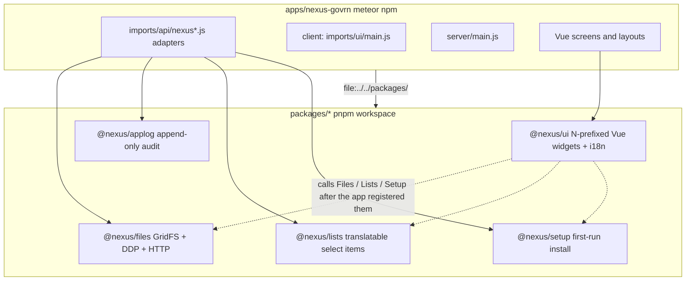
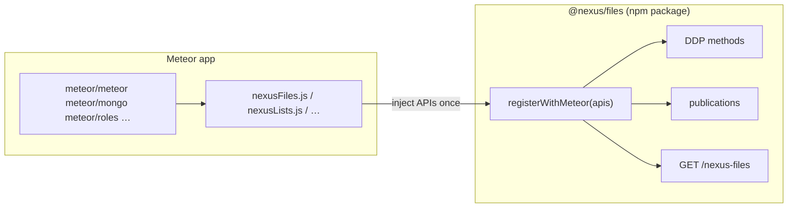
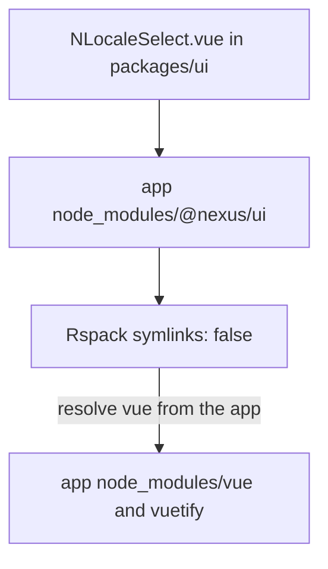
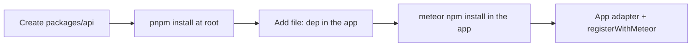

<!--
Author: Karmil Asgarally - INTELLEKTRA © 2026
Shared JS packages and how Meteor apps consume them
-->
# Shared packages

NEXUS keeps reusable JavaScript in `packages/*` and product code in `apps/*`. Packages are ordinary npm libraries (`@nexus/ui`, `@nexus/files`, …). Meteor product apps consume them with a `file:` dependency and `meteor npm`, not as Atmosphere packages and not as pnpm workspace members.

This file is the integration map. Daily pnpm commands live in [`PNPM.md`](PNPM.md). Per-package APIs live in each package README. Design story (locales, lists, fields, files, setup, accounts, applog): [`docs/architecture/_Architecture.md`](docs/architecture/_Architecture.md).

## Contents

- [Why packages exist](#why-packages-exist)
- [What lives where](#what-lives-where)
- [Package catalog](#package-catalog)
- [Install worlds](#install-worlds)
- [Why packages must not import `meteor/*`](#why-packages-must-not-import-meteor)
- [The `registerWithMeteor` contract](#the-registerwithmeteor-contract)
- [How GovRN wires packages](#how-govrn-wires-packages)
  - [Registration order](#registration-order)
  - [App adapter files](#app-adapter-files)
  - [Client and server entry](#client-and-server-entry)
  - [Rspack](#rspack)
- [Consume a package from a Meteor app](#consume-a-package-from-a-meteor-app)
- [Dependencies and peerDependencies](#dependencies-and-peerdependencies)
- [Fixed collection names](#fixed-collection-names)
- [Vue UI versus Meteor-injected packages](#vue-ui-versus-meteor-injected-packages)
- [Add a new shared JS package](#add-a-new-shared-js-package)
- [Docker](#docker)
- [Testing](#testing)
- [Later: publish to npm](#later-publish-to-npm)
- [What not to do](#what-not-to-do)
- [Troubleshooting](#troubleshooting)
- [Key files](#key-files)

## Why packages exist

Each Meteor product under `apps/` pins its own Vue / Vuetify / Meteor versions. Shared behaviour (GridFS, audit, lists, first-run setup, Vue widgets) must still be one implementation.

Packages give that split:

- One source tree per concern, imported as `@nexus/<name>`.
- Apps stay free to upgrade UI frameworks on their own schedule.
- Package code is testable with Vitest without booting Meteor (Meteor APIs are injected or mocked).
- After a future npm publish, the import path does not change. Only the dependency string in the app `package.json` does (`file:` → a version).



## What lives where

| Path | Role | Tool |
|------|------|------|
| [`packages/*`](packages/ui) | Shared JS libraries (`@nexus/…`) | `pnpm install` at the **repo root** |
| [`apps/*`](apps/nexus-govrn) | Meteor products (e.g. `nexus-govrn`) | `meteor npm install` **in that app** |
| [`services/`](services/README.md) | Python/Arelle, DevOps sidecars | venv / Compose — **not** packages |
| [`docker/`](docker/README.md) | Compose stacks and the Meteor image | copies `packages/` then `meteor npm ci` |
| [`tooling/`](tooling/penpot/README.md) | Local development aids such as Penpot | isolated Compose stacks — **not** packages |

A folder belongs under `packages/` when it is JavaScript that more than one Meteor app (or several sub-apps in one app) will import. Python, certs, Compose files, and design tooling do not.

## Package catalog

Today the workspace is six members. Each has its own README for the public API.

| Folder | npm name | What it owns | Meteor injection? |
|--------|----------|--------------|-------------------|
| [`packages/ui`](packages/ui/README.md) | `@nexus/ui` | Vue 3 widgets including Settings/accounts (`NSettingsWorkspace`, `NAccountsRegister`, `NAccountForm`), translatable fields (`NTranslatableTextField`, `NTranslatableTextarea`), and `createNexusI18n` | No. Peer Vue / Vuetify / vue-i18n from the **app**. |
| [`packages/files`](packages/files/README.md) | `@nexus/files` | `nexus_files` + GridFS bucket `nexus_fs`, DDP upload/remove, `GET /nexus-files/:fileId`, `Files.defineOwner` | Yes. `Files.registerWithMeteor` |
| [`packages/applog`](packages/applog/README.md) | `@nexus/applog` | Append-only `nexus_applog`; wraps `insertAsync` / `updateAsync` / `removeAsync`; `Applog.record` / `runAsSystem`. `applog.recent` is **superadmin** only | Yes. `Applog.registerWithMeteor` |
| [`packages/lists`](packages/lists/README.md) | `@nexus/lists` | `nexus_lists` items (`listKey` + stable `code` + `title` map; always `title.en`) | Yes. `Lists.registerWithMeteor` |
| [`packages/setup`](packages/setup/README.md) | `@nexus/setup` | Singleton `nexus_setup` (`_id: 'current'`), first admin user, public branding publication | Yes. `Setup.registerWithMeteor` |
| [`packages/accounts`](packages/accounts/README.md) | `@nexus/accounts` | User CRUD, password reset, suspend, role assignment via `meteor/roles`; `registerRoleCatalog` | Yes. `Accounts.registerWithMeteor` |

Layouts, Vuetify theme, routes, and product collections (Risks, invoices, …) stay in the app.

## Install worlds

Same split as [`README.md`](README.md#install-worlds) and [`PNPM.md`](PNPM.md). Do not mix the tools.

| World | Path | Install | Lockfile |
|-------|------|---------|----------|
| Shared JS | `packages/*` | `pnpm install` at the repo root | [`pnpm-lock.yaml`](pnpm-lock.yaml) |
| Meteor apps | `apps/*` | `meteor npm install` in that app | each app’s `package-lock.json` |
| Non-JS | `services/`, `docker/` | venv / Compose | not pnpm |
| Development tooling | `tooling/*` | Docker Compose via root scripts | not pnpm |

[`pnpm-workspace.yaml`](pnpm-workspace.yaml) is only:

```yaml
packages:
  - "packages/*"
```

Apps are **not** workspace members. That is why they use `file:`, not `workspace:*`.

```json
"@nexus/ui": "file:../../packages/ui",
"@nexus/files": "file:../../packages/files",
"@nexus/applog": "file:../../packages/applog",
"@nexus/lists": "file:../../packages/lists",
"@nexus/setup": "file:../../packages/setup"
```

`meteor npm install` creates a junction (Windows) or symlink from `apps/<app>/node_modules/@nexus/<name>` to `packages/<name>`. Rspack must keep `resolve.symlinks: false` so Vue and Vuetify still resolve from the **app**. See [Rspack](#rspack).

## Why packages must not import `meteor/*`

Meteor 3 resolves `meteor/meteor`, `meteor/mongo`, `meteor/roles`, and the rest from the **app** compilation unit. An npm package under `packages/` is outside that graph. `import { Meteor } from 'meteor/meteor'` inside `@nexus/files` fails at runtime (and often at bundle time).

The house rule is therefore:

1. Package source never imports `meteor/*`.
2. The **app** imports Meteor APIs and passes them in once via `registerWithMeteor`.
3. Calling `registerWithMeteor` twice throws. Using the package before that call throws.

This is the same pattern for files, lists, setup, and applog. It is also why Vitest can mock those APIs: the package has no hidden Meteor import.



## The `registerWithMeteor` contract

Every Meteor-talking package follows the same shape.

**Always required** (client and server): `Meteor`, `Mongo`, `check`, `Match`, plus package-specific APIs (`Random` and `Roles` for files; `Roles` for lists and applog; `Roles` and `Accounts` for setup).

**Server only** for `@nexus/files`: `MongoInternals` (GridFS bucket on the raw Mongo db) and `WebApp` (download route). The client calls `registerWithMeteor` **without** those two.

Typical call from an app adapter:

```javascript
import { Files } from '@nexus/files'
import { Meteor } from 'meteor/meteor'
import { Mongo, MongoInternals } from 'meteor/mongo'
import { Roles } from 'meteor/roles'
import { check, Match } from 'meteor/check'
import { Random } from 'meteor/random'
import { WebApp } from 'meteor/webapp'

Files.registerWithMeteor({
  Meteor,
  Mongo,
  MongoInternals,
  check,
  Match,
  Random,
  Roles,
  WebApp,
})

Files.defineOwner({
  type: 'demo',
  collection: FilesDemoParents,
  allowAnonymous: true,
  roles: {
    upload: 'files.demo.upload',
    download: 'files.demo.download',
    remove: 'files.demo.remove',
  },
})
```

What `registerWithMeteor` does on first call:

1. Stores the APIs. A second call throws.
2. Constructs the package’s `Mongo.Collection` with the **fixed** name (`nexus_files`, `nexus_lists`, …).
3. Denies client `insert` / `update` / `remove` on that collection (lists, setup, applog; files go through methods and Meteor’s default deny). Writes happen only on the server via methods or wrappers.
4. On the server: registers DDP methods, publications, HTTP routes, and indexes.

`@nexus/setup` also accepts optional `runAsSystem` (pass `Applog.runAsSystem`) so the first-run insert is audited as `actorKind: 'SYSTEM'`. Call `Setup.registerWithMeteor` **before** `Applog.registerCollection`, because applog wraps collections that must already exist.

## How GovRN wires packages

GovRN is the reference consumer. Copy this pattern for the next Meteor product.

### Registration order

[`apps/nexus-govrn/server/main.js`](apps/nexus-govrn/server/main.js) (server) and [`apps/nexus-govrn/imports/ui/main.js`](apps/nexus-govrn/imports/ui/main.js) (client) both register in this order:

1. **Files** — GridFS + demo owner
2. **Lists** — `nexus_lists`
3. **Setup** — `nexus_setup` (may pass `Applog.runAsSystem`; that helper is importable before applog’s `registerWithMeteor`)
4. **Accounts** — user admin methods; pass `Applog.record` (callable after applog registers)
5. **Applog** — then, **server only**, `Applog.registerCollection` for `nexus_files`, demo parents, `nexus_lists`, and `nexus_setup`

Startup seeds (`seedFilesDemoParents`, `seedDemoAdmin`) run inside `Applog.runAsSystem` so they are not attributed to a user.

### App adapter files

The app never sprinkles `registerWithMeteor` across screens. One adapter per package:

| Adapter | Package | Extra |
|--------|---------|--------|
| [`imports/api/nexusFiles.js`](apps/nexus-govrn/imports/api/nexusFiles.js) | `@nexus/files` | Spreads server-only `MongoInternals` / `WebApp`; `defineOwner` for `demo` |
| [`imports/api/nexusLists.js`](apps/nexus-govrn/imports/api/nexusLists.js) | `@nexus/lists` | Injection only |
| [`imports/api/nexusSetup.js`](apps/nexus-govrn/imports/api/nexusSetup.js) | `@nexus/setup` | `Accounts` + `Applog.runAsSystem` |
| [`imports/api/nexusAccounts.js`](apps/nexus-govrn/imports/api/nexusAccounts.js) | `@nexus/accounts` | `Accounts` + `Roles` + `Applog.record` |
| [`imports/api/nexusApplog.js`](apps/nexus-govrn/imports/api/nexusApplog.js) | `@nexus/applog` | Registers collections on the server after the others exist |

Screens import `Files`, `Lists`, `Setup`, `Accounts` helpers, or Vue widgets from `@nexus/ui`. They do not call `registerWithMeteor`.

### Client and server entry

```javascript
// client — imports/ui/main.js
registerNexusFiles()
registerNexusLists()
registerNexusSetup()
registerNexusAccounts()
registerNexusApplog()
```

```javascript
// server — server/main.js
registerNexusFiles({ MongoInternals, WebApp })
registerNexusLists()
registerNexusSetup()
registerNexusAccounts()
registerNexusApplog()
```

The Vue tree mounts only after those calls, so `NSetupWizard` / `NFileUpload` / `NListSelect` see a registered package.

### Rspack

[`apps/nexus-govrn/rspack.config.js`](apps/nexus-govrn/rspack.config.js) has three package-related jobs:

1. **`resolve.symlinks: false`** — `file:` installs a junction. If Rspack followed it into `packages/ui`, `vue` / `vuetify` would walk up to the repo root and miss the app’s `node_modules`.
2. **Aliases** for `@nexus/accounts`, `@nexus/applog`, `@nexus/files`, `@nexus/lists`, `@nexus/setup` to the app’s `node_modules/@nexus/…` so client and server agree on one copy.
3. **`vue-loader` include** of both `node_modules/@nexus/ui` and `../../packages/ui` so SFCs in the package compile.

Do not alias `vuetify` to its package root — subpaths such as `vuetify/styles` break.



## Consume a package from a Meteor app

```javascript
import { NFileReplace, NFileUpload, NLocaleSelect, NTranslatableTextField, createNexusI18n } from '@nexus/ui'
import { Files } from '@nexus/files'
import { Applog } from '@nexus/applog'
import { Lists } from '@nexus/lists'
import { Setup } from '@nexus/setup'
```

The import specifier stays `@nexus/<name>` after an npm publish. GridFS, audit, lists, and setup APIs are documented in the package READMEs.

UI widgets assume the matching Meteor package is already registered:

- `NFileUpload` / `NFileReplace` → `Files.registerWithMeteor` + `Files.defineOwner`
- `NListItemsEditor` / `NListSelect` → `Lists.registerWithMeteor`
- `NSetupWizard` → `Setup.registerWithMeteor`

## Dependencies and peerDependencies

`@nexus/ui` declares **peer** Vue, vue-i18n, Vuetify, `vue-meteor-tracker`, `@nexus/files`, `@nexus/lists`, `@nexus/setup`, and `@nexus/accounts`. The **app** installs the concrete versions. That is how GovRN can stay on Vuetify 4 while another product upgrades.

pnpm may still put peer copies in the **workspace** store for library development. Those copies are not GovRN’s Vue.

Meteor-injected packages (`files`, `applog`, `lists`, `setup`) have **no** `meteor` npm dependency. Meteor is injected.

When a package needs a real runtime library (a date helper, …):

```bash
pnpm --filter @nexus/ui add dayjs
```

Commit `pnpm-lock.yaml`. Do not run that command inside `apps/nexus-govrn`.

## Fixed collection names

Package collection names are opinionated, like `meteor-roles`. They do not change per app.

| Package | Collection / bucket |
|---------|---------------------|
| `@nexus/files` | `nexus_files`, GridFS `nexus_fs.files` / `nexus_fs.chunks` |
| `@nexus/applog` | `nexus_applog` |
| `@nexus/lists` | `nexus_lists` |
| `@nexus/setup` | `nexus_setup` (singleton `_id: 'current'`) |

One Meteor app, one Mongo database, one set of these names, shared by every sub-app (Risks, Controls, ERP, …).

## Vue UI versus Meteor-injected packages

| Kind | Examples | Talks to Meteor how |
|------|----------|---------------------|
| Vue library | `@nexus/ui` | Uses peers from the app. Calls `Files.*` / `Lists.*` / `Setup.*` / `Accounts.*` that the app already registered. SFCs contain **no** `meteor/*` imports. |
| Injected Meteor library | `@nexus/files`, `@nexus/applog`, `@nexus/lists`, `@nexus/setup`, `@nexus/accounts` | `registerWithMeteor` on client and server. Methods and publications are created inside the package from the injected `Meteor`. |

Keep that split. Do not put DDP methods in `@nexus/ui`. Do not put Vue components in `@nexus/files`.

## Add a new shared JS package

1. Create `packages/<name>/package.json` with a scoped name (`@nexus/api`, …), `"private": true` until you publish, `"type": "module"`, and an `exports` map pointing at `src/index.js` (same pattern as the existing packages). Reusable Vue components in `@nexus/ui` use an `N` prefix: `NThing.vue` / `NThing` in JavaScript and `<n-thing>` in templates.
2. Add the INTELLEKTRA file header on every source file. Keep names human-readable. Address access control and OWASP in the same change — see [`SECURITY.md`](SECURITY.md) and [`.cursor/rules/security-owasp.mdc`](.cursor/rules/security-owasp.mdc).
3. If the package needs Meteor: **do not** import `meteor/*`. Export `registerWithMeteor`, deny client writes, use `check` / `Match`, and `*Async` collection APIs.
4. From the repo root: `pnpm install` (the `packages/*` glob picks it up; no edit to `pnpm-workspace.yaml`).
5. In each Meteor app that needs it, add `"@nexus/<name>": "file:../../packages/<name>"`, then `meteor npm install` in that app.
6. Add an adapter under `apps/<app>/imports/api/` and call it from client and server entry, in a documented order.
7. If the package has Vue SFCs, include it in that app’s `vue-loader` `include` and keep `resolve.symlinks: false`.
8. Document the package (README + Contents). Tests only when someone asks — [`TESTING.md`](TESTING.md).
9. Do not put Python/Arelle under `packages/` — use [`services/`](services/README.md).



## Docker

The Meteor production image does **not** run pnpm. [`docker/Dockerfile`](docker/Dockerfile):

1. `COPY packages /packages` so `file:../../packages/ui` from `/opt/src` is `/packages/ui`
2. `meteor npm ci` with the app `package-lock.json`

pnpm is **host-only**. Details: [docker/README.md — shared packages](docker/README.md#shared-packages).

## Testing

| Layer | Command | Where |
|-------|---------|--------|
| Package unit / component | `pnpm test` or `pnpm --filter @nexus/files test` | `packages/<name>/tests/` (Vitest, Meteor mocked) |
| Meteor runtime | `cd apps/nexus-govrn && meteor npm test` | methods, pubs, HTTP, GridFS |
| Screens | `pnpm test:e2e` | `e2e/` Playwright |

Do not add tests unless a person asked. Protocol: [`TESTING.md`](TESTING.md).

## Later: publish to npm

Keep the `@nexus/<name>` import in apps. Change only the app dependency:

```json
"@nexus/ui": "^0.2.0"
```

Optionally point the package `exports` at a built `dist`. The workspace remains where you develop the library. Apps can mix `file:` (local) and registry versions (released products).

## What not to do

- Do not add `apps/*` or `services/*` to `pnpm-workspace.yaml`.
- Do not run `pnpm install` inside a Meteor app directory.
- Do not replace `file:` with `workspace:` in an app.
- Do not `import … from 'meteor/…'` inside `packages/*`.
- Do not call `registerWithMeteor` from a Vue component. Keep one adapter per package.
- Do not alias `vuetify` in Rspack to `node_modules/vuetify`.
- Do not switch the Meteor Dockerfile to `pnpm`.
- Do not rename `nexus_files` / `nexus_fs` / `nexus_applog` / `nexus_lists` / `nexus_setup` per product.
- Do not use sync Mongo (`insert`, `findOne`, `fetch`) in packages or apps. See [`.cursor/rules/meteor-async.mdc`](.cursor/rules/meteor-async.mdc).

## Troubleshooting

**`Cannot find module 'meteor/meteor'` inside a package.**  
The package imported `meteor/*`. Remove that import and inject the API from the app.

**`Files.registerWithMeteor was already called`.**  
Client or server entry registered twice, or a test re-imported without resetting modules. Register once per process.

**`Call Files.registerWithMeteor before using @nexus/files`.**  
A screen or helper ran before the adapter. Register in `client` / `server` entry before `app.mount`.

**GovRN cannot resolve `@nexus/ui`.**  
From `apps/nexus-govrn` run `meteor npm install`. Confirm `node_modules/@nexus/ui` junctions to `packages/ui`.

**GovRN cannot resolve `vue` / `vuetify/styles` after a workspace change.**  
Rspack followed the junction, or someone ran pnpm in the app. Keep `resolve.symlinks: false`. Re-run `meteor npm install` in the app.

**Docker build fails on `file:../../packages/ui`.**  
The image must `COPY packages` before `meteor npm ci`. See [docker/README.md](docker/README.md#shared-packages).

**A new package’s `.vue` files are not compiled.**  
Add the package path to `vue-loader` `include` in that app’s `rspack.config.js`.

## Key files

| Path | Role |
|------|------|
| [`pnpm-workspace.yaml`](pnpm-workspace.yaml) | Workspace glob: `packages/*` only |
| [`apps/nexus-govrn/package.json`](apps/nexus-govrn/package.json) | `file:` dependencies on every `@nexus/*` package |
| [`apps/nexus-govrn/rspack.config.js`](apps/nexus-govrn/rspack.config.js) | Symlinks, aliases, `vue-loader` include |
| [`apps/nexus-govrn/server/main.js`](apps/nexus-govrn/server/main.js) | Server registration order and seeds |
| [`apps/nexus-govrn/imports/ui/main.js`](apps/nexus-govrn/imports/ui/main.js) | Client registration then Vue mount |
| [`PNPM.md`](PNPM.md) | Host pnpm commands and what not to do |
| [`TESTING.md`](TESTING.md) | Vitest / mocha / Playwright |
| [`SECURITY.md`](SECURITY.md) | Access control and OWASP for this stack |
