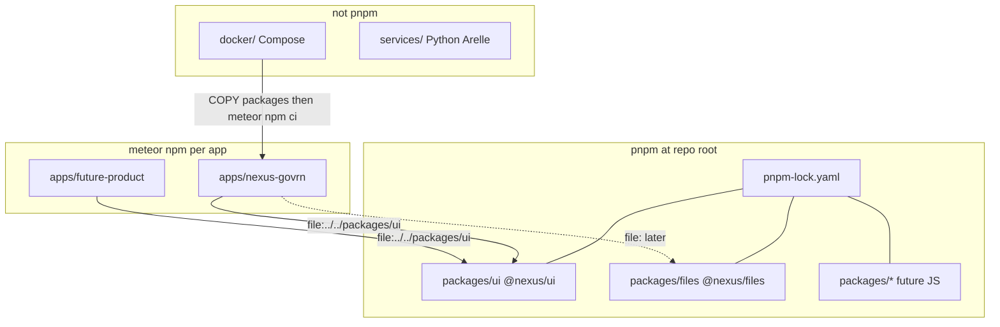
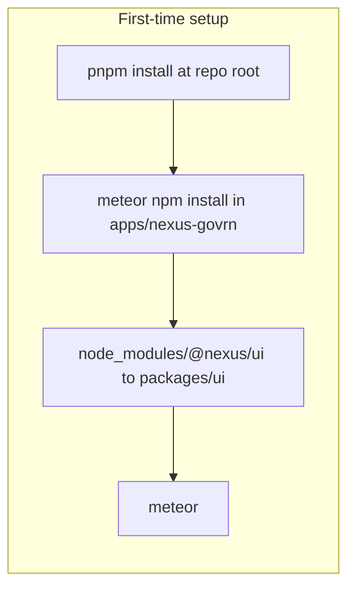
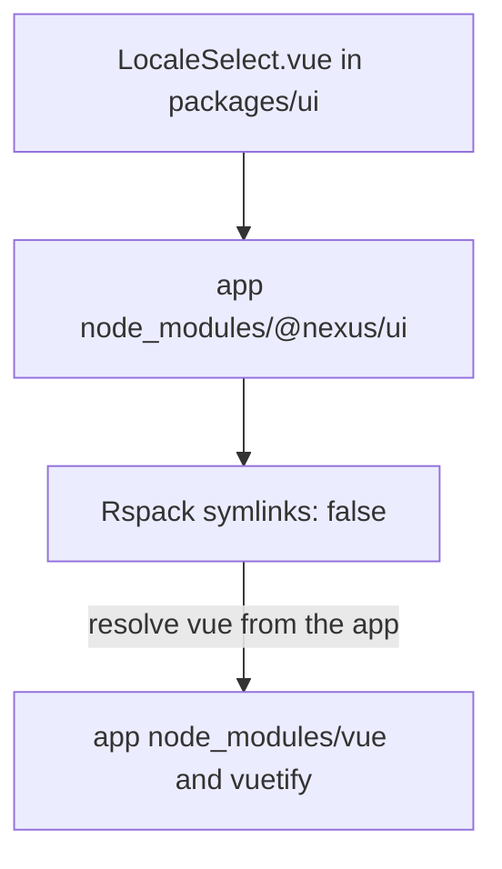
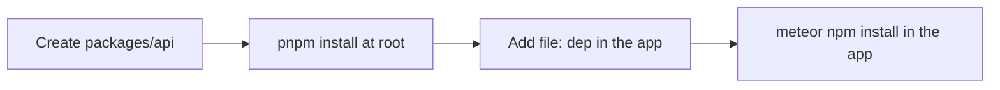
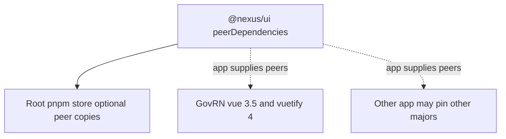
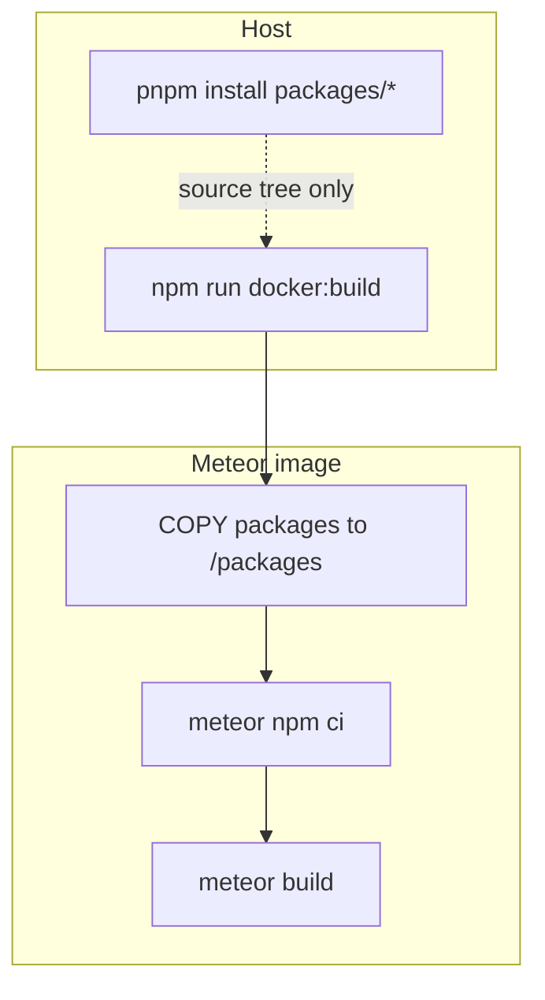
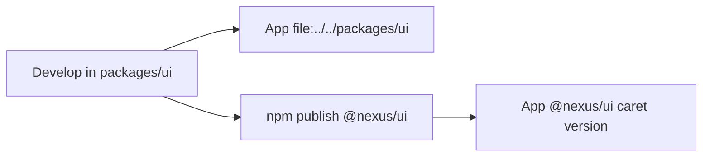

<!--
Author: Karmil Asgarally - INTELLEKTRA © 2026
How to use pnpm in this monorepo
-->
# pnpm in ik-nexus

This repo uses **pnpm 10** for **shared JavaScript packages only**. Meteor product apps and non-JS services do **not** belong in the pnpm workspace. If you run `pnpm install` inside `apps/nexus-govrn`, you are in the wrong tree.

## Contents

- [Why pnpm, and why not everywhere](#why-pnpm-and-why-not-everywhere)
- [What pnpm owns](#what-pnpm-owns)
- [Install pnpm](#install-pnpm)
- [First-time setup](#first-time-setup)
- [Daily commands](#daily-commands)
- [Workspace members vs filters](#workspace-members-vs-filters)
- [Add a new shared JS package](#add-a-new-shared-js-package)
- [Consume a package from a Meteor app](#consume-a-package-from-a-meteor-app)
- [Dependencies and peerDependencies](#dependencies-and-peerdependencies)
- [Lockfile](#lockfile)
- [Scripts at the repo root](#scripts-at-the-repo-root)
- [Docker](#docker)
- [What not to do](#what-not-to-do)
- [Troubleshooting](#troubleshooting)
- [Later: publish to npm](#later-publish-to-npm)

## Why pnpm, and why not everywhere

pnpm gives `packages/*` a single lockfile, fast installs, and first-class workspace members (`@nexus/ui`, `@nexus/files`; more JS libs later).

Meteor 3 does **not** play well with a hoisted monorepo. It installs through `meteor npm` and resolves Vue/Vuetify from **that app’s** `node_modules`. If GovRN were a pnpm workspace member, those deps would hoist (or live in a content-addressable store) and Rspack / `meteor npm ci` would miss them or load two copies.

Product apps also **pin independently**. GovRN can stay on Vuetify 4 while another app upgrades. One workspace lockfile would fight that.

So there are three install worlds:

| World | Path | Tool | Lockfile |
|-------|------|------|----------|
| Shared JS | `packages/*` | `pnpm install` at the **repo root** | [`pnpm-lock.yaml`](pnpm-lock.yaml) |
| Meteor apps | `apps/*` | `meteor npm install` **in that app** | each app’s `package-lock.json` |
| Non-JS | `services/`, `docker/` | venv / Compose | not pnpm |

See the short version in [`README.md`](README.md#install-worlds).



`file:` is a path from the app to the package source. It is not a pnpm workspace link. `workspace:*` would only work if the app were a workspace member.

## What pnpm owns

Declared in [`pnpm-workspace.yaml`](pnpm-workspace.yaml):

```yaml
packages:
  - "packages/*"
```

Today that is [`packages/ui`](packages/ui) (`@nexus/ui`) and [`packages/files`](packages/files) (`@nexus/files`). Tomorrow: API clients, shared helpers, config. Each new folder under `packages/` with a `package.json` joins the workspace automatically.

**Not** workspace members:

- `apps/*` — Meteor products (`meteor npm`)
- `services/*` — Python/Arelle, DevOps sidecars
- `docker/*` — Compose stacks (root `npm run docker:*` scripts are Node, not a pnpm package)

Root [`package.json`](package.json) is private. It pins the tool and holds Docker helper scripts. It is **not** a library.

```json
"packageManager": "pnpm@10.34.5"
```

Root [`.npmrc`](.npmrc):

```ini
ignore-workspace-root-check=true
```

That lets you run pnpm from the root even though the root has no library dependencies. Do **not** add `shamefully-hoist`. Do **not** add `apps/*` to the workspace glob.

npm may warn that `ignore-workspace-root-check` is unknown when you run `npm run docker:*`. That is expected: the key is for pnpm. Ignore the warning.

## Install pnpm

Use the version in `packageManager`. Corepack (ships with Node 16.13+) is the reliable way:

```bash
corepack enable
corepack prepare pnpm@10.34.5 --activate
pnpm --version
```

You should see `10.34.5`. A global pnpm 9 is fine **only if** you invoke 10 explicitly, for example `npx pnpm@10.34.5 install`. Prefer Corepack so `pnpm` on your PATH matches the pin.

Windows, macOS, and Linux are the same commands. You need Node (the Meteor apps already require Node 24 for production images; any current LTS is enough for host pnpm).

## First-time setup

From the **repository root** (`ik-nexus/`, not `apps/nexus-govrn/`):

```bash
pnpm install
```

That:

1. Reads `pnpm-workspace.yaml`
2. Links `@nexus/ui` and `@nexus/files`
3. Writes / updates **only** [`pnpm-lock.yaml`](pnpm-lock.yaml)
4. Puts workspace `node_modules` at the repo root (and under `packages/*` as needed)

It does **not** install Vue into GovRN. It does **not** touch `apps/nexus-govrn/package-lock.json`.

Then, for each Meteor app you actually run:

```bash
cd apps/nexus-govrn
meteor npm install
meteor
```

GovRN depends on the shared package with a **file** dependency, not a workspace protocol:

```json
"@nexus/ui": "file:../../packages/ui"
```

`meteor npm` creates a junction/symlink from `apps/nexus-govrn/node_modules/@nexus/ui` to `packages/ui`. Rspack must keep `resolve.symlinks: false` so Vue and Vuetify still resolve from the **app**. See [`packages/ui/README.md`](packages/ui/README.md#install-in-an-app).





If Rspack followed the junction as a real path into `packages/ui`, it would walk up to the repo root and miss GovRN’s Vue.

## Daily commands

Always run workspace commands from the **repo root** unless noted.

| Task | Command |
|------|---------|
| Install / refresh shared JS | `pnpm install` |
| Frozen install (CI) | `pnpm install --frozen-lockfile` |
| List workspace packages | `pnpm list -r --depth -1` |
| Add a runtime dep to `@nexus/ui` | `pnpm --filter @nexus/ui add <pkg>` |
| Add a peer (Vue, etc.) | edit `packages/ui/package.json` `peerDependencies`, then `pnpm install` |
| Add a root-only tool (optional) | `pnpm add -w -D <pkg>` |
| Why a package is installed | `pnpm why <pkg>` |
| Outdated workspace deps | `pnpm outdated -r` |
| Run a script in one package | `pnpm --filter @nexus/ui <script>` |
| Run a script in every package | `pnpm -r <script>` |

There are no package scripts on `@nexus/ui` yet. `-r` / `--filter` are ready for when you add `lint` or `test`.

**Meteor app** (wrong tool: `pnpm` inside `apps/…`):

```bash
cd apps/nexus-govrn
meteor npm install
meteor npm update
meteor
```

**Docker** stays npm at the repo root (those scripts only spawn Compose):

```bash
npm run docker:up -- nexus-govrn
```

## Workspace members vs filters

pnpm names come from each package’s `"name"` field, not the folder name.

| Folder | Package name | Filter |
|--------|----------------|--------|
| `packages/ui` | `@nexus/ui` | `--filter @nexus/ui` |
| `packages/files` | `@nexus/files` | `--filter @nexus/files` |

```bash
pnpm --filter @nexus/ui list
```

`--filter` only sees **workspace members**. It will not see `nexus-govrn`. That is intentional.

Do **not** use `workspace:*` in a Meteor app:

```json
"@nexus/ui": "workspace:*"
```

That protocol works only when the **consumer** is also a workspace member. Apps are not. Keep `file:../../packages/ui` until you publish.

## Add a new shared JS package

1. Create `packages/<name>/package.json` with a scoped name (`@nexus/api`, `@nexus/config`, …), `"private": true` until you publish, and `"type": "module"` if it is ESM.
2. Add an `exports` map (same pattern as `@nexus/ui`).
3. From the repo root: `pnpm install` (the `packages/*` glob picks it up; no edit to `pnpm-workspace.yaml`).
4. In each Meteor app that needs it:

```json
"@nexus/api": "file:../../packages/api"
```

then `meteor npm install` in that app.

5. Document the package (README + Contents). Do not put Python/Arelle under `packages/` — use [`services/`](services/README.md).



## Consume a package from a Meteor app

```js
import { LocaleSelect, createNexusI18n } from '@nexus/ui'
import { Files } from '@nexus/files'
```

The import path stays `@nexus/ui` / `@nexus/files` after an npm publish. Only the dependency string in the app `package.json` changes (`file:` → a version). GridFS wiring is documented in [`packages/files/README.md`](packages/files/README.md).

If Rspack cannot compile the `.vue` files, include the package in `vue-loader` (GovRN already includes `node_modules/@nexus/ui` and `../../packages/ui`). Do not alias `vuetify` to its package root — subpaths like `vuetify/styles` break.

## Dependencies and peerDependencies

`@nexus/ui` declares **peer** Vue, vue-i18n, and Vuetify. The **app** installs the concrete versions. That is how two products can pin different majors.

pnpm 10 may still materialize those peers into the **workspace** store (`autoInstallPeers` defaults to true). That copy lives under the repo-root `node_modules` / `.pnpm` store. It is for developing the library. It is **not** GovRN’s Vue.



The dashed arrows are the ones that run in the browser. The workspace store is only for developing the library on the host.

When you add a real runtime dependency to a shared package (a date library, etc.):

```bash
pnpm --filter @nexus/ui add dayjs
```

Commit the updated `pnpm-lock.yaml`. Do not run that command inside `apps/nexus-govrn`.

## Lockfile

| File | Owner | Commit? |
|------|--------|---------|
| [`pnpm-lock.yaml`](pnpm-lock.yaml) | pnpm workspace | yes |
| `apps/<app>/package-lock.json` | `meteor npm` | yes |
| `package-lock.json` at repo root | — | do not create one for `packages/*` |

`pnpm install --frozen-lockfile` in CI if you add a job that installs shared JS. Meteor CI / Docker keep using the app lockfile.

Never run `pnpm import` against an app lockfile to “unify” the repo.

## Scripts at the repo root

Root scripts are **npm** scripts that call `node docker/stack.mjs`. They do not need pnpm:

```bash
npm run docker:build -- nexus-govrn
```

You can run the same via `pnpm run docker:build -- nexus-govrn`. Extra `--` is still required so the app name reaches the Node runner. Using `npm run` here avoids mixing mental models: Docker ≠ workspace.

## Docker

The Meteor production image does **not** run pnpm. [`docker/Dockerfile`](docker/Dockerfile):

1. `COPY packages /packages` so `file:../../packages/ui` from `/opt/src` is `/packages/ui`
2. `meteor npm ci` with the app `package-lock.json`

pnpm is **host-only**. Details: [docker/README.md — pnpm is host-only](docker/README.md#pnpm-is-host-only).



## What not to do

- Do not add `apps/*` or `services/*` to `pnpm-workspace.yaml`.
- Do not run `pnpm install` inside a Meteor app directory.
- Do not replace `file:` with `workspace:` in an app.
- Do not enable `shamefully-hoist` to “make Meteor see” root deps.
- Do not alias `vuetify` in Rspack to `node_modules/vuetify`.
- Do not switch the Meteor Dockerfile to `pnpm`.
- Do not delete an app’s `package-lock.json` in favour of the root pnpm lock.

## Troubleshooting

**`pnpm install` inside `apps/nexus-govrn` looks at the wrong workspace or fails.**  
`cd` to the repo root. The workspace file lives there.

**GovRN cannot resolve `@nexus/ui`.**  
From `apps/nexus-govrn` run `meteor npm install`. Confirm `node_modules/@nexus/ui` junctions to `packages/ui`.

**GovRN cannot resolve `vue` / `vuetify/styles` after a workspace change.**  
You likely ran pnpm in the app or added hoist settings. Revert `pnpm-workspace.yaml` / `.npmrc`. Re-run `meteor npm install` in the app. Keep `resolve.symlinks: false` in that app’s `rspack.config.js`.

**Root `pnpm install` changed `apps/nexus-govrn/node_modules`.**  
That should not happen. Check that `pnpm-workspace.yaml` is only `packages/*`.

**Corepack / version mismatch.**  
`corepack prepare pnpm@10.34.5 --activate`. Avoid mixing a global pnpm 9 with this repo’s lockfile.

**`npm run` warns about `ignore-workspace-root-check`.**  
Harmless. That key is for pnpm; npm reads the same `.npmrc`.

**Need a Python/Arelle service.**  
Add it under [`services/`](services/README.md), not `packages/`.

## Later: publish to npm

Keep the `@nexus/ui` import in apps. Change only the app dependency:

```json
"@nexus/ui": "^0.2.0"
```

Optionally point the package `exports` at a built `dist`. The workspace remains the place you develop the library; apps can mix `file:` (local) and registry versions (released products) as you choose.



Import stays `from '@nexus/ui'` on both arrows.
