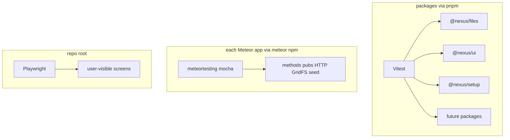

<!--
Author: Karmil Asgarally - INTELLEKTRA © 2026
Testing solution and protocols for packages and Meteor apps
-->
# Testing

This monorepo uses **three layers** so a green run always shows *what* ran, not only that something passed. Package and Playwright runs also write an HTML report you can reopen. Meteor mocha prints a spec log (that driver does not produce a useful HTML report).

The protocol below is for **shared JS packages** (`packages/*`) and for **Meteor product apps** (`apps/*`), including **sub-apps** we have not built yet (Risks, Controls, and the rest). Cursor follows the same rules in [`.cursor/rules/testing.mdc`](.cursor/rules/testing.mdc).

## Contents

- [When tests are created](#when-tests-are-created)
- [Why three layers](#why-three-layers)
- [Install worlds](#install-worlds)
- [Command cheat sheet](#command-cheat-sheet)
- [Layer 1 — Packages (Vitest)](#layer-1--packages-vitest)
  - [Package coverage today](#package-coverage-today)
  - [Package commands](#package-commands)
  - [Package file layout](#package-file-layout)
  - [How to add a package test](#how-to-add-a-package-test)
- [Layer 2 — Meteor runtime (mocha)](#layer-2--meteor-runtime-mocha)
  - [Meteor coverage today](#meteor-coverage-today)
  - [Meteor commands](#meteor-commands)
  - [Meteor file layout](#meteor-file-layout)
  - [How to add a Meteor runtime test](#how-to-add-a-meteor-runtime-test)
  - [Windows note](#windows-note)
- [Layer 3 — User-visible flows (Playwright)](#layer-3--user-visible-flows-playwright)
  - [Playwright coverage today](#playwright-coverage-today)
  - [Playwright commands](#playwright-commands)
  - [Playwright file layout](#playwright-file-layout)
  - [How to add a Playwright spec](#how-to-add-a-playwright-spec)
- [Sub-apps in Meteor products](#sub-apps-in-meteor-products)
- [Reports](#reports)
- [GitHub Actions](#github-actions)
- [Writing rules](#writing-rules)
- [What not to do](#what-not-to-do)
- [Troubleshooting](#troubleshooting)
- [Key files](#key-files)

## When tests are created

Tests are **not** created automatically during feature work. A sub-app such as Risks or Controls will go through several iterations; adding suites in each pass would freeze unfinished contracts.

Create or expand test files **only when a person asks** (for example “add tests for Risks” or “cover the lightbox with Playwright”). Until then, implement the product code only. Do not add a suite “while we are here”.

## Why three layers

A Meteor `npm test` that only asserts `package.json` has the right name will print “passed” and hide the fact that nothing of value ran. That is what we replaced.



| Layer | Runner | Protects | Needs Meteor process? |
|-------|--------|----------|------------------------|
| Shared JS | Vitest | Pure logic and Vue components in `packages/*` | No. Meteor APIs are mocked. |
| Meteor runtime | mocha (`meteortesting:mocha`) | DDP methods, publications, HTTP, GridFS, seeded parents | Yes. `--full-app` so `server/main.js` still runs. |
| User-visible flow | Playwright | What a person can break in the browser | Yes. Reuses `http://127.0.0.1:3000` or starts `meteor run`. |

Pick **one** layer per test. Do not invent a fourth runner. If app JS does not need Meteor, move it to `packages/*` and Vitest it. Do **not** add Vitest inside a Meteor app’s `meteor npm` tree.

## Install worlds

Same split as the rest of the repo. Do not mix them.

| World | Install | Then run |
|-------|---------|----------|
| Shared JS + Playwright | `pnpm install` at the **repo root** | `pnpm test`, `pnpm test:e2e` |
| Meteor app | `meteor npm install` in `apps/<app>` | `meteor npm test` |

First-time Playwright browsers (once per machine):

```bash
pnpm exec playwright install chromium
```

GovRN first-time:

```bash
cd apps/nexus-govrn
meteor npm install
```

## Command cheat sheet

From the **repository root** unless noted.

| What | Command |
|------|---------|
| All package unit/component tests | `pnpm test` |
| Same as above | `pnpm test:packages` |
| One package | `pnpm --filter @nexus/files test`, `pnpm --filter @nexus/ui test`, or `pnpm --filter @nexus/setup test` |
| Package tests, watch mode | `pnpm test:watch` |
| GovRN Meteor runtime | `cd apps/nexus-govrn` then `meteor npm test` |
| GovRN mocha, watch | `cd apps/nexus-govrn` then `meteor npm run test-app` |
| Files-gallery (and later screen) E2E | `pnpm test:e2e` |
| Install Playwright Chromium | `pnpm exec playwright install chromium` |

Open reports after a run:

| Report | Path |
|--------|------|
| Vitest HTML | [`reports/vitest/index.html`](reports/vitest/index.html) |
| Playwright HTML | [`reports/playwright/index.html`](reports/playwright/index.html) |
| Mocha | Terminal spec log (CI may attach a log artifact) |

## Layer 1 — Packages (Vitest)

Root pnpm owns this world ([`pnpm-workspace.yaml`](pnpm-workspace.yaml) is `packages/*` only). Config: [`vitest.config.js`](vitest.config.js). Wrapper: [`scripts/run-vitest.mjs`](scripts/run-vitest.mjs) runs Vitest, then copies the HTML report from `.vitest/` to `reports/vitest/`.

Reporters are `default` + `verbose` + HTML. Every suite and test **name** must appear in the terminal.

Environment is `happy-dom` so Vue SFCs can mount. [`vitest.setup.js`](vitest.setup.js) stubs `ResizeObserver` for overlay/layout code.

### Package coverage today

**`@nexus/files`** — `packages/files/tests/`

- MIME allowlists and `/nexus-files` prefix
- `defineOwner` validation and `allowAnonymous`
- `registerWithMeteor` required APIs, “already called”, server wiring
- GridFS `toNativeObjectId` (24-char hex and Meteor `ObjectID._str`) so downloads cannot miss the blob
- HTTP GET path parse and 404 / 401 / 200
- `downloadUrl` encoding and `remove` DDP wiring

**`@nexus/setup`** — `packages/setup/tests/`

- Image data-URL allowlist and size limit
- `registerWithMeteor` required APIs, “already called”, `nexus_setup` deny
- `setup.isComplete` / `setup.complete` (roles, no password on the document, `setup-already-complete`)
- Client helpers (`setup.complete`, `setup.public`, login fallback)
- `setup.public` projects only `companyName` / `logoDataUrl` / `iconDataUrl`

**`@nexus/ui`** — `packages/ui/tests/`

- `createNexusI18n`, stored locale, `lang` / `dir` for AR vs FR, core `setup.title`
- `FileLightbox`: native `img.file-lightbox-image`, `90vw` / `80vh` constraints, prev/next/close
- `SetupWizard`: no `meteor/*`, company/admin gates, complete then login, review error, non-image logo

Meteor is **mocked**. These tests never boot Mongo or DDP.

### Package commands

```bash
pnpm install
pnpm test
pnpm test:watch
pnpm --filter @nexus/files test
pnpm --filter @nexus/ui test
pnpm --filter @nexus/setup test
```

### Package file layout

```text
packages/<name>/tests/*.test.js
```

Each package’s `"test"` script calls the root wrapper with a path filter so `pnpm --filter <pkg> test` only runs that folder.

### How to add a package test

1. Create `packages/<name>/tests/<topic>.test.js` with the INTELLEKTRA file header.
2. Title the `describe` / `it` as the contract (“returns 404 when the metadata document is missing”), not “works”.
3. Import from `../src/...`. Reset modules (`vi.resetModules()`) when the unit under test keeps process-wide state (`registerWithMeteor`).
4. For Vue, mount with `@vue/test-utils`. Stub Vuetify (`VOverlay`, `VBtn`) instead of importing `vuetify/components` (that pulls CSS Vitest will not load).
5. Run `pnpm test` and confirm the new names print. Open `reports/vitest/index.html` if you want the same list in a browser.

A new workspace package needs a `"test"` script like the others (`node ../../scripts/run-vitest.mjs packages/<name>/tests`). The root include already matches `packages/*/tests/**/*.test.js`.

## Layer 2 — Meteor runtime (mocha)

GovRN (and later each Meteor product) uses `meteor test --full-app --driver-package meteortesting:mocha`. `--full-app` is required: without it, `server/main.js` does not load, so `@nexus/files` is never registered and seeds never run.

The driver is a **CLI extra package**, not a line in [`.meteor/packages`](apps/nexus-govrn/.meteor/packages). Leave that file alone.

[`apps/nexus-govrn/tests/run-mocha.mjs`](apps/nexus-govrn/tests/run-mocha.mjs) sets `SERVER_TEST_REPORTER=spec`, `CLIENT_TEST_REPORTER=spec`, and `MOCHA_TIMEOUT=30000` on Windows and Unix.

`testModule` is **server-only** so the client Rspack test bundle does not pull Node `Buffer` / `assert`:

```json
"testModule": { "server": "tests/main.js" }
```

Client mocha is omitted on purpose (it needs `TEST_BROWSER_DRIVER`). Screens belong in Playwright.

### Meteor coverage today

[`apps/nexus-govrn/tests/server/files.runtime.test.js`](apps/nexus-govrn/tests/server/files.runtime.test.js):

- Demo parents used by `/files-test` exist
- Anonymous `nexusFiles.start` for owner type `demo`
- `GET /nexus-files/<missing>` → 404
- DDP `start` / `pushChunk` / `finish`, then GET returns the same bytes; `gridFsId` is 24-char hex

Fetches use `WebApp.httpServer.address().port` so they hit the **test** process, not some other app on port 3000.

### Meteor commands

```bash
cd apps/nexus-govrn
meteor npm install
meteor npm test
meteor npm run test-app
```

Do **not** run `pnpm test` from `apps/nexus-govrn`. That is the wrong tree.

### Meteor file layout

```text
apps/<app>/tests/main.js                 # imports server suites
apps/<app>/tests/run-mocha.mjs           # spec reporter + Windows abort handling
apps/<app>/tests/server/<area>.test.js   # methods, pubs, HTTP, seed
```

### How to add a Meteor runtime test

1. Add `apps/<app>/tests/server/<area>.test.js` with a file header.
2. Import it from `tests/main.js`.
3. `before` should wait for `Meteor.startup`, then ensure registration/seed if the suite depends on them (GovRN’s files suite calls `registerNexusFiles` and `seedFilesDemoParents` and ignores “already called”).
4. Assert DDP errors, HTTP status/body, or collection documents. Title the case as the runtime contract.
5. Run `meteor npm test` and read the spec names in the terminal.

### Windows note

`meteor test --once` can abort libuv after a **green** suite (`UV_HANDLE_CLOSING` in `src/win/async.c`). `run-mocha.mjs` exits 0 when mocha printed passing tests and no `failing` line. Ubuntu CI does not hit that abort.

## Layer 3 — User-visible flows (Playwright)

Root `@playwright/test`. Config: [`playwright.config.js`](playwright.config.js). Base URL is `http://127.0.0.1:3000`. If GovRN is already up, it is reused; otherwise Playwright runs `meteor run` in `apps/nexus-govrn` (up to 10 minutes for first boot).

Reporter is `list` plus HTML under `reports/playwright/`. Specs run serially (`fullyParallel: false`).

### Playwright coverage today

[`e2e/files-gallery.spec.js`](e2e/files-gallery.spec.js): open `/files-test`, upload [`e2e/fixtures/lightbox-probe.png`](e2e/fixtures/lightbox-probe.png) on the **images** card (not the documents field), wait for a thumbnail, open the lightbox, assert `img.file-lightbox-image` is visible and has a non-zero box. `/lists-test` and first-run `/onboarding` have no Playwright spec yet.

### Playwright commands

```bash
pnpm exec playwright install chromium   # once per machine
pnpm test:e2e
```

Optional: start GovRN yourself (`cd apps/nexus-govrn && meteor run`) so Playwright skips the long boot.

### Playwright file layout

```text
e2e/<flow>.spec.js
e2e/fixtures/           # committed tiny binaries (PNG), not huge assets
```

### How to add a Playwright spec

1. Add `e2e/<flow>.spec.js` with a file header. Name the `test()` as the user-visible contract.
2. Target the screen the way a person would (card text, role, test id). There are two “Upload files” inputs on `/files-test` — scope to the right card.
3. Put small fixtures under `e2e/fixtures/`.
4. Run `pnpm test:e2e`. Open `reports/playwright/index.html` after failures (trace is kept on failure).

## Sub-apps in Meteor products

GovRN does not yet contain Risks, Controls, or other product areas. Build the sub-app first. Add tests **only after someone asks**, using the table below. Several product iterations without new test files are expected.

| Kind of code | Layer | Location |
|--------------|-------|----------|
| Shared helper or Vue widget used by more than one app/sub-app | Vitest | `packages/<name>/tests/` |
| Sub-app methods, publications, allow/deny, HTTP, seed | mocha | `apps/<app>/tests/server/<sub-app>.test.js` imported from `tests/main.js` |
| Sub-app screen (list, form, detail, upload) | Playwright | `e2e/<sub-app>-<flow>.spec.js` |

Example after the user asks to test Risks:

1. Extract anything reusable (status labels, validators) to `packages/*` and Vitest it.
2. Mocha: creating a risk requires a parent; publication only returns rows the caller may see; a forbidden method returns `not-authorized`.
3. Playwright: open the Risks list, create one, see it after reload.

A **new Meteor app** under `apps/` copies the GovRN pattern: `tests/run-mocha.mjs`, `testModule.server`, `meteor npm test` with `--full-app`, and Playwright specs at the **repo root** `e2e/` (one Playwright project, not a second install inside the app).

## Reports

| Run | Terminal | Reopen later |
|-----|----------|--------------|
| `pnpm test` | Verbose Vitest (every name) | `reports/vitest/index.html` (copied from `.vitest/`) |
| `meteor npm test` | Mocha spec (every name) | CI artifact `meteor-mocha-log` when a log file exists |
| `pnpm test:e2e` | Playwright list | `reports/playwright/index.html` |

`reports/vitest/*`, `reports/playwright/*`, `.vitest/`, and `test-results/` are gitignored except the `.gitkeep` placeholders.

## GitHub Actions

[`.github/workflows/test.yml`](.github/workflows/test.yml) runs on push and pull request (Ubuntu):

1. **packages** — `pnpm test` → artifact `vitest-report`
2. **meteor** — install Meteor, `meteor npm ci` in GovRN, `meteor npm test` → artifact `meteor-mocha-log` if present
3. **e2e** — waits for **packages**, then Playwright → artifact `playwright-report`

Open the artifacts on the workflow run to see which tests executed.

## Writing rules

- Test titles describe the **behavior that must not regress**.
- Never ship a silent placeholder (`it('works')`, `package.json has correct name`).
- Same file-header and human-readable names as production code.
- One assertion theme per `it`. Extract a named helper instead of a nested setup puzzle.
- Mock Meteor in Vitest. Use real Meteor only in mocha.

```javascript
// BAD — silent pass
it('works', () => { expect(true).toBe(true) })

// GOOD — names the contract
it('returns 404 for a missing /nexus-files id', async () => {
  const response = await fetch(filesUrl('does-not-exist'))
  expect(response.status).toBe(404)
})
```

## What not to do

- Do not run `pnpm install` or `pnpm test` inside `apps/`.
- Do not add Vitest to a Meteor app’s `package.json`.
- Do not use `meteor test` **without** `--full-app` for runtime suites (methods will be missing).
- Do not put Playwright inside `apps/<app>/`. Keep `e2e/` at the repo root.
- Do not commit `.meteor/local`, `reports/vitest/*` (except `.gitkeep`), or Playwright `test-results/`.
- Do not create test files unless a person asked for them. Sub-app iterations do not imply a new suite.

## Troubleshooting

| Symptom | Likely cause |
|---------|----------------|
| `pnpm test` starts Meteor mocha | Current directory is `apps/nexus-govrn`. `cd` to the repo root. |
| Mocha: `Method 'nexusFiles.start' not found` | Tests ran without `--full-app`, or `registerWithMeteor` did not run. Use `meteor npm test` (wrapper already passes `--full-app`). |
| Mocha GET `/nexus-files/...` returns 200 HTML | Fetch hit a different Meteor (SPA fallback). Use `WebApp.httpServer` port, as the files runtime suite does. |
| Vitest: `Unknown file extension ".css"` | A test imported `vuetify/components`. Stub `VOverlay` / `VBtn` instead. |
| Playwright times out on webServer | First `meteor run` is slow. Wait, or start GovRN yourself and rerun `pnpm test:e2e`. |
| Playwright clicks the wrong upload | Two file inputs on `/files-test`. Scope to the images card. |
| Windows mocha exits non-zero after “4 passing” | Old script without `run-mocha.mjs`. Use `meteor npm test` from this branch. |

## Key files

| Path | Role |
|------|------|
| [`vitest.config.js`](vitest.config.js) | Package include, verbose + HTML reporters |
| [`scripts/run-vitest.mjs`](scripts/run-vitest.mjs) | Run Vitest and copy HTML to `reports/vitest/` |
| [`playwright.config.js`](playwright.config.js) | `e2e/`, port 3000, HTML report |
| [`apps/nexus-govrn/tests/run-mocha.mjs`](apps/nexus-govrn/tests/run-mocha.mjs) | Spec reporter, `--full-app`, Windows abort |
| [`apps/nexus-govrn/tests/main.js`](apps/nexus-govrn/tests/main.js) | Server mocha entry |
| [`.github/workflows/test.yml`](.github/workflows/test.yml) | CI jobs and artifacts |
| [`.cursor/rules/testing.mdc`](.cursor/rules/testing.mdc) | Agent protocol when you ask for tests |
