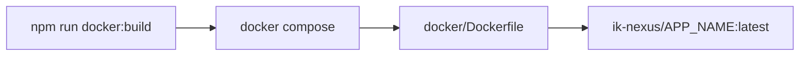
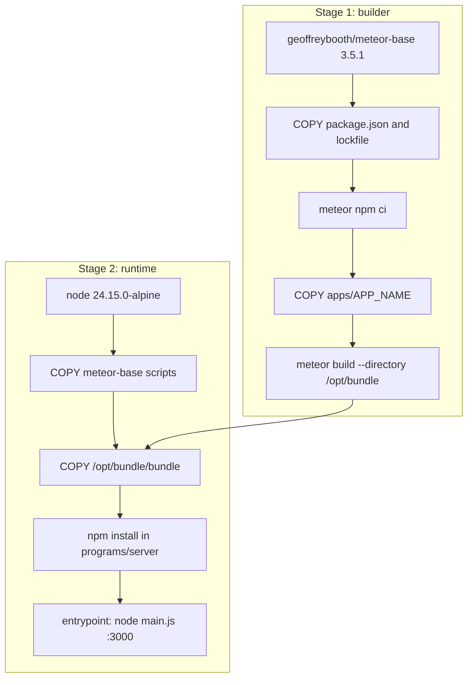
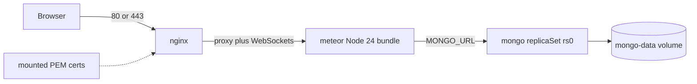

<!--
Author: Karmil Asgarally - INTELLEKTRA © 2026
Docker stack usage
-->
# Docker stacks

Each Meteor app under `apps/` gets one Compose stack: NGINX in front, the production Meteor image, and MongoDB on a named volume.

Commands go through a Node runner and root npm scripts. The same commands work on Windows, Linux, and macOS. You only need Node and Docker. There is no PowerShell-only path.

## Commands

```bash
npm run docker:up -- nexus-govrn
npm run docker:build -- nexus-govrn
npm run docker:ps -- nexus-govrn
npm run docker:down -- nexus-govrn
npm run docker:down -- nexus-govrn --volumes   # also wipe Mongo data
npm run docker:certs -- nexus-govrn            # local self-signed TLS for :8443
```

Or `npm run docker -- <command> [app]`. With only one app env file, the name can be omitted. `npm run docker -- help` lists every command.

Add another app by creating `docker/apps/<name>.env` and `docker/certs/<name>/`.

## How the Meteor image is built

The Meteor app is **not copied into the image as source**. Docker runs a Linux `meteor build`, then the final image keeps only the Node bundle. That is required: a Windows-host `meteor build` would target the wrong architecture for the Linux runtime.

`npm run docker:build -- nexus-govrn` and `npm run docker:up` call Compose, which builds [`Dockerfile`](Dockerfile) from the **repo root** and tags `ik-nexus/<app>:latest`.



Compose wires it like this ([`docker-compose.yml`](docker-compose.yml)):

- **context:** `..` (repository root) so the Dockerfile can `COPY apps/${APP_NAME}`
- **dockerfile:** `docker/Dockerfile`
- **build-arg:** `APP_NAME` from `docker/apps/<name>.env`

[`.dockerignore`](../.dockerignore) at the repo root keeps `.git`, `.meteor/local`, `node_modules`, Rspack/Meteor cache dirs, and TLS PEMs out of the build context. The builder reinstalls npm deps inside the image.

### Multi-stage Dockerfile

Two stages. The heavy Meteor toolchain never reaches the image that actually runs.



#### Stage 1 — builder (`geoffreybooth/meteor-base:3.5.1`)

The meteor-base image already has the Meteor CLI. Paths it defines:

| Variable | Path | Role |
|----------|------|------|
| `$APP_SOURCE_FOLDER` | `/opt/src` | App source during the build |
| `$APP_BUNDLE_FOLDER` | `/opt/bundle` | Output of `meteor build` |
| `$SCRIPTS_FOLDER` | `/docker` | Helper scripts (`entrypoint.sh`, npm install) |

Steps:

1. Fail fast if `APP_NAME` is empty.
2. Raise Node heap (`TOOL_NODE_FLAGS=--max-old-space-size=4096`). Give Docker Desktop at least 4 GB RAM (8 GB is safer) if `meteor build` OOMs (exit 137).
3. Copy only `apps/${APP_NAME}/package.json` and `package-lock.json`, then run meteor-base’s `build-app-npm-dependencies.sh` (`meteor npm ci`). That layer caches until dependencies change. **DevDependencies stay** — Rspack and Vue loader run at **build** time.
4. Copy the rest of `apps/${APP_NAME}` into `/opt/src`.
5. Run a **full client + server** build:

```text
meteor build --directory /opt/bundle
```

`--directory` writes a folder instead of a tarball. **Do not use `--server-only`**: this app’s Vue client must be in the bundle. meteor-base’s own `build-meteor-bundle.sh` passes `--server-only`, which is why the Dockerfile runs `meteor build` itself.

The app pins `METEOR@3.5.2` in `.meteor/release`. There is no `meteor-base:3.5.2` tag; **3.5.1** downloads the project’s exact release if needed.

Output: `/opt/bundle/bundle/` (`main.js`, `programs/server`, `programs/web.browser`, …).

#### Stage 2 — runtime (`node:24.15.0-alpine`)

Meteor 3.5 expects Node 24. This stage copies only:

- meteor-base helper scripts (`/docker`, including `entrypoint.sh` and Mongo wait)
- the built bundle (`/opt/bundle/bundle`)

Then `build-meteor-npm-dependencies.sh` runs `npm install` in `programs/server` so server/native deps match Alpine.

The container starts with `/docker/entrypoint.sh` → `node main.js` on port **3000**. No Meteor CLI and no app source remain.

Compose injects runtime env:

| Variable | Purpose |
|----------|---------|
| `ROOT_URL` | Public URL (must match how browsers reach the app) |
| `PORT` | `3000` (NGINX proxies to this) |
| `MONGO_URL` | `mongodb://mongo:27017/<db>?replicaSet=rs0` |

### How the image sits in the stack



NGINX is a separate image. It proxies HTTP/HTTPS and WebSockets to `meteor:3000`. Mongo is official `mongo:7` as a single-node replica set (`rs0`) so Meteor 3.5 change streams work. Mongo data lives on the `mongo-data` volume; port 27017 is not published.

### Adding another Meteor app

Same Dockerfile and Compose file. Create `docker/apps/<name>.env` (`APP_NAME` must match `apps/<name>`) and `docker/certs/<name>/`. Then `npm run docker:up -- <name>`.

## Why 8081 works and 8443 does not (until you add certs)

`docker/apps/nexus-govrn.env` publishes two host ports:

| Host port | Container | Used for |
|-----------|-----------|----------|
| `HTTP_PORT` (8081) | 80 | HTTP |
| `HTTPS_PORT` (8443) | 443 | HTTPS |

NGINX only listens on **443** when both of these files exist:

```text
docker/certs/<app>/fullchain.pem
docker/certs/<app>/privkey.pem
```

Those names are what DigitalOcean / Let's Encrypt already use (`fullchain.pem` + `privkey.pem`). Until they are present, the entrypoint logs `No TLS certs mounted; HTTP only`, port 8443 is mapped but nothing accepts TLS, and **http://localhost:8081** is the only working URL.

PEM files are gitignored. Only `.gitkeep` is committed under `docker/certs/`.

## Local HTTPS (self-signed)

Generate a localhost certificate, point Meteor at the HTTPS URL, then recreate the stack so NGINX reloads the certs:

```bash
npm run docker:certs -- nexus-govrn
```

Edit `docker/apps/nexus-govrn.env`:

```env
ROOT_URL=https://localhost:8443
```

Then:

```bash
npm run docker:up -- nexus-govrn
```

Open **https://localhost:8443**. The browser will warn because the cert is self-signed — continue anyway. HTTP on 8081 redirects to `https://localhost:8443`.

To replace an existing pair: `npm run docker:certs -- nexus-govrn --force`.

### Manual OpenSSL (if you prefer)

```bash
openssl req -x509 -nodes -newkey rsa:2048 \
  -keyout docker/certs/nexus-govrn/privkey.pem \
  -out docker/certs/nexus-govrn/fullchain.pem \
  -days 825 \
  -subj "/CN=localhost" \
  -addext "subjectAltName=DNS:localhost,IP:127.0.0.1"
```

Then set `ROOT_URL` and run `npm run docker:up` as above.

## Production / DigitalOcean

Copy the server certificate and key into the app cert directory using those exact filenames:

```text
docker/certs/nexus-govrn/fullchain.pem
docker/certs/nexus-govrn/privkey.pem
```

Typical Let's Encrypt paths on the droplet:

```bash
cp /etc/letsencrypt/live/your.domain/fullchain.pem docker/certs/nexus-govrn/fullchain.pem
cp /etc/letsencrypt/live/your.domain/privkey.pem docker/certs/nexus-govrn/privkey.pem
```

Set public ports and the public URL in `docker/apps/nexus-govrn.env`:

```env
HTTP_PORT=80
HTTPS_PORT=443
ROOT_URL=https://your.domain
```

Then `npm run docker:up -- nexus-govrn`. HTTP on port 80 redirects to HTTPS on 443.
