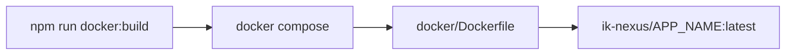
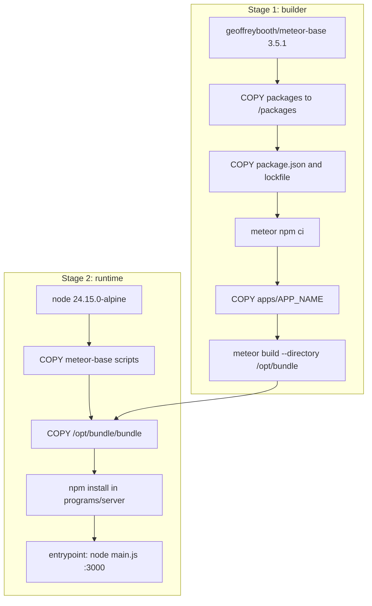
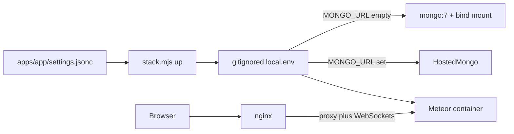
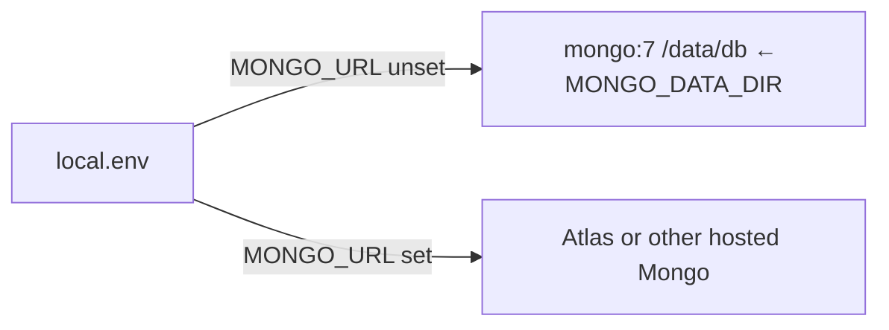

<!--
Author: Karmil Asgarally - INTELLEKTRA © 2026
Docker stack usage
-->
# Docker stacks

Each Meteor app under `apps/` gets one Compose stack: NGINX in front and the production Meteor image. Mongo is either an in-stack `mongo:7` replica with a **host bind mount**, or a hosted `MONGO_URL` (Atlas). Settings and secrets stay out of the image.

`APP_NAME` is the folder under `apps/` (today: **`nexus-govrn`**). It must match `docker/apps/<APP_NAME>.env`. Commands below use `<app>`; substitute that name.

Commands go through a Node runner and root npm scripts. The same commands work on Windows, Linux, and macOS. You only need Node and Docker. There is no PowerShell-only path.

## Contents

- [Commands](#commands)
- [How the Meteor image is built](#how-the-meteor-image-is-built)
  - [Shared packages](#shared-packages)
  - [pnpm is host-only](#pnpm-is-host-only)
  - [Multi-stage Dockerfile](#multi-stage-dockerfile)
    - [Stage 1 — builder](#stage-1--builder-geoffreyboothmeteor-base351)
    - [Stage 2 — runtime](#stage-2--runtime-node24150-alpine)
  - [How the image sits in the stack](#how-the-image-sits-in-the-stack)
- [Runtime settings and secrets](#runtime-settings-and-secrets)
- [Mongo: in-stack bind mount or hosted URL](#mongo-in-stack-bind-mount-or-hosted-url)
  - [In-stack mongo (default)](#in-stack-mongo-default)
  - [Hosted Mongo / Atlas](#hosted-mongo--atlas)
  - [What is not a Mongo disk](#what-is-not-a-mongo-disk)
  - [Adding another Meteor app](#adding-another-meteor-app)
- [HTTP vs HTTPS ports](#http-vs-https-ports)
- [Local HTTPS (self-signed)](#local-https-self-signed)
  - [Manual OpenSSL (if you prefer)](#manual-openssl-if-you-prefer)
- [Production / DigitalOcean](#production--digitalocean)

## Commands

```bash
# example app: nexus-govrn
npm run docker:up -- <app>
npm run docker:build -- <app>
npm run docker:ps -- <app>
npm run docker:down -- <app>
npm run docker:down -- <app> --volumes   # named volumes only; bind-mount Mongo data stays
npm run docker:certs -- <app>            # local self-signed TLS for :8443
```

Or `npm run docker -- <command> [app]`. With only one app env file, the name can be omitted. `npm run docker -- help` lists every command.

Add another app by creating `docker/apps/<name>.env`, `docker/apps/<name>.local.env.example`, and `docker/certs/<name>/`. Secrets go in the gitignored `docker/apps/<name>.local.env` overlay, never in the committed `.env`.

## How the Meteor image is built

The Meteor app is **not copied into the image as source**. Docker runs a Linux `meteor build`, then the final image keeps only the Node bundle. That is required: a Windows-host `meteor build` would target the wrong architecture for the Linux runtime.

`npm run docker:build -- <app>` and `npm run docker:up` call Compose, which builds [`Dockerfile`](Dockerfile) from the **repo root** and tags `ik-nexus/<app>:latest`.



Compose wires it like this ([`docker-compose.yml`](docker-compose.yml)):

- **context:** `..` (repository root) so the Dockerfile can `COPY apps/${APP_NAME}` and `COPY packages`
- **dockerfile:** `docker/Dockerfile`
- **build-arg:** `APP_NAME` from `docker/apps/<name>.env`

[`.dockerignore`](../.dockerignore) at the repo root keeps `.git`, `.meteor/local`, `node_modules`, Rspack/Meteor cache dirs, and TLS PEMs out of the build context. The builder reinstalls npm deps inside the image.

### Shared packages

Apps depend on [`@nexus/ui`](../packages/ui) with `"@nexus/ui": "file:../../packages/ui"`. The Meteor app is copied to `/opt/src`, so that relative path resolves to **`/packages/ui`**. The Dockerfile copies the repo `packages/` tree there **before** `meteor npm ci`, otherwise the file dependency is missing and the install fails.

### pnpm is host-only

The host repo uses pnpm for [`packages/*`](../packages/ui) only. The Meteor image does **not**. It still runs `meteor npm ci` against the app’s `package-lock.json` and the `file:` copy at `/packages`. Do not switch the Dockerfile to `pnpm`.

### Multi-stage Dockerfile

Two stages. The heavy Meteor toolchain never reaches the image that actually runs.



#### Stage 1 — builder (`geoffreybooth/meteor-base:3.5.1`)

The meteor-base image already has the Meteor CLI. Paths it defines:

| Variable | Path | Role |
|----------|------|------|
| `$APP_SOURCE_FOLDER` | `/opt/src` | App source during the build |
| `$APP_BUNDLE_FOLDER` | `/opt/bundle` | Output of `meteor build` |
| `$SCRIPTS_FOLDER` | `/docker` | Helper scripts (`entrypoint.sh`, npm install) |

Steps:

1. Fail fast if `APP_NAME` is empty.
2. Raise Node heap (`TOOL_NODE_FLAGS=--max-old-space-size=4096`). Give Docker Desktop at least 4 GB RAM (8 GB is safer) if `meteor build` OOMs (exit 137).
3. Copy `packages/` to `/packages` so `file:../../packages/ui` from `/opt/src` resolves.
4. Copy only `apps/${APP_NAME}/package.json` and `package-lock.json`, then run meteor-base’s `build-app-npm-dependencies.sh` (`meteor npm ci`). That layer caches until dependencies change. **DevDependencies stay** — Rspack and Vue loader run at **build** time.
5. Copy the rest of `apps/${APP_NAME}` into `/opt/src`.
6. Run a **full client + server** build:

```text
meteor build --directory /opt/bundle
```

`--directory` writes a folder instead of a tarball. **Do not use `--server-only`**: the Vue client must be in the bundle. meteor-base’s own `build-meteor-bundle.sh` passes `--server-only`, which is why the Dockerfile runs `meteor build` itself.

Each app pins Meteor in `apps/<app>/.meteor/release` (nexus-govrn: **3.5.2**). There is no `meteor-base:3.5.2` tag; **3.5.1** downloads the project’s exact release if needed.

Output: `/opt/bundle/bundle/` (`main.js`, `programs/server`, `programs/web.browser`, …).

#### Stage 2 — runtime (`node:24.15.0-alpine`)

Meteor 3.5 expects Node 24. This stage copies only:

- meteor-base helper scripts (`/docker`, including `entrypoint.sh` and Mongo wait)
- the built bundle (`/opt/bundle/bundle`)

Then `build-meteor-npm-dependencies.sh` runs `npm install` in `programs/server` so server/native deps match Alpine.

The container starts with `/docker/entrypoint.sh` → `node main.js` on port **3000**. No Meteor CLI and no app source remain.

Compose injects runtime env (image still has none of these baked in):

| Variable | Purpose |
|----------|---------|
| `ROOT_URL` | Public URL (must match how browsers reach the app) |
| `PORT` | `3000` (NGINX proxies to this) |
| `MONGO_URL` | In-stack replica by default, or a hosted URL from the local overlay |
| `METEOR_SETTINGS` | Minified JSON from `apps/<app>/settings.jsonc` (written by the runner) |
| `MAIL_URL`, `TWILIO_*` | Optional process env from the gitignored overlay |

### How the image sits in the stack



NGINX is a separate image. It proxies HTTP/HTTPS and WebSockets to `meteor:3000`. When `MONGO_URL` is unset, official `mongo:7` runs as a single-node replica set (`rs0`) so Meteor 3.5 change streams work. Port 27017 is not published. When `MONGO_URL` is set, those mongo services are not started.

## Runtime settings and secrets

The image does **not** contain `settings.json`, SMTP credentials, Twilio tokens, or Mongo URIs. [`stack.mjs`](stack.mjs) writes them at `docker:up` / `docker:build`.

| File | Git | Holds |
|------|-----|--------|
| `docker/apps/<app>.env` (example: [`nexus-govrn.env`](apps/nexus-govrn.env)) | committed | `APP_NAME`, ports, `ROOT_URL`, `MONGO_DB`, default `MONGO_DATA_DIR` |
| `docker/apps/<app>.local.env.example` | committed | Empty `MAIL_URL` / `TWILIO_*` plus commented `MONGO_URL` / `MONGO_DATA_DIR` |
| `docker/apps/<app>.local.env` | **gitignored** | `METEOR_SETTINGS`, `MAIL_URL`, `TWILIO_*`, optional hosted `MONGO_URL` |

On first `docker:up` or `docker:build`, the runner copies the example to `docker/apps/<app>.local.env` if that overlay is missing. It then minifies `apps/<app>/settings.jsonc` and upserts a single `METEOR_SETTINGS=...` line without wiping other keys. Do not minify that JSON by hand — `$` and quotes in `.env` files are easy to break.

`MAIL_URL` and `TWILIO_*` are ordinary process environment. The container receives them; a Meteor app can use them when it implements mail or SMS.

`public.devSeedAdmin` in settings must be `false` (or omitted) on a public `https://` `ROOT_URL`. The runner refuses `docker:up` in that case. `https://localhost` is not treated as production.

Never commit a PM2-style file that lists live SendGrid or Twilio keys. Treat any such historical values as leaked and rotate them.

## Mongo: in-stack bind mount or hosted URL



### In-stack mongo (default)

Leave `MONGO_URL` **unset** (commented or omitted — do not leave `MONGO_URL=` empty). The runner starts Compose profile `local-mongo` (`mongo` + `mongo-init`). Meteor’s `MONGO_URL` becomes `mongodb://mongo:27017/<MONGO_DB>?replicaSet=rs0`.

Data is a **host bind mount**, not a named Docker volume:

```text
${MONGO_DATA_DIR}:/data/db
```

Default path convention: `docker/data/<app>/mongo` (gitignored). Override `MONGO_DATA_DIR` in the committed env or the overlay. On a droplet, point it at Block Storage, for example `/mnt/mongo/<app>`.

`docker:down` stops the containers. `docker:down --volumes` removes named volumes only; it does **not** delete the bind-mount folder. To wipe local Mongo data, stop the stack and delete that host directory, then `docker:up` again.

`PERSIST-TEST` is **not** in application code. It is a manual mongosh insert used to prove the folder persists. Some apps still have Meteor’s tutorial `links` seed on an empty database.

To drop `PERSIST-TEST` (and only it), with the in-stack mongo up (example app `nexus-govrn`):

```bash
docker exec <app>-mongo-1 mongosh "$MONGO_DB" --eval "db.links.deleteOne({title:'PERSIST-TEST'})"
```

### Hosted Mongo / Atlas

Set `MONGO_URL` in `docker/apps/<app>.local.env`. The runner starts only `meteor` and `nginx`. The `mongo` / `mongo-init` services and the bind mount are not created. Atlas **replaces** the in-stack replica; it does not sit beside it.

Meteor `depends_on` mongo is `required: false`, so an Atlas `up` does not wait for a local replica.

### What is not a Mongo disk

DigitalOcean **Spaces** is object storage. It is not a filesystem for WiredTiger. Do not point `MONGO_DATA_DIR` at a Spaces mount or expect `mongod` to store `--dbpath` there.

### Adding another Meteor app

Same Dockerfile and Compose file. Create `docker/apps/<name>.env` (`APP_NAME` must match `apps/<name>`), `docker/apps/<name>.local.env.example`, and `docker/certs/<name>/`. Then `npm run docker:up -- <name>`.

## HTTP vs HTTPS ports

Each `docker/apps/<app>.env` publishes two host ports. The `nexus-govrn` example uses 8081 / 8443; pick unused ports for the next app.

| Host port | Container | Used for |
|-----------|-----------|----------|
| `HTTP_PORT` (example 8081) | 80 | HTTP |
| `HTTPS_PORT` (example 8443) | 443 | HTTPS |

NGINX only listens on **443** when both of these files exist:

```text
docker/certs/<app>/fullchain.pem
docker/certs/<app>/privkey.pem
```

Those names are what DigitalOcean / Let's Encrypt already use (`fullchain.pem` + `privkey.pem`). Until they are present, the entrypoint logs `No TLS certs mounted; HTTP only`, the HTTPS port is mapped but nothing accepts TLS, and HTTP on `HTTP_PORT` is the only working URL.

PEM files are gitignored. Only `.gitkeep` is committed under `docker/certs/`.

## Local HTTPS (self-signed)

Generate a localhost certificate, point Meteor at the HTTPS URL, then recreate the stack so NGINX reloads the certs:

```bash
npm run docker:certs -- <app>
```

Edit `docker/apps/<app>.env` so `ROOT_URL` matches the HTTPS port (`HTTPS_PORT=8443` in the nexus-govrn example):

```env
ROOT_URL=https://localhost:8443
```

Then:

```bash
npm run docker:up -- <app>
```

Open that `ROOT_URL`. The browser will warn because the cert is self-signed — continue anyway. HTTP on the mapped HTTP port redirects to HTTPS when certs exist.

To replace an existing pair: `npm run docker:certs -- <app> --force`.

### Manual OpenSSL (if you prefer)

```bash
openssl req -x509 -nodes -newkey rsa:2048 \
  -keyout docker/certs/<app>/privkey.pem \
  -out docker/certs/<app>/fullchain.pem \
  -days 825 \
  -subj "/CN=localhost" \
  -addext "subjectAltName=DNS:localhost,IP:127.0.0.1"
```

Then set `ROOT_URL` and run `npm run docker:up` as above.

## Production / DigitalOcean

Copy the server certificate and key into the app cert directory using those exact filenames:

```text
docker/certs/<app>/fullchain.pem
docker/certs/<app>/privkey.pem
```

Typical Let's Encrypt paths on the droplet:

```bash
cp /etc/letsencrypt/live/your.domain/fullchain.pem docker/certs/<app>/fullchain.pem
cp /etc/letsencrypt/live/your.domain/privkey.pem docker/certs/<app>/privkey.pem
```

Set public ports and the public URL in `docker/apps/<app>.env`:

```env
HTTP_PORT=80
HTTPS_PORT=443
ROOT_URL=https://your.domain
```

Put secrets only in `docker/apps/<app>.local.env`:

- hosted `MONGO_URL` **or** `MONGO_DATA_DIR=/mnt/mongo/<app>` for an in-stack replica on Block Storage
- `MAIL_URL` / `TWILIO_*` when you need them
- `METEOR_SETTINGS` is rewritten from that app’s `settings.jsonc` on every `docker:up`

Production `settings.jsonc` must not enable `public.devSeedAdmin`. Then `npm run docker:up -- <app>`. HTTP on port 80 redirects to HTTPS on 443.

If the droplet cannot run Docker, use the bare-metal path instead: [`../deploy/README.md`](../deploy/README.md) (apt NGINX, Mongo 8 replica, UFW, Certbot, PM2).
