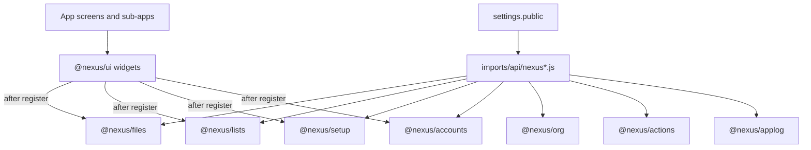

<!--
Author: Karmil Asgarally - INTELLEKTRA © 2026
Overarching Meteor app design architecture
-->
# Meteor app architecture

NEXUS products are Meteor 3 + Vue 3 apps under `apps/`. Shared behaviour lives in `@nexus/*` npm libraries under `packages/`. GovRN (`apps/nexus-govrn`) is the reference consumer: the next product copies the same settings shape, the same adapters, and the same helpers.

This folder is the design story. Package READMEs are the public API. [`PACKAGES.md`](../../PACKAGES.md) is the install and `registerWithMeteor` contract. [`SECURITY.md`](../../SECURITY.md) is access control.

## Contents

- [How a product is assembled](#how-a-product-is-assembled)
- [Guides](#guides)
  - [Locales](locales.md)
  - [Translatable fields](translatable-fields.md)
  - [Lists](lists.md)
  - [@nexus/ui](ui.md)
  - [Files](files.md)
  - [Setup](setup.md)
  - [Accounts](accounts.md)
  - [Auth](auth.md)
  - [Org](org.md)
  - [Actions](actions.md)
  - [Applog](applog.md)
- [Package injection](#package-injection)
- [What stays in the app](#what-stays-in-the-app)
- [Related contracts](#related-contracts)

## How a product is assembled

Two install worlds share one git repo. That split is deliberate: Meteor 3 does not consume a hoisted pnpm workspace, and each product pins Vue / Vuetify on its own schedule.

| Tree | Path | Tool |
|------|------|------|
| Shared JS | `packages/*` | `pnpm install` at the repo root |
| Meteor product | `apps/<name>` | `meteor npm install` in that app (`file:../../packages/<name>`) |

Packages **must not** import `meteor/*`. The app injects Meteor, Mongo, `check`, Roles, and the rest once per package through `registerWithMeteor`. Vue widgets in `@nexus/ui` call those registered helpers; they never construct collections themselves.

GovRN registration order (client and server): **Files → Lists → Setup → Accounts → Org → Actions → Applog**. Setup may pass `Applog.runAsSystem` before applog’s `registerWithMeteor`. Applog then wraps collections that already exist.

## Guides

| Document | Concern |
|----------|---------|
| [Locales](locales.md) | UI chrome vs stored maps. `defaultData` is always `en`. How a leftover `title.fr` is ignored when `data` is `["en"]`. |
| [Translatable fields](translatable-fields.md) | `NTranslatableTextField` / `NTranslatableTextarea`, fill-empty vs replace-all, `locales.translate`, adding a prose field. |
| [Lists](lists.md) | `nexus_lists`: stable `code` + title map. `NListSelect` / `NListItemsEditor`. `Lists.title`. |
| [@nexus/ui](ui.md) | `N` prefix, no `meteor/*`, inject keys, i18n factory, which widgets exist. |
| [Files](files.md) | GridFS (`nexus_files` / `nexus_fs`), `defineOwner`, DDP chunks, HTTP download, `NFileUpload` / `NFileReplace`. |
| [Setup](setup.md) | First-run singleton `nexus_setup`, wizard vs `devSeedAdmin`, public branding, admin company editor. |
| [Accounts](accounts.md) | User CRUD, suspend, role catalogs, `accounts.directory`, `setOrg`. Settings screens in `@nexus/ui`. |
| [Auth](auth.md) | Split sign-in, password reset, optional TOTP, gated self-register. GovRN is invite-only. |
| [Org](org.md) | Generic `nexus_org` tree; `profile.orgNodeId`. |
| [Actions](actions.md) | Shared actions and status journals; `canRead` / `canWrite` plus assignee. |
| [Applog](applog.md) | Append-only audit, collection wrappers, `runAsSystem`, superadmin-only read. |

## Package injection

Call `registerWithMeteor` from one adapter per package (`imports/api/nexusFiles.js`, …), not from screens. Call it on **both** client and server with the same normalized locales (lists) and the same owner definitions (files). Server-only APIs (`MongoInternals`, `WebApp`) are passed only from `server/main.js`.

The Vue tree mounts **after** those calls so `NSetupWizard`, `NFileUpload`, and `NListSelect` see a registered package.

Rspack in the app must set `resolve.symlinks: false` and compile SFCs from both `node_modules/@nexus/ui` and `../../packages/ui`. Details: [`PACKAGES.md`](../../PACKAGES.md).

## What stays in the app

Layouts, Vuetify theme, Vue Router, product collections (Books, later Risks, invoices), DDP methods for those collections, and `settings.jsonc`. A sub-app such as Books owns its schema, forms, and views; it imports widgets and helpers, it does not re-implement GridFS or list storage.

## Related contracts

- [`PACKAGES.md`](../../PACKAGES.md) — `file:`, `registerWithMeteor`, Rspack, Docker copy of `packages/`
- [`SECURITY.md`](../../SECURITY.md) — deny client writes, roles, uploads, `locales.translate`
- [`PNPM.md`](../../PNPM.md) — host pnpm for `packages/*` only
- [`TESTING.md`](../../TESTING.md) — Vitest / mocha / Playwright (only when someone asks)
- Package READMEs: [ui](../../packages/ui/README.md), [files](../../packages/files/README.md), [lists](../../packages/lists/README.md), [setup](../../packages/setup/README.md), [accounts](../../packages/accounts/README.md), [org](../../packages/org/README.md), [actions](../../packages/actions/README.md), [applog](../../packages/applog/README.md)
