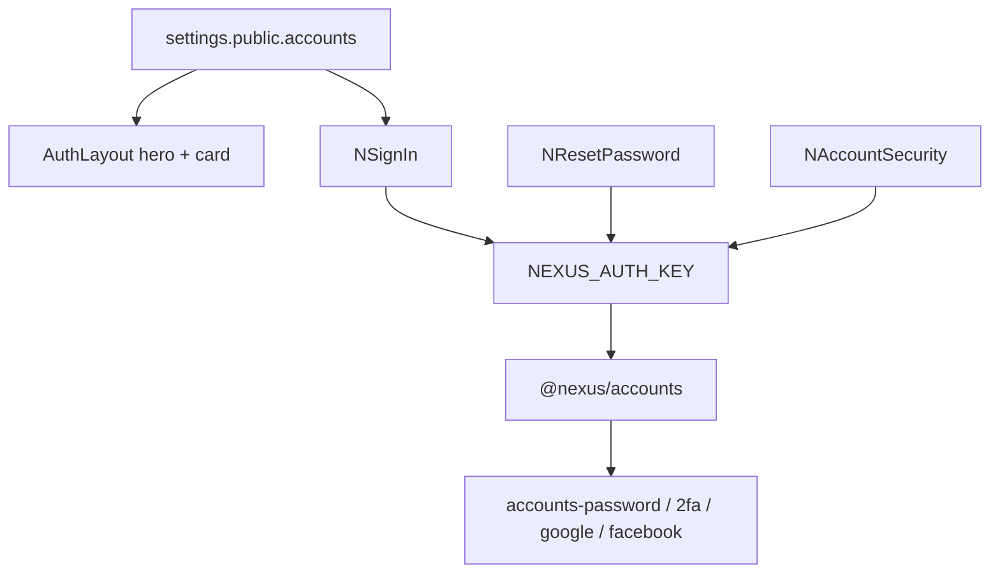

<!--
Author: Karmil Asgarally - INTELLEKTRA © 2026
Sign-in, password reset, optional TOTP, gated self-register
-->
# Auth

Shared sign-in is a settings-driven split layout plus widgets in `@nexus/ui`. Password, reset, optional TOTP, and gated self-register live in `@nexus/accounts`. GovRN stays **invite-only**.

Back to [_Architecture.md](_Architecture.md). Admin user CRUD: [Accounts](accounts.md). Package APIs: [`packages/accounts/README.md`](../../packages/accounts/README.md), [`packages/ui/README.md`](../../packages/ui/README.md).

## Contents

- [What the caller sees](#what-the-caller-sees)
- [Settings](#settings)
- [Layering](#layering)
- [Password and TOTP](#password-and-totp)
- [Password reset](#password-reset)
- [Self-register](#self-register)
- [Security](#security)
- [Source map](#source-map)

## What the caller sees

| Path | Widget | Who |
|------|--------|-----|
| `/signin` | `NSignIn` | Guest (auth layout) |
| `/forgot-password` | `NForgotPassword` | Guest |
| `/reset-password/:token` | `NResetPassword` | Guest |
| `/account` | `NAccountSecurity` | Any signed-in user |

The auth layout keeps the app bar (brand from `nexus_setup`, locale, theme) and splits the rest: a cover image from `settings.public.accounts.heroImage`, then the card. Empty `heroImage` uses a gradient. Email and password stay empty unless `public.devSeedAdmin` is true.

GovRN hides signup and Google/Facebook. After login the app goes to `?next=` (same-origin path only) or `/`.

## Settings

Author [`settings.jsonc`](../../apps/nexus-govrn/settings.jsonc):

```jsonc
"public": {
  "accounts": {
    "selfRegister": false,
    "selfRegisterRoles": ["user"],
    "heroImage": "https://images.unsplash.com/photo-1486406149926-2bddad0bc895?auto=format&fit=crop&w=1600&q=80"
  }
}
```

`heroImage` is a Meteor `public/` path (`/auth-hero.jpg`) **or** a full `http(s)` URL. The browser sets CSS `background-image`. The server does **not** fetch that URL.

OAuth secrets stay **out of** `public`:

```jsonc
"oauth": {
  "google": { "clientId": "", "secret": "" },
  "facebook": { "appId": "", "secret": "" }
}
```

Empty or missing pairs: do not upsert `ServiceConfiguration` and do not show that button, even if `selfRegister` is on.

## Layering

Packages must not import `meteor/*`. The app injects login/reset/OAuth/2FA functions through `NEXUS_AUTH_KEY` (GovRN: [`authProvide.js`](../../apps/nexus-govrn/imports/ui/authProvide.js)). Those functions call `@nexus/accounts` helpers, which wrap the injected `Accounts` / `Meteor` APIs.



## Password and TOTP

Password login works without a code. After the user enrolls on `/account`, `loginWithPassword` fails with `no-2fa-code` and `NSignIn` asks for the TOTP, then calls `loginWithPasswordAnd2faCode`.

Enrollment is for **any** signed-in user, not only admins on `/settings`. Confirm the current password, show the QR SVG from `Accounts.generate2faActivationQrCode`, enter the first TOTP, enable. Later disable with `Accounts.disableUser2fa`. Admin “set password” on `NAccountForm` stays admin-for-others.

## Password reset

`Accounts.urls.resetPassword` points at `/reset-password/:token`. Email templates are plain text with no secrets. Without `MAIL_URL`, Meteor prints the message on the **server console**. That is the intended local behaviour. Do not add SendGrid or SMTP here.

## Self-register

`Accounts.config({ forbidClientAccountCreation: true })` always. Signup goes through `accounts.selfRegister`, not client `Accounts.createUser`.

The platform catalog includes `user` next to `superadmin` / `admin`. Startup creates every catalog name, so `user` exists even though setup does not grant it. `selfRegisterRoles` must be catalog names and must never include `superadmin` or `admin`. Default is `["user"]`.

When `selfRegister` is true:

- `accounts.selfRegister` creates the password user and assigns those roles
- Google/Facebook `onCreateUser` is allowed and `onLogin` assigns the same roles if the user has none
- `NSignIn` shows signup and only the providers that have server credentials

When it is false (GovRN): new OAuth users are rejected; existing users can still sign in with a linked service.

## Security

- Client `Accounts.createUser` stays closed
- OAuth secrets never in `Meteor.settings.public`
- Suspend still rejects password, 2FA, and OAuth logins
- Hero URL is a client background only
- New methods use `check` / `Match`; self-register writes applog
- `?next=` must start with `/` and must not start with `//`

## Source map

| Concern | Where |
|---------|--------|
| Settings | [`apps/nexus-govrn/settings.jsonc`](../../apps/nexus-govrn/settings.jsonc) |
| DDP and hooks | [`packages/accounts/`](../../packages/accounts/) |
| Widgets | [`packages/ui/src/components/auth/`](../../packages/ui/src/components/auth/) |
| Inject | [`imports/ui/authProvide.js`](../../apps/nexus-govrn/imports/ui/authProvide.js) |
| Layout | [`imports/ui/layouts/AuthLayout.vue`](../../apps/nexus-govrn/imports/ui/layouts/AuthLayout.vue) |
| Routes | [`imports/ui/router.js`](../../apps/nexus-govrn/imports/ui/router.js) |
