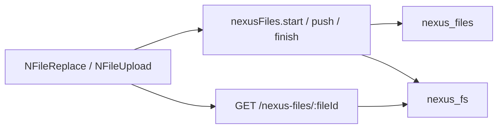

<!--
Author: Karmil Asgarally - INTELLEKTRA © 2026
GridFS uploads, owner types, and file widgets
-->
# Files

Opinionated GridFS for every sub-app in one Meteor product. Collection names are fixed (`nexus_files`, bucket `nexus_fs`). There is no storage UI in `@nexus/files` — [`NFileUpload` / `NFileReplace`](ui.md) call `Files.upload` after the app registered the package.

Back to [_Architecture.md](_Architecture.md). Package API: [`packages/files/README.md`](../../packages/files/README.md).

## Contents

- [One bucket, many owners](#one-bucket-many-owners)
- [defineOwner](#defineowner)
- [Upload and download](#upload-and-download)
- [App wiring](#app-wiring)
- [UI widgets](#ui-widgets)
- [What not to do](#what-not-to-do)
- [Source map](#source-map)

## One bucket, many owners

Books covers, later risk attachments, and the files demo share one GridFS bucket. A file row points at a **parent** (`ownerType` + `ownerId`). The parent document must exist before `nexusFiles.start` accepts an upload.

Roles are per owner type: `files.<ownerType>.upload` / `download` / `remove`. `allowAnonymous` is demo-only. Product owners (risks, invoices, books) stay `false`.

MIME allowlist and size limits are **server** checks. The browser accept list is not a control.

## defineOwner

The app opts each parent collection in:

```javascript
Files.defineOwner({
  type: 'bookCover',
  collection: Books,
  allowAnonymous: false,
  roles: {
    upload: 'files.bookCover.upload',
    download: 'files.bookCover.download',
    remove: 'files.bookCover.remove',
  },
})
```

Unknown `ownerType` is refused. Client `insert` / `update` / `remove` on `nexus_files` are denied.

## Upload and download

DDP: `nexusFiles.start` → `pushChunk` → `finish`, plus `remove`. Publication `nexusFiles.forOwner` is **metadata only** (never chunks).

HTTP `GET /nexus-files/:fileId` streams the blob `Content-Disposition: inline`. Product owners need the `meteor_login_token` cookie and the download role. The app calls `Files.syncDownloadCookie()` after login so `` and `window.open` send the cookie.



## App wiring

[`imports/api/nexusFiles.js`](../../apps/nexus-govrn/imports/api/nexusFiles.js) is the adapter. Server `registerWithMeteor` receives `MongoInternals` and `WebApp`. Client does not. GovRN defines owners such as `bookCover` and `bookPdf` (and a demo owner).

## UI widgets

| Widget | Job |
|--------|-----|
| `NFileUpload` | Many files: `document` list or `images` grid + lightbox |
| `NFileReplace` | One file: `document` field or `avatar`. Uploads the new file first, then deletes the previous |

Shared props: `ownerType`, `ownerId`, optional `accept`, `disabled`, `label`. Widgets use `useOwnerFiles` → `Files.subscribeForOwner`.

Setup branding (logo/icon) is **not** GridFS. Those are data URLs on `nexus_setup`. See [Setup](setup.md).

## What not to do

- Do not add `insecure` or a permissive `allow` on `nexus_files`.
- Do not fetch a caller-supplied URL to store a file.
- Do not enable `allowAnonymous` on product owners.
- Do not skip the parent-exists check.

## Source map

| Concern | Where |
|---------|--------|
| Package | [`packages/files/`](../../packages/files/) |
| Widgets | [`packages/ui/src/components/files/`](../../packages/ui/src/components/files/) |
| App adapter | [`imports/api/nexusFiles.js`](../../apps/nexus-govrn/imports/api/nexusFiles.js) |
