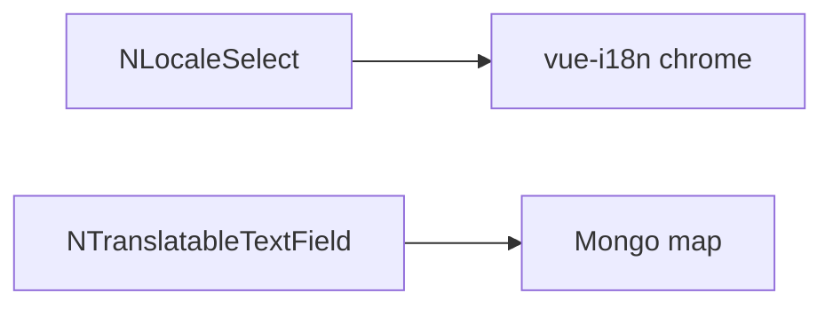

<!--
Author: Karmil Asgarally - INTELLEKTRA © 2026
UI vs data locales and how stored maps are resolved
-->
# Locales

The header language picker and the text stored on a document are **not** the same list. Getting that wrong is how leftover `title.fr` leaked onto a French UI when `data` was only `["en"]`.

Back to [_Architecture.md](_Architecture.md). Fields that edit maps: [Translatable fields](translatable-fields.md). List titles: [Lists](lists.md).

## Contents

- [Two axes](#two-axes)
- [Opinionated minimum](#opinionated-minimum)
- [Settings](#settings)
- [Resolution](#resolution)
- [How the app wires locales](#how-the-app-wires-locales)
- [Add another data locale](#add-another-data-locale)
- [What not to do](#what-not-to-do)
- [Source map](#source-map)

## Two axes

| Axis | Settings | Changes | Stored where |
|------|----------|---------|--------------|
| **UI** | `defaultUi`, `ui` | Chrome: menus, buttons, Vuetify. `NLocaleSelect` + vue-i18n. | `localStorage` (per app `storageKey`) |
| **Data** | `defaultData`, `data` | Keys on locale maps (`title`, list titles, org titles, action/status descriptions, book prose). Form tabs and translate. | Mongo on the document |

`data` must be a subset of `ui`. A client can ship three UI languages and only English data (`ui: ["en","fr","ar"]`, `data: ["en"]`). The picker still switches chrome to French; stored maps stay `{ en: "…" }`.



The picker does **not** change which tab is active on a form, and it does **not** choose which leftover Mongo key to display.

## Opinionated minimum

These two settings are required and cannot be something else:

```jsonc
"defaultData": "en",
"data": ["en"]
```

- `defaultData` must be `en`. English is the required stored key (`title.en`, `description.en`, …).
- `data` must include `en`. Extra codes (`fr`, `ar`, later `es`) are optional.
- `normalizeLocales` throws at startup if either rule fails. `@nexus/lists` `registerWithMeteor` repeats the same check.

With only `["en"]`:

- Forms render a normal Vuetify control (no tabs, no translate). See [Translatable fields](translatable-fields.md).
- `locales.translate` is refused.
- Writes keep `{ en: "…" }` only. `coerceLocalized` drops any other key.

GovRN’s `settings.jsonc` currently adds `fr` and `ar` so the picker and the tabs are visible. That is a product choice, not a platform requirement.

## Settings

Author [`apps/nexus-govrn/settings.jsonc`](../../apps/nexus-govrn/settings.jsonc). `meteor npm start` writes gitignored `settings.json`. All four keys are mandatory:

```jsonc
"locales": {
  "defaultUi": "en",
  "ui": ["en", "fr", "ar"],
  "defaultData": "en",
  "data": ["en"]          // or ["en", "fr", "ar"]
}
```

`defaultUi` must appear in `ui`. Every `data` code must appear in `ui`. Invalid settings fail startup. Helpers used when a Vue tree forgets to provide locales (`defaultLocales()`) are English-only.

The object is public (sent to every client). It names language codes only. Do not put secrets here. Meteor does not hot-reload settings — rebuild `settings.json` and restart.

## Resolution

Display is **not** “whatever key matches the UI locale”. It is:

1. Coerce the value to a map that contains **only** `locales.data` keys (`coerceLocalized`).
2. If the current UI locale is in `data` and that key has text, show it.
3. Else show `defaultData` (`en`).
4. Else show `''` (lists then fall back to `item.code`).

```javascript
resolveLocalized(
  { en: 'Governance handbook', fr: 'Leftover French' },
  'fr',
  { defaultData: 'en', data: ['en'] },
)
// → 'Governance handbook'
```

`fr` is a UI language here, but it is **not** a data language. The leftover `fr` string is ignored.

Call `resolveLocalized(map, uiLocale, locales)` with the **normalized locales object**, not a bare `'en'` string. A string third argument means “only that code is a data key”, which hides leftover keys but would also hide real `fr` text when `data` includes `fr`. Books pass `appLocales`.

| Document | `data` | UI locale | Shown |
|----------|--------|-----------|-------|
| `{ en: 'Hello', fr: 'Bonjour' }` | `["en","fr"]` | `fr` | `Bonjour` |
| `{ en: 'Hello', fr: '' }` | `["en","fr"]` | `fr` | `Hello` |
| `{ en: 'Hello', fr: 'Bonjour' }` | `["en"]` | `fr` | `Hello` |
| `"Hello"` (legacy string) | any | any | `Hello` (coerced onto `en`) |

Existing Mongo rows can still have `title.fr` from an older `data` list. After you shrink `data` to `["en"]`, those keys remain until the next write, but **views must not show them**.

## How the app wires locales

1. `normalizeLocales(Meteor.settings.public.locales)` in [`imports/api/appLocales.js`](../../apps/nexus-govrn/imports/api/appLocales.js). Server code imports that file (or `@nexus/ui/src/i18n/locales.js`), **not** the `@nexus/ui` Vue barrel.
2. `Lists.registerWithMeteor({ …, locales: appLocales })` on client and server.
3. `createNexusI18n({ locales: appLocales, storageKey, messages })`. `app.use(i18n)` provides `NEXUS_LOCALES_KEY`.
4. Screens call `resolveLocalized(value, locale, appLocales)` or `Lists.title(item, locale)`.

## Add another data locale

1. Add the code to `settings.public.locales.ui` **and** `data` (keep `defaultData: "en"`).
2. Rebuild `settings.json` and restart Meteor.
3. Add a vue-i18n pack if the code is new chrome (`es.js` does not exist today; missing catalogs fall back to `defaultUi`).
4. Forms grow a tab. Translate can target the new code.
5. New writes store the extra key. Old documents keep working: missing keys fall back to `en`.

## What not to do

- Do not treat the UI picker as the source of stored keys.
- Do not read `map[uiLocale]` unless `uiLocale` is in `locales.data`.
- Do not import the `@nexus/ui` Vue barrel from server entry.
- Do not set `defaultData` to anything other than `en`.
- Do not add a UI pack “while we are here”. Add it when a product ships that chrome.

## Source map

| Concern | Where |
|---------|--------|
| Normalize / coerce / resolve | [`packages/ui/src/i18n/locales.js`](../../packages/ui/src/i18n/locales.js) |
| App locales | [`apps/nexus-govrn/imports/api/appLocales.js`](../../apps/nexus-govrn/imports/api/appLocales.js) |
| Settings | [`apps/nexus-govrn/settings.jsonc`](../../apps/nexus-govrn/settings.jsonc) |
| Book display | [`localizedBookField`](../../apps/nexus-govrn/imports/apps/Books/collections/books.js) |
