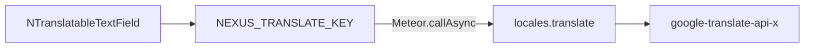

<!--
Author: Karmil Asgarally - INTELLEKTRA © 2026
Translatable field widgets and server-side translate
-->
# Translatable fields

Editors bind a **locale map** (`{ en, fr, ar }`), not a string. Tabs and translate follow [`locales.data`](locales.md), not the header picker.

Back to [_Architecture.md](_Architecture.md). Resolution rules: [Locales](locales.md). List titles use the same field: [Lists](lists.md).

## Contents

- [Widgets](#widgets)
- [Translate control](#translate-control)
- [Server translate](#server-translate)
- [How the app injects translate](#how-the-app-injects-translate)
- [Books as the worked example](#books-as-the-worked-example)
- [Add a prose field in a sub-app](#add-a-prose-field-in-a-sub-app)
- [What not to do](#what-not-to-do)
- [Source map](#source-map)

## Widgets

`NTranslatableTextField` and `NTranslatableTextarea` live in [`packages/ui/src/components/fields/`](../../packages/ui/src/components/fields/). Shared logic is `useTranslatableInput`.

- `v-model` is a map keyed by `locales.data`.
- Incoming values go through `coerceLocalized` / `emptyLocalizedMap`.
- `data.length === 1` (the required minimum is `["en"]`): only the Vuetify control. No toolbar.
- `data.length > 1`: compact tabs plus one translate control.
- `required` means `defaultData` (`en`) must be non-empty even when another tab is showing.
- Vuetify 4 attrs (`label`, `rows`, `auto-grow`, `disabled`, slots) pass through (`inheritAttrs: false`, `v-bind="$attrs"`).

`NListItemForm` uses one `NTranslatableTextField` for `draft.title`. Submit still requires `draft.title.en`.

## Translate control

Shown only when the app provided `NEXUS_TRANSLATE_KEY` and `data.length > 1`.

- Icon click — **fill empty**: `to` = other `data` codes whose value is blank.
- Chevron — **Replace all**: `to` = every other `data` code. The active tab is never overwritten.
- Disabled while the active tab is empty or a call is in flight. Fill-empty is also disabled when every other key already has text.

The component chooses `to`. The server always translates the list it is given.

## Server translate

[`google-translate-api-x`](https://www.npmjs.com/package/google-translate-api-x) talks to `translate.google.com` with **no CORS**. The unofficial client stays on the Meteor server. `@nexus/ui` only calls the injected function.

`locales.translate` checks, in order:

1. `{ text, from, to }` shape
2. Logged-in user
3. At least two codes in `locales.data` (otherwise refuse)
4. `from` and every `to` in `data`; `to` must not include `from`
5. Trimmed non-empty text, cap 5000 characters

The host is fixed. The caller cannot pass a URL (OWASP A10). Rate limits and unofficial breakage are expected; treat translate as assistance, not a source of truth.



## How the app injects translate

[`imports/ui/main.js`](../../apps/nexus-govrn/imports/ui/main.js):

```javascript
app.provide(NEXUS_TRANSLATE_KEY, (params) => Meteor.callAsync('locales.translate', params))
```

The method lives in [`imports/api/localesTranslate.js`](../../apps/nexus-govrn/imports/api/localesTranslate.js) and is imported from `server/main.js`. The npm package is a GovRN dependency, not an `@nexus/ui` dependency.

## Books as the worked example

| Piece | File | Job |
|-------|------|-----|
| Schema | [`books.js`](../../apps/nexus-govrn/imports/apps/Books/collections/books.js) | Prose fields use `localizedStringSchema()` (keys = `appLocales.data`; `en` required). Scalars stay strings (`isbn`, `category`, …). |
| Write | `readFormFields` | `coerceLocalized` on every prose field before SimpleSchema. Extra keys never persist. |
| Form | [`FrmBook.vue`](../../apps/nexus-govrn/imports/apps/Books/forms/FrmBook.vue) | Title / author / publisher → text field. Description / about author → textarea. |
| View | [`VewBook.vue`](../../apps/nexus-govrn/imports/apps/Books/views/VewBook.vue), [`VewBooks.vue`](../../apps/nexus-govrn/imports/apps/Books/views/VewBooks.vue) | `localizedBookField` → `resolveLocalized(value, locale, appLocales)`. Category → `Lists.title`. |

## Add a prose field in a sub-app

1. Put a locale map on the schema via `localizedStringSchema()` (or `{ optional: true }`).
2. On insert/update, run `coerceLocalized(value, appLocales)` so the server — not the client — decides the keys.
3. Bind `NTranslatableTextField` or `NTranslatableTextarea` with `v-model` on that map.
4. Display with `resolveLocalized(value, locale, appLocales)`.
5. Do not bind the field to `locale` from `useI18n()` as if it were a string.

Name/address and other identifiers stay plain `String` unless the product wants them translated.

## What not to do

- Do not call `google-translate-api-x` from the browser.
- Do not pass a client-supplied URL into `locales.translate`.
- Do not skip `coerceLocalized` on the server and trust the client map.

## Source map

| Concern | Where |
|---------|--------|
| Field + toolbar | [`packages/ui/src/components/fields/`](../../packages/ui/src/components/fields/) |
| Translate method | [`apps/nexus-govrn/imports/api/localesTranslate.js`](../../apps/nexus-govrn/imports/api/localesTranslate.js) |
| Book schema + coerce | [`books.js`](../../apps/nexus-govrn/imports/apps/Books/collections/books.js) |
