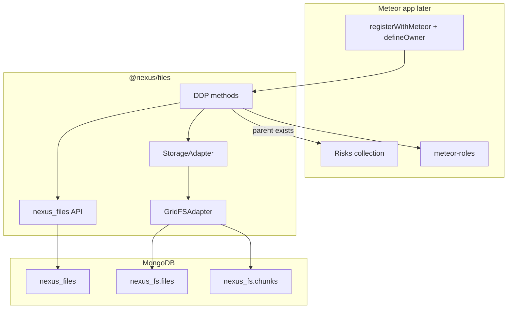
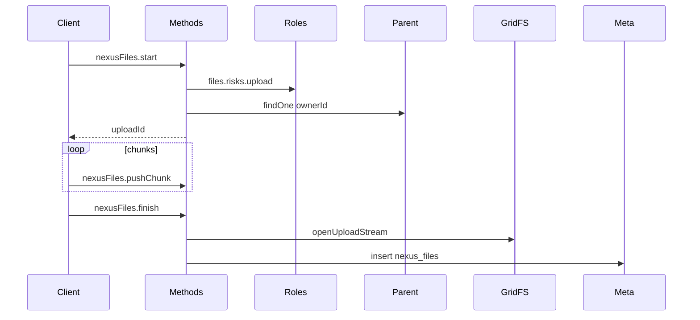

<!--
Author: Karmil Asgarally - INTELLEKTRA © 2026
Shared NEXUS files package (GridFS)
-->
# @nexus/files

Opinionated GridFS uploads for NEXUS Meteor apps. Collection names are fixed (`nexus_files`, `nexus_fs`), like meteor-roles. There is no UI here — later `@nexus/ui` will call `Files.upload`.

**Code quality:** keep this package human-readable (see `.cursor/rules/human-readable-code.mdc`). Named helpers, comments for *why*, no clever one-liners.

Do **not** run `pnpm` inside `apps/`. This package is a `packages/*` workspace member; install it from the **repo root**. Apps consume it later with `file:../../packages/files` and `meteor npm install`.

## Contents

- [What this package owns](#what-this-package-owns)
- [Develop in this repo](#develop-in-this-repo)
- [Install in an app later](#install-in-an-app-later)
- [Collection names](#collection-names)
- [Roles](#roles)
- [registerWithMeteor and defineOwner](#registerwithmeteor-and-defineowner)
- [DDP API](#ddp-api)
- [Limits](#limits)
- [Storage adapter](#storage-adapter)
- [Docker](#docker)
- [Later: publish to npm](#later-publish-to-npm)

## What this package owns

- Metadata collection `nexus_files` and GridFS bucket `nexus_fs`
- DDP methods `nexusFiles.start` / `pushChunk` / `finish` / `remove`
- Publication `nexusFiles.forOwner` (metadata only, never chunks)
- Client helper `Files.upload({ ownerType, ownerId, file })` (no Vue)
- `Files.defineOwner` so each parent collection (risks, incidents, …) opts in

This package must **not** import `meteor/*`. The app injects Meteor APIs.

## Develop in this repo

`@nexus/files` is a pnpm workspace member (`packages/*` only). From the **repo root**:

```bash
pnpm install
```

That does not install or hoist Meteor apps. Do not add `apps/` to [`pnpm-workspace.yaml`](../../pnpm-workspace.yaml). Do not run `pnpm` inside `apps/`.

## Install in an app later

v1 ships the package only. When an app is ready:

```json
"@nexus/files": "file:../../packages/files"
```

Then `meteor npm install` in that app. Do not use `workspace:*` — apps are not workspace members.

## Collection names

| Store | Name |
|-------|------|
| Metadata | `nexus_files` |
| GridFS files | `nexus_fs.files` |
| GridFS chunks | `nexus_fs.chunks` |

These names do not change per app. One GridFS bucket per Meteor app is shared by every sub-app (Risks, Incidents, Controls, ERP modules).

`nexus_files` document:

- `ownerType`, `ownerId`
- `name`, `mime`, `size`
- `storage: 'gridfs'`
- `gridFsId`
- `uploadedBy`, `createdAt`

## Roles

meteor-roles strings, registered by the app:

| Action | Role |
|--------|------|
| Upload | `files.<ownerType>.upload` |
| Download / subscribe | `files.<ownerType>.download` |
| Hard delete | `files.<ownerType>.remove` |

Example for risks: `files.risks.upload`, `files.risks.download`, `files.risks.remove`.

## registerWithMeteor and defineOwner

```js
import { Files } from '@nexus/files'
import { Meteor } from 'meteor/meteor'
import { Mongo, MongoInternals } from 'meteor/mongo'
import { Roles } from 'meteor/roles'
import { check, Match } from 'meteor/check'
import { Random } from 'meteor/random'
import { Risks } from '/imports/api/risks'

Files.registerWithMeteor({
  Meteor,
  Mongo,
  MongoInternals,
  check,
  Match,
  Random,
  Roles,
})

Files.defineOwner({
  type: 'risks',
  collection: Risks,
  roles: {
    upload: 'files.risks.upload',
    download: 'files.risks.download',
    remove: 'files.risks.remove',
  },
})
```

The parent document must already exist (`collection.findOne(ownerId)`) before `nexusFiles.start` accepts an upload.



## DDP API

| Method / publication | Who | Check |
|----------------------|-----|--------|
| `nexusFiles.start` | logged-in | parent exists; `files.<type>.upload`; mime/size |
| `nexusFiles.pushChunk` | same user as session | session owner; binary chunk |
| `nexusFiles.finish` | same user | write GridFS; insert `nexus_files` |
| `nexusFiles.remove` | logged-in | `files.<type>.remove`; hard-delete blob + row |
| `nexusFiles.forOwner` | logged-in | `files.<type>.download`; **metadata only** |

```js
import { Files } from '@nexus/files'

await Files.upload({ ownerType: 'risks', ownerId: riskId, file })
```

`file` is a browser `File` or a `Uint8Array` (then pass `name` and `mime` too).



In-memory sessions die on server restart. Delete is hard delete (metadata + GridFS chunks).

## Limits

- Default max size: **25 MB**
- Allowlist: pdf; office (`doc`/`docx`/`xls`/`xlsx`/`ppt`/`pptx`); images (`png`/`jpeg`/`gif`/`webp`); `txt`; `csv`
- Empty MIME is rejected

## Storage adapter

v1 is `GridFSAdapter` (`mongodb.GridFSBucket` on the injected `MongoInternals` db, bucket `nexus_fs`). A future Azure adapter can implement the same `write` / `read` / `remove` contract. Metadata keeps `storage` plus an adapter-specific id. `nexus_files` is not renamed.

## Docker

The image copies `packages/` to `/packages` before `meteor npm ci`. From `/opt/src`, `file:../../packages/files` is `/packages/files`. See [docker/README.md](../../docker/README.md#shared-packages).

## Later: publish to npm

Keep the `@nexus/files` import. Change the app dependency from `file:../../packages/files` to a version.
