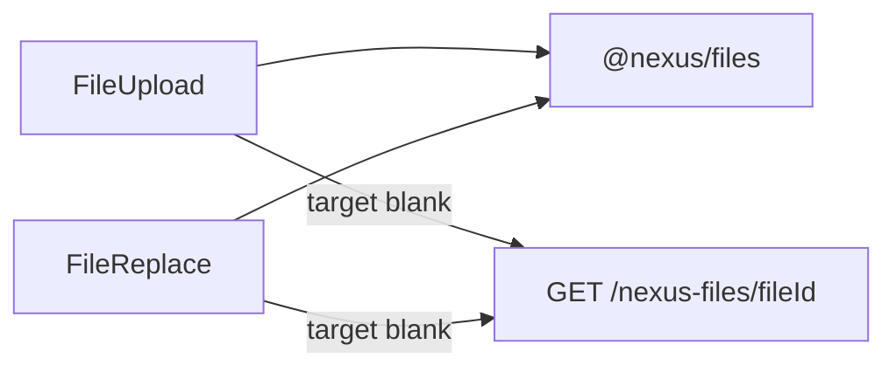

<!--
Author: Karmil Asgarally - INTELLEKTRA © 2026
Shared NEXUS UI package
-->
# @nexus/ui

Shared Vue 3 components and i18n bootstrap for NEXUS Meteor apps. Source is consumed today via a `file:` dependency. The same `@nexus/ui` import path will work after an npm publish.

## Contents

- [What this package owns](#what-this-package-owns)
- [Folder layout](#folder-layout)
- [Develop in this repo](#develop-in-this-repo)
- [Install in an app](#install-in-an-app)
- [Create the i18n instance](#create-the-i18n-instance)
- [Use LocaleSelect](#use-localeselect)
- [File upload components](#file-upload-components)
- [Docker](#docker)
- [Testing](#testing)
- [Later: publish to npm](#later-publish-to-npm)

## What this package owns

- `LocaleSelect` — language menu (EN / FR / AR, RTL for Arabic)
- `FileUpload` — many files (`document` list or `images` grid + lightbox)
- `FileReplace` — one file (`document` field or clickable `avatar`); uploads the new file, then deletes the previous
- `createNexusI18n` — vue-i18n factory with core `locale.*` / `files.*` strings and Vuetify `$vuetify` catalogs
- Helpers: `setAppLocale`, `supportedLocales`, `applyDocumentLocale`, `readStoredLocale`, `persistLocale`, `useOwnerFiles`

Layouts and Vuetify theme/defaults stay in each app. GridFS and DDP live in `@nexus/files`.

## Folder layout

```text
src/
  index.js
  i18n/
  components/
    locale/LocaleSelect.vue
    files/FileUpload.vue
    files/FileReplace.vue
    files/FileRow.vue
    files/FileLightbox.vue
    files/useOwnerFiles.js
```

Public imports stay `@nexus/ui`.

## Develop in this repo

`@nexus/ui` is a pnpm workspace member (`packages/*` only). From the **repo root**:

```bash
pnpm install
```

That does not install or hoist Meteor apps. Do not add `apps/` to [`pnpm-workspace.yaml`](../../pnpm-workspace.yaml).

## Install in an app

```json
"@nexus/ui": "file:../../packages/ui",
"@nexus/files": "file:../../packages/files"
```

Then `meteor npm install`. Point Rspack at the package source so `vue-loader` compiles the SFCs:

```js
resolve: {
  // file: installs @nexus/ui as a junction; keep the importer under node_modules
  // so vue / vue-i18n / vuetify resolve from the app.
  symlinks: false,
},
```

Do not alias `vuetify` to its package root — that breaks `vuetify/styles` and other subpaths.

The app must call `Files.registerWithMeteor` (and `defineOwner`) before mounting these file components. See [`packages/files/README.md`](../files/README.md).

## Create the i18n instance

```js
import { createNexusI18n } from '@nexus/ui'
import ar from './ar.js'
import en from './en.js'
import fr from './fr.js'

export const i18n = createNexusI18n({
  storageKey: 'your-app-locale',
  messages: { en, fr, ar },
})
```

`app.use(i18n)` also provides the storage key so `LocaleSelect` persists the choice. Keep Vuetify’s `createVueI18nAdapter({ i18n, useI18n })` in the app.

## Use LocaleSelect

```js
import { LocaleSelect } from '@nexus/ui'
```

```html
<LocaleSelect />
```

## File upload components

```js
import { FileReplace, FileUpload } from '@nexus/ui'
```

```html
<FileReplace owner-type="demo" :owner-id="docId" variant="document" />
<FileReplace
  owner-type="demo"
  :owner-id="avatarId"
  variant="avatar"
  shape="round"
  :width="128"
  :height="128"
/>
<FileUpload owner-type="demo" :owner-id="docsId" variant="document" />
<FileUpload owner-type="demo" :owner-id="photosId" variant="images" />
```

Shared props: `ownerType`, `ownerId`, optional `accept`, `disabled`, `label`.

- `FileReplace` `variant="document"` — paperclip field, name and Open/Remove below. No image preview.
- `FileReplace` `variant="avatar"` — click the preview (or empty placeholder) to open the OS file picker. `shape` is `round` or `square`; `width` and `height` are pixels. Uploads the new file first, then deletes the previous one.
- `FileUpload` `variant="document"` — many documents in a list.
- `FileUpload` `variant="images"` — thumbnail grid; click a thumbnail for a lightbox. Optional `thumbnailWidth` / `thumbnailHeight`.



`FileReplace` uploads the new file first, then hard-deletes every other file for that owner so a failed upload keeps the previous file.

## Docker

The image copies `packages/` to `/packages` before `meteor npm ci`. From `/opt/src`, `file:../../packages/ui` is `/packages/ui`. See [docker/README.md](../../docker/README.md#shared-packages).

## Testing

From the repo root: `pnpm --filter @nexus/ui test`. Suite lives in `tests/`. See [`TESTING.md`](../../TESTING.md).

## Later: publish to npm

Keep the `@nexus/ui` import. Change the app dependency from `file:../../packages/ui` to a version. Optionally point `exports` at a built `dist` without changing callers.
