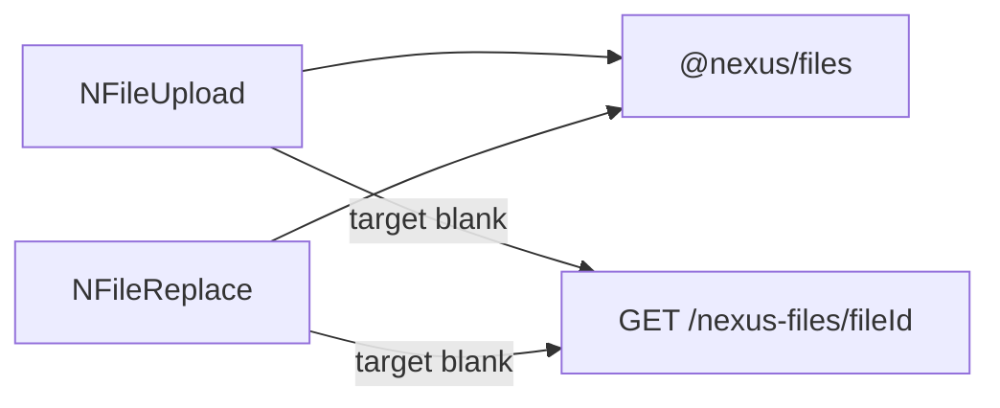

<!--
Author: Karmil Asgarally - INTELLEKTRA © 2026
Shared NEXUS UI package
-->
# @nexus/ui

Shared Vue 3 components and i18n bootstrap for NEXUS Meteor apps. Source is consumed today via a `file:` dependency. The same `@nexus/ui` import path will work after an npm publish.

## Contents

- [What this package owns](#what-this-package-owns)
- [Component naming convention](#component-naming-convention)
- [Folder layout](#folder-layout)
- [Develop in this repo](#develop-in-this-repo)
- [Install in an app](#install-in-an-app)
- [Create the i18n instance](#create-the-i18n-instance)
- [UI and data locales](#ui-and-data-locales)
- [Use NLocaleSelect](#use-nlocaleselect)
- [Translatable fields](#translatable-fields)
- [File upload components](#file-upload-components)
- [List components](#list-components)
- [Date and time pickers](#date-and-time-pickers)
- [Modal and remove confirm](#modal-and-remove-confirm)
- [Admin configuration card](#admin-configuration-card)
- [Settings and accounts](#settings-and-accounts)
- [Setup wizard](#setup-wizard)
- [Docker](#docker)
- [Testing](#testing)
- [Later: publish to npm](#later-publish-to-npm)

## What this package owns

- `NLocaleSelect` — language menu from `locales.ui` (hidden when fewer than two codes; RTL for Arabic)
- `NTranslatableTextField` / `NTranslatableTextarea` — `v-text-field` / `v-textarea` for a data-locale map; tabs plus translate (fill empty or replace all)
- `NFileUpload` — many files (`document` list or `images` grid + lightbox)
- `NFileReplace` — one file (`document` field or clickable `avatar`); uploads the new file, then deletes the previous
- `createNexusI18n` — vue-i18n factory with core `locale.*` / `files.*` / `lists.*` / `setup.*` strings and Vuetify `$vuetify` catalogs
- `NListItemsEditor` — table of items for one `listKey`, add/edit modal, delete confirm
- `NListSelect` — `v-select` of active items; `v-model` is the stable `code`
- `NDatePicker` — readonly text field that opens `v-date-picker`; `v-model` is `YYYY-MM-DD`
- `NTimePicker` — readonly text field that opens `v-time-picker`; `v-model` is `HH:mm`
- `NSetupWizard` — first-run `v-stepper-vertical` (company, address, branding, first admin, review)
- `NModal` — `v-dialog` with title, close, default slot, optional activator; expose `open` / `close`
- `NRemoveIcon` — error delete icon plus a Vuetify confirm dialog (no SweetAlert)
- `NAdminConfigCard` — context-pane card of admin list/setup links (`title` + `items`)
- `NSettingsWorkspace` — settings landing cards
- `NSettingsHeading` — Settings / Accounts page heading
- `NAccountsRegister` — admin user table
- `NAccountForm` — create/edit user, reset password, suspend, assign roles
- Helpers: `normalizeLocales`, `assertRequiredDataLocale`, `REQUIRED_DATA_LOCALE`, `resolveLocalized`, `emptyLocalizedMap`, `coerceLocalized`, `localeDisplayName`, `setAppLocale`, `supportedLocales`, `applyDocumentLocale`, `readStoredLocale`, `persistLocale`, `NEXUS_TRANSLATE_KEY`, `useOwnerFiles`, `useListItems`, `useAccountsUsers`

Layouts and Vuetify theme/defaults stay in each app. GridFS and DDP live in `@nexus/files`. Select-list items live in `@nexus/lists`. First-run install lives in `@nexus/setup`.

## Component naming convention

Every reusable Vue component in `@nexus/ui` starts with **`N`**:

- Filename and JavaScript export: PascalCase (`NFileUpload.vue`, `NFileUpload`)
- Vue template usage: kebab-case (`<n-file-upload>`)

The prefix distinguishes NEXUS components from app-local components and Vuetify’s `v-*` components. This applies to public widgets and internal reusable building blocks (`NFileRow`, `NFileLightbox`, `NListItemForm`). Composables remain `use…` (`useOwnerFiles`, `useListItems`) and non-component helpers keep descriptive camelCase names.

## Folder layout

```text
src/
  index.js
  i18n/
    locales.js
    createNexusI18n.js
    locales/{en,fr,ar}.js
  components/
    fields/NTranslatableTextField.vue
    fields/NTranslatableTextarea.vue
    fields/NTranslatableToolbar.vue
    fields/useTranslatableInput.js
    locale/NLocaleSelect.vue
    files/NFileUpload.vue
    files/NFileReplace.vue
    files/NFileRow.vue
    files/NFileLightbox.vue
    files/useOwnerFiles.js
    lists/NListItemForm.vue
    lists/NListItemsEditor.vue
    lists/NListSelect.vue
    lists/useListItems.js
    pickers/NDatePicker.vue
    pickers/NTimePicker.vue
    pickers/dateTime.js
    dialogs/NModal.vue
    dialogs/NRemoveIcon.vue
    admin/NAdminConfigCard.vue
    accounts/NSettingsWorkspace.vue
    accounts/NSettingsHeading.vue
    accounts/NAccountsRegister.vue
    accounts/NAccountForm.vue
    setup/NSetupWizard.vue
```

Public imports stay `@nexus/ui`. Server-only locale helpers: `@nexus/ui/locales` (or `@nexus/ui/src/i18n/locales.js`).

## Develop in this repo

`@nexus/ui` is a pnpm workspace member (`packages/*` only). From the **repo root**:

```bash
pnpm install
```

That does not install or hoist Meteor apps. Do not add `apps/` to [`pnpm-workspace.yaml`](../../pnpm-workspace.yaml).

## Install in an app

```json
"@nexus/ui": "file:../../packages/ui",
"@nexus/accounts": "file:../../packages/accounts",
"@nexus/files": "file:../../packages/files",
"@nexus/lists": "file:../../packages/lists",
"@nexus/setup": "file:../../packages/setup"
```

Then `meteor npm install`. Point Rspack at the package source so `vue-loader` compiles the SFCs:

```js
resolve: {
  // file: installs @nexus/ui as a junction; keep the importer under node_modules
  // so vue / vue-i18n / vuetify resolve from the app.
  symlinks: false,
},
```

Do not alias `vuetify` to its package root — that breaks `vuetify/styles` and other subpaths.

The app must call `Files.registerWithMeteor` (and `defineOwner`) before mounting these file components. See [`packages/files/README.md`](../files/README.md). Call `Lists.registerWithMeteor` before `NListItemsEditor` / `NListSelect`. See [`packages/lists/README.md`](../lists/README.md). Call `Setup.registerWithMeteor` before `NSetupWizard`. See [`packages/setup/README.md`](../setup/README.md). Call `Accounts.registerWithMeteor` on `@nexus/accounts` before `NAccountsRegister` / `NAccountForm`. See [`packages/accounts/README.md`](../accounts/README.md).

## Create the i18n instance

```js
import { createNexusI18n, normalizeLocales } from '@nexus/ui'
import ar from './ar.js'
import en from './en.js'
import fr from './fr.js'

export const i18n = createNexusI18n({
  storageKey: 'your-app-locale',
  locales: normalizeLocales(Meteor.settings.public.locales),
  messages: { en, fr, ar },
})
```

`app.use(i18n)` provides the storage key and the normalized locales. `NLocaleSelect` persists the UI locale in `localStorage`. A stored code that is not in `ui` falls back to `defaultUi`. Missing UI catalogs (for example `es`) use vue-i18n `fallbackLocale = defaultUi`. Keep Vuetify’s `createVueI18nAdapter({ i18n, useI18n })` in the app.

Server code that only needs the normalizer must import `@nexus/ui/locales` (or `@nexus/ui/src/i18n/locales.js`) so Vue SFCs are not loaded.

## UI and data locales

`settings.public.locales` is four mandatory keys: `defaultUi`, `ui`, `defaultData`, `data`. `defaultData` must be `en` and `data` must include `en` (minimum `{ defaultData: "en", data: ["en"] }`). `data` must be a subset of `ui`. `normalizeLocales` throws if the object is invalid.

- **UI** (`ui` / `defaultUi`) — chrome and `NLocaleSelect`. Hide the picker when `ui.length < 2`.
- **Data** (`data` / `defaultData`) — keys stored on list titles and other locale maps. Always includes `title.en` (and other `data` codes when configured). `NListItemForm` uses `NTranslatableTextField` for the title map. Lists persist whatever is in `data`, including codes with no UI pack. A one-code `data` list hides tabs and translate.

Resolve a map with `resolveLocalized(map, uiLocale, locales)`: if `uiLocale` is in `locales.data` and that key has text, use it; otherwise `defaultData`; otherwise `''`. Keys that are not in `data` are ignored even when they still exist on the document (a leftover `title.fr` must not show when `data` is `["en"]`). `coerceLocalized` turns a legacy string into `{ [defaultData]: value }` and keeps only `data` keys. `emptyLocalizedMap(data)` builds `{ en: '', … }`.

## Use NLocaleSelect

```js
import { NLocaleSelect } from '@nexus/ui'
```

```html
<n-locale-select />
```

The menu lists every code in `ui`. It does not change document maps — those follow `data` on the form.

## Translatable fields

`v-model` is a locale map (`{ en, fr, ar }`), keyed by `locales.data`. Other Vuetify 4 props and slots pass through to the inner `v-text-field` or `v-textarea`. `required` means `defaultData` must be non-empty even when another tab is showing.

When `data.length === 1` (the required minimum is `["en"]`), render only the Vuetify control — no tabs and no translate. When `data.length > 1`, compact language tabs sit on the top-right of the control. Provide `NEXUS_TRANSLATE_KEY` from the app (a function that calls a server method) to show the translate icon:

- Click the icon — fill **empty** other locales from the active tab
- Chevron menu — **Replace all** other locales. The source tab is never changed

`@nexus/ui` does not call Google itself. Hide the icon when the inject is missing, `data.length < 2`, or the active tab is empty.

```js
import { NTranslatableTextarea, NTranslatableTextField } from '@nexus/ui'
```

```html
<n-translatable-text-field v-model="form.title" :label="t('books.titleLabel')" required />
<n-translatable-textarea v-model="form.description" :label="t('books.description')" rows="3" auto-grow />
```

## File upload components

```js
import { NFileReplace, NFileUpload } from '@nexus/ui'
```

```html
<n-file-replace owner-type="demo" :owner-id="docId" variant="document" />
<n-file-replace
  owner-type="demo"
  :owner-id="avatarId"
  variant="avatar"
  shape="round"
  :width="128"
  :height="128"
/>
<n-file-upload owner-type="demo" :owner-id="docsId" variant="document" />
<n-file-upload owner-type="demo" :owner-id="photosId" variant="images" />
```

Shared props: `ownerType`, `ownerId`, optional `accept`, `disabled`, `label`.

- `NFileReplace` `variant="document"` — paperclip field, name and Open/Remove below. No image preview.
- `NFileReplace` `variant="avatar"` — click the preview (or empty placeholder) to open the OS file picker. `shape` is `round` or `square`; `width` and `height` are pixels. Uploads the new file first, then deletes the previous one.
- `NFileUpload` `variant="document"` — many documents in a list.
- `NFileUpload` `variant="images"` — thumbnail grid; click a thumbnail for a lightbox. Optional `thumbnailWidth` / `thumbnailHeight`.



`NFileReplace` uploads the new file first, then hard-deletes every other file for that owner so a failed upload keeps the previous file.

## List components

```js
import { NListItemsEditor, NListSelect } from '@nexus/ui'
```

```html
<n-list-items-editor list-key="risks.category" />
<n-list-select v-model="category" list-key="risks.category" />
```

`NListItemsEditor` is the setup page: table for one `listKey`, Add opens a modal (`code`, one `NTranslatableTextField` for the title map, `sortOrder`, `active`). Edit uses the same modal; `code` is locked. Delete asks for confirmation.

`NListSelect` is for capture forms. It shows **active** items only. The bound value is `code`, not `_id` or a translated title. Labels use the **UI** locale and fall back to `defaultData` when that key is missing.

Later product routes such as `/risks/setup/categories` pass `list-key="risks.category"` into the same editor.

## Date and time pickers

```js
import { NDatePicker, NTimePicker } from '@nexus/ui'
```

```html
<n-date-picker v-model="invoiceDate" :min="earliest" :rules="[required]" />
<n-time-picker v-model="startTime" />
<n-time-picker v-model="meetingTime" ampm />
```

Both are a Vuetify text field. Click (or keyboard-activate) the field to open the matching picker. The field shows a locale-formatted value; the bound model stays machine-readable:

| Component | Picker | `v-model` |
|-----------|--------|-----------|
| `NDatePicker` | `v-date-picker` | `YYYY-MM-DD` |
| `NTimePicker` | `v-time-picker` | `HH:mm` (24-hour, even when `ampm` is set) |

Shared props: `label`, `placeholder`, `disabled`, `clearable`, `required`, `rules`, `hideDetails`, `id`, `min`, `max`, `density`. `rules` run against the ISO model, not the formatted text, so comparisons such as “due date ≥ invoice date” stay correct. `NTimePicker` keeps the menu open while the user sets hour and minute; **Done** closes it.

**Colour and shape** are not owned by `@nexus/ui`. Do not hard-code `color` or `rounded` on these widgets. Set `defaults.VDatePicker` and `defaults.VTimePicker` in the Meteor app’s Vuetify config (GovRN: [`vuetify.config.js`](../../apps/nexus-govrn/imports/ui/vuetify.config.js)) so each product can theme pickers independently. Optional `color` / `rounded` props exist only to override one instance.

## Modal and remove confirm

```js
import { NModal, NRemoveIcon } from '@nexus/ui'
```

```html
<n-modal v-model="formOpen" :title="t('books.add')">
  <frm-book is-modal @close="formOpen = false" />
</n-modal>

<n-remove-icon
  :title="t('books.removeTitle')"
  :text="t('books.removeConfirm', { title: book.title })"
  @confirm="removeBook"
/>
```

`NModal` is a `v-dialog`: title, close button, default slot for a form. Optional `#activator` uses Vuetify’s dialog activator props. `open` / `close` are exposed on the component instance. There is no `meteor/*` in the SFC.

`NRemoveIcon` is an error-coloured `mdi-delete-outline` button. Clicking it opens a confirm dialog (Cancel / Remove). Confirm emits `confirm`. No SweetAlert.

## Admin configuration card

```js
import { NAdminConfigCard } from '@nexus/ui'
```

```html
<n-admin-config-card
  v-if="canManageLists"
  :title="t('books.config')"
  :items="configItems"
/>
```

`items` is `{ key, title, to, icon?, subtitle? }[]`. The parent gates visibility (`superadmin` / `admin`); Vue `v-if` is display only. Uses the app’s `app-context-card` / `app-section-title` classes so the card matches the context pane.

## Settings and accounts

```js
import { NAccountForm, NAccountsRegister, NSettingsHeading, NSettingsWorkspace } from '@nexus/ui'
```

The Meteor app mounts these from `imports/ui/settings/` on `/settings` and `/settings/accounts`. They call `@nexus/accounts` helpers. There is no `meteor/*` in the SFCs. Vue `v-if` on admin roles is display only.

`NAccountForm` assigns roles with a multi `v-combobox` of names from `allAssignableRoleNames()` (platform plus each sub-app catalog). The chips are the role ids (`books.create`, `superadmin`). Sub-app labels do not live in this package — register the catalog from the sub-app folder.

## Setup wizard

```js
import { NSetupWizard } from '@nexus/ui'
```

```html
<n-setup-wizard @completed="onCompleted" />
```

Five vertical steps: company (name required), address, logo/icon file inputs as data URLs, first admin, then review and submit. On success the wizard calls `Setup.complete`, signs in with `Setup.loginWithPassword`, and emits `completed`. There is no `meteor/*` in the SFC.

## Docker

The image copies `packages/` to `/packages` before `meteor npm ci`. From `/opt/src`, `file:../../packages/ui` is `/packages/ui`. See [docker/README.md](../../docker/README.md#shared-packages).

## Testing

From the repo root: `pnpm --filter @nexus/ui test`. Suite lives in `tests/` (`createNexusI18n`, `NFileLightbox`, `NSetupWizard`). See [`TESTING.md`](../../TESTING.md).

## Later: publish to npm

Keep the `@nexus/ui` import. Change the app dependency from `file:../../packages/ui` to a version. Optionally point `exports` at a built `dist` without changing callers.
